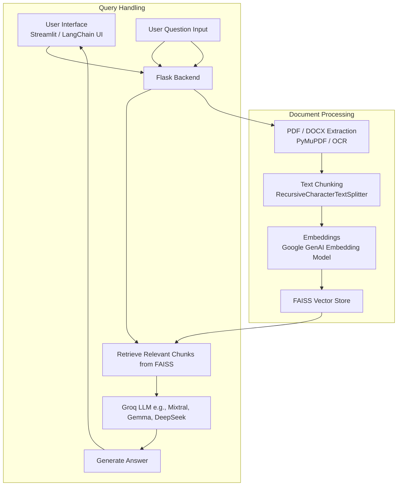

# System Architecture

This document provides an overview of the system architecture of ExamPrompt AI, detailing how various components interact to support document-based question answering.

---

## High-Level Overview

ExamPrompt AI follows a modular pipeline-based design, separating concerns such as document loading, text preprocessing, vector storage, retrieval, and language model response generation.

---

## Data Flow

1. **User Uploads a Document**
   - Supports `.pdf` (and optionally `.docx`)
   - Saved temporarily on the server

2. **Document Processing**
   - Text is extracted (using PyMuPDF or OCR if needed)
   - Text is split into smaller overlapping chunks using `RecursiveCharacterTextSplitter`

3. **Embedding Generation**
   - Each text chunk is converted into a vector using Google Generative AI embeddings (`embedding-001` model)

4. **Vector Storage**
   - Embeddings are stored in a FAISS vector database for fast similarity-based retrieval

5. **Question Handling**
   - User submits a natural language query via the frontend
   - Relevant document chunks are retrieved from the FAISS store

6. **LLM Response**
   - Retrieved chunks + question are passed to a Groq-powered LLM (e.g., Mixtral or Gemma)
   - A context-aware response is generated and returned to the user

7. **Chat History Management**
   - Session-based memory is maintained using Flask-Session
   - Enables follow-up questions within the same context

---

## Component Diagram (Logical)

---

## Technologies Involved

| Layer           | Technology                           |
| --------------- | ------------------------------------ |
| Frontend        | Streamlit / LangChain Chat UI        |
| Backend API     | Flask                                |
| Session Storage | Flask-Session                        |
| Text Extraction | PyMuPDF / EasyOCR                    |
| Text Splitting  | RecursiveCharacterTextSplitter       |
| Embeddings      | Google Generative AI Embeddings      |
| Vector Store    | FAISS                                |
| LLM Inference   | ChatGroq (Mixtral / Gemma models)    |
| Deployment      | Docker, Render / Hugging Face Spaces |

---

## Design Considerations

* **Stateless vector retrieval** keeps the system efficient and modular.
* **Session-based memory** allows users to follow up without losing context.
* **Embeddings + vector search** enable fast document-aware Q\&A.
* Easily extensible for features like file comparison, user auth, or citation.
