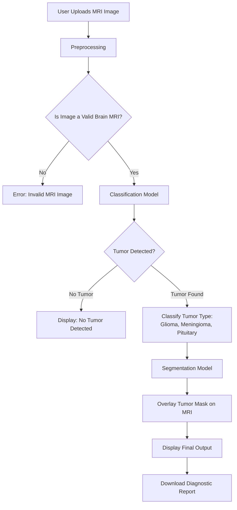

# 03 - Planning

## Project Planning & Roadmap

This document outlines the planning and execution strategy behind the Brain Tumor Detection System. The project was carried out in two structured phases—**Research** and **Application Development**—each with specific goals, tasks, and deliverables. Clear milestones ensured a smooth transition from concept to deployment of a fully functional AI-based diagnostic tool.

---

## Objectives

* Develop a model to **detect and classify brain tumors** from MRI scans.
* Integrate **tumor segmentation** for enhanced visual interpretation.
* Build a **user-friendly web application** for public access.
* Enable **automated diagnostic report generation**.
* Ensure the system is **accurate, lightweight, and easy to deploy**.

---

## Project Workflow

---

## Phase 1 – Research & Prototyping

| Task                      | Description                                                  |
| ------------------------- | ------------------------------------------------------------ |
| Dataset Acquisition       | MRI images sourced from public datasets (e.g., Kaggle).      |
| Model Design              | Developed CNN-based architecture for initial classification. |
| Training & Validation     | Trained on labeled datasets; validated on split test sets.   |
| Research Paper Submission | Published findings in an IEEE-affiliated journal.            |

---

## Phase 2 – Application Development

| Task                        | Description                                                        |
| --------------------------- | ------------------------------------------------------------------ |
| Image Validation Module     | Screened out non-MRI or irrelevant inputs.                         |
| Classification Optimization | Improved prediction accuracy and reduced model size (\~39.5 MB).   |
| Tumor Segmentation          | Added U-Net-based segmentation for highlighting tumor regions.     |
| Web App Development         | Built with Streamlit; included interactive and responsive UI.      |
| Report Generation           | Generated downloadable .txt reports with annotated MRI predictions.|
| Deployment                  | Hosted publicly via Streamlit Cloud for free and easy access.      |

---

## Key Design Principles

* **Modular Architecture**: Each component (validation, classification, segmentation) operates independently for easier debugging and scaling.
* **Lightweight & Efficient**: Optimized for CPU execution—suitable even without GPU support.
* **Scalable**: Future-proof structure allows extension to other medical imaging tasks.
* **User-Centric**: Interface and outputs were designed to be clear for both clinicians and non-technical users.

