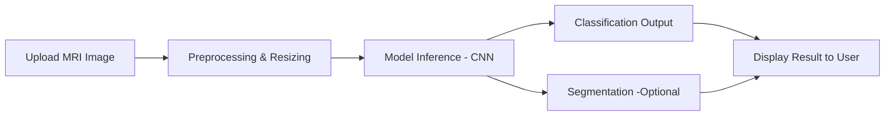

# 01 - System Architecture

##  System Architecture Overview

The **Brain Tumor Detection System** is architected to deliver high performance, reliability, and user accessibility. Designed with modularity in mind, it brings together deep learning models, intuitive user interfaces, and efficient data pipelines to support the early detection of brain tumors from MRI scans.

---

## 🔧 Core Components

The system is structured into three primary layers:

### 1. **Model Layer (Back-End)**

* **Custom CNN Architecture**: A lightweight 4-layer Convolutional Neural Network trained on MRI images to classify brain tumors into four categories: *No Tumor*, *Glioma*, *Meningioma*, and *Pituitary Tumor*.
* **Storage Footprint**: Approximately 39.5 MB, suitable for deployment in low-resource or offline environments.
* **Inference Engine**: Loads the trained model and performs real-time classification of MRI images.

### 2. **Application Layer**

* **Web Application**: Built using **Streamlit**, providing a clean and responsive interface for healthcare professionals.
* **Workflow Orchestration**: Automatically initiates preprocessing, model inference, and result visualization upon image upload.
* **Interpretability Support**: Offers optional overlays and visual outputs for transparency in predictions.

### 3. **Data Layer**

* **Input Management**: Accepts user-uploaded MRI scans.
* **Image Pipeline**: Handles preprocessing tasks such as grayscale conversion, resizing, noise reduction, and—when applicable—tumor segmentation.
* **Prediction Output**: Returns tumor classification and, optionally, a segmented overlay.

---

## 🔁 End-to-End Workflow

---

## 🛠️ Technologies Utilized

* **TensorFlow / Keras** – Model development and training
* **OpenCV & NumPy** – Image preprocessing and transformation
* **Streamlit** – Web-based user interface
* **Matplotlib** – Visualization of MRI results
* **Python** – Core application and orchestration logic

---

## 🔐 Security & Optimization Measures

* **In-Memory Processing**: MRI scans are never stored on disk, ensuring patient data privacy.
* **Low Latency**: Inference time kept under 1 second per scan.
* **Model Compression**: Efficient serialization and reduced size without compromising accuracy.

---

## Future Scalability & Enhancements

* Integration with Electronic Health Record (EHR) systems and hospital APIs
* Docker-based containerization for scalable deployment in cloud environments
* Expansion to handle more tumor types and support for 3D imaging modalities

---

This architecture ensures that the system remains robust, easy to deploy, and adaptable to evolving clinical and technological needs.
