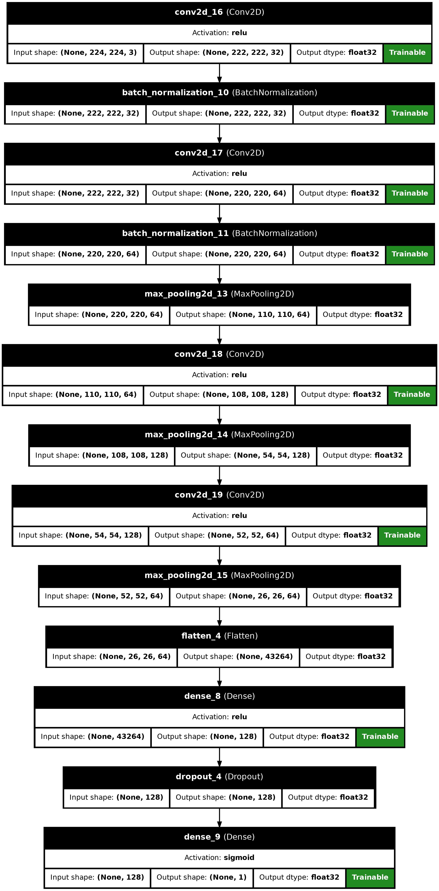
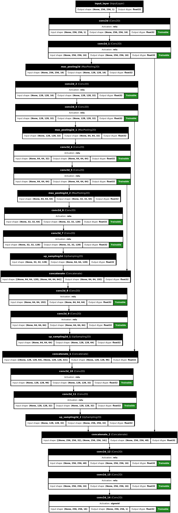

# 02 – Model Architectures and Strategy

## Overview

The Brain Tumor Detection System adopts a modular deep learning pipeline consisting of three dedicated models. Each model is responsible for solving a specific task in the processing chain—ensuring the system is accurate, interpretable, and efficient. The pipeline consists of the following models:

1. **Validity Classifier** – Filters out irrelevant or non-MRI inputs.
2. **Tumor Classifier** – Determines the type of brain tumor present.
3. **Tumor Segmenter** – Generates a precise tumor region mask for visualization.

---

## Model 1: MRI Validity Classifier

This model acts as the first filter, verifying whether an input image is a valid brain MRI scan. This step eliminates unrelated or poor-quality inputs that could negatively affect subsequent stages.

* **Task**: Binary Classification — *Valid* vs. *Invalid* images
* **Dataset**: Custom-labeled collection comprising both MRI and non-MRI images
* **Output**: 0 (Invalid) or 1 (Valid)

**Architecture Summary**:
A compact convolutional neural network optimized for binary classification. It includes:

* Convolutional layers (Conv2D) with ReLU activations
* MaxPooling for spatial reduction
* Dense layers leading to a final Sigmoid activation



---

## Model 2: Tumor Classification CNN

Once a valid MRI scan is confirmed, this model classifies it into one of four tumor categories.

* **Task**: Multiclass classification — *No Tumor*, *Glioma*, *Meningioma*, *Pituitary*
* **Input Shape**: 256×256 grayscale MRI scan
* **Output**: One-hot encoded class label via Softmax

**Architecture Details**:

```
Model: Sequential
- Conv2D (31 filters) + MaxPooling
- Conv2D (65 filters) + MaxPooling
- Conv2D (128 filters) + MaxPooling
- Conv2D (128 filters) + MaxPooling
- Flatten
- Dense (128 units) + Dropout
- Dense (4 units – Softmax)
```

* **Parameter Count**: \~3.45 million
* **Accuracy**: Approximately 97% on held-out test data


---

## Model 3: Tumor Segmentation Model

This model performs semantic segmentation to delineate the tumor area within the MRI scan. It provides visual feedback that complements the classification result.

* **Task**: Binary segmentation (tumor region vs. background)
* **Output**: Pixel-wise binary mask (256×256×1)
* **Architecture**: U-Net-inspired encoder–decoder structure

**Architecture Highlights**:

* Contracting path: Stacked Conv2D + MaxPooling layers

* Expanding path: UpSampling + Concatenation with skip connections

* Final layer: Sigmoid activation for binary mask generation

* **Parameter Count**: \~487,000



---

## Summary

The modular pipeline ensures strong generalization and practical utility:

* **Validity Classifier** safeguards against poor inputs.
* **Tumor Classifier** provides accurate diagnostic labels.
* **Segmenter** visually highlights tumor areas for interpretability.

Each model has been independently trained, validated, and evaluated before being integrated into a unified and streamlined inference workflow.
