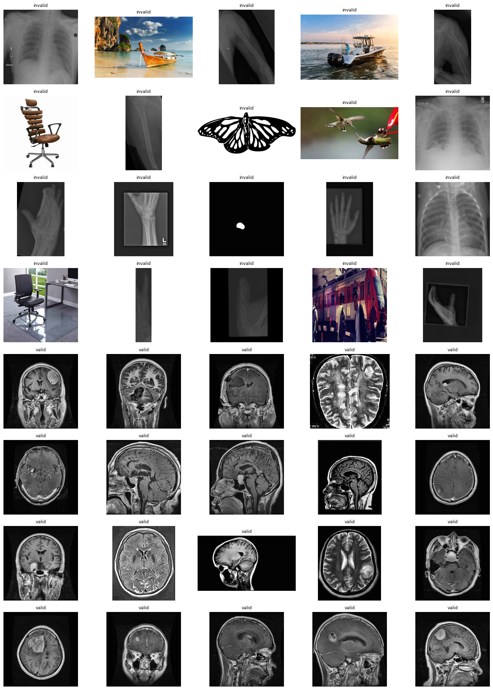
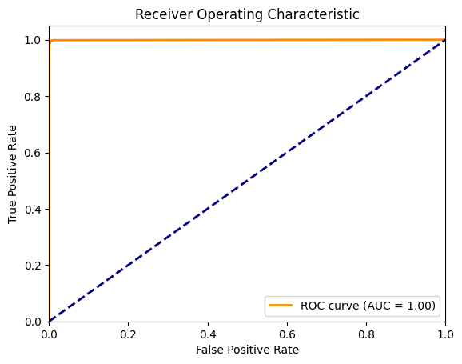
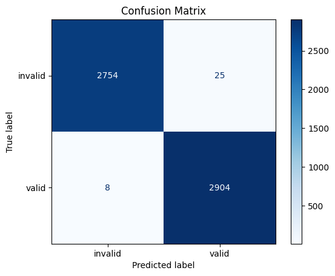
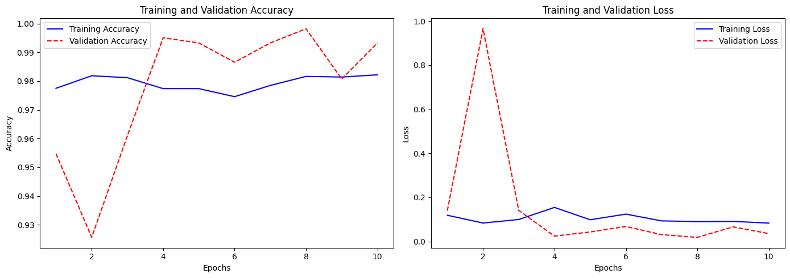

# 05 Validator Model – Image Classification for Input Integrity

The Validator Model is a dedicated binary classifier designed to detect whether an input image is a **valid brain MRI** or an **invalid, unrelated image**. It serves as the **first checkpoint** in the Brain Tumor Detection System, ensuring that only relevant images proceed for tumor classification or segmentation.

---

## Model Purpose

The primary goal of the Validator Model is to:

* Prevent unrelated images (e.g., furniture, animals, chest X-rays) from being misinterpreted by the tumor detection system.
* Improve the robustness, accuracy, and trustworthiness of the pipeline.
* Simulate real-world use cases where users may accidentally upload non-brain images.

---

## 🏗️ Architecture Overview

The model follows a custom-built **Convolutional Neural Network (CNN)** with batch normalization, max-pooling, and dropout regularization. Below is a summary of its architecture:

```
Input Image Shape: (256, 256, 1)
```

| Layer Type              | Output Shape    | Parameters |
| ----------------------- | --------------- | ---------- |
| Conv2D (32 filters)     | (222, 222, 32)  | 896        |
| BatchNormalization      | (222, 222, 32)  | 128        |
| Conv2D (64 filters)     | (220, 220, 64)  | 18,496     |
| BatchNormalization      | (220, 220, 64)  | 256        |
| MaxPooling2D            | (110, 110, 64)  | 0          |
| Conv2D (128 filters)    | (108, 108, 128) | 73,856     |
| MaxPooling2D            | (54, 54, 128)   | 0          |
| Conv2D (64 filters)     | (52, 52, 64)    | 73,792     |
| MaxPooling2D            | (26, 26, 64)    | 0          |
| Flatten                 | (43264)         | 0          |
| Dense (128 units)       | (128)           | 5,537,920  |
| Dropout (rate=0.3)      | (128)           | 0          |
| Dense (1 unit, sigmoid) | (1)             | 129        |

**Total Parameters**: 5,705,473
**Trainable**: 5,705,281
**Non-trainable**: 192

---

## 🧪 Dataset Composition

The final dataset used for training was constructed after aggregating multiple image sources, classified as **valid** or **invalid**.

### ✅ Valid Images

All 5,712 valid images are sourced from the brain MRI tumor dataset's official training set, spanning 4 classes:

* Glioma
* Meningioma
* Pituitary
* No Tumor

### Invalid Images

Invalid images include both medical and non-medical data, collected across multiple curated sections:

| Section | Description                      | Count |
| ------- | -------------------------------- | ----- |
| 1       | Furniture images                 | 400   |
| 2       | Animal images (90×10)            | 900   |
| 3       | Human portraits                  | 400   |
| 4       | Vehicles                         | 700   |
| 5       | Bone X-rays                      | 1,400 |
| 6       | Lung X-rays                      | 600   |
| 7       | Segmentation masks (X-ray scans) | 1,050 |

**Total Invalid Images**: 5,450

### 🔄 Final Class Distribution

| Class     | Count      |
| --------- | ---------- |
| Valid     | 5,712      |
| Invalid   | 5,450      |
| **Total** | **11,162** |


Perfect — that’ll make the file even more complete and visually informative.

Let’s add your **valid vs invalid sample image** section into the `05_validator_model.md`. Below is the updated portion with that included:

---

### Sample: Valid vs Invalid Images

To illustrate how the Validator Model distinguishes between valid and invalid inputs, here's a visual comparison:



> The Validator Model is trained to detect such variations and block any non-relevant input at the earliest stage.

---

## 🔍 Input Image Preprocessing

* **Resized to**: 256×256 pixels
* **Color Mode**: Grayscale (1 channel)
* **Augmentation**:

  * Zoom range: 0.1
  * Rotation: 5°
  * Width & height shift: 0.05
  * Brightness adjustment: (0.9 to 1.2)
  * Horizontal flip: enabled

---

## ⚙️ Training Setup

| Parameter     | Value               |
| ------------- | ------------------- |
| Framework     | TensorFlow (Keras)  |
| Optimizer     | Adam                |
| Loss Function | Binary Crossentropy |
| Metrics       | Accuracy, AUC       |
| Batch Size    | 2 (GPU limited)     |
| Epochs        | 10                  |
| GPU Used      | RTX 3050 Ti         |

Training was conducted over a single run after combining all section-wise data to improve generalization and class balance.

---

## 📊 Evaluation Metrics

Final performance on a **5,691-image test set**:

| Metric           | Score                                                                                      |
| ---------------- | ------------------------------------------------------------------------------------------ |
| Accuracy         | 99.33%                                                                                     |
| F1 Score         | 0.99                                                                                       |
| AUC              | 1.00                                                                                       |
| Confusion Matrix | True Positives: 2820<br>True Negatives: 2823<br>False Positives: 18<br>False Negatives: 30 |

---

## 📈 Visualization Placeholders

  

  

  


---

## 🧠 Why This Model Matters

This validator ensures the integrity of every input entering the brain tumor detection system. It acts as a **domain-aware filter**, improving downstream model accuracy and avoiding false classifications on completely unrelated data.
