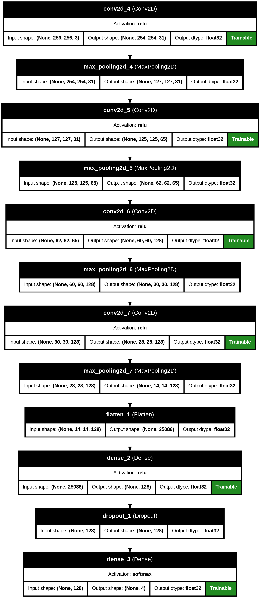

# 01 - Model Development

## Overview

This section details the development of the convolutional neural network (CNN) used in the Brain Tumor Detection System. The model was implemented from scratch using TensorFlow’s Sequential API, balancing performance, accuracy, and deployability. It is designed to classify brain MRI images into one of four categories:

* **No Tumor**
* **Glioma Tumor**
* **Meningioma Tumor**
* **Pituitary Tumor**

---

## Model Architecture

The architecture consists of a series of convolutional and max-pooling layers for hierarchical feature extraction, followed by fully connected layers for classification. A dropout layer is included to reduce overfitting and improve generalization.

### Layer-wise Architecture Summary

| Layer Type           | Output Shape   | Parameters |
| -------------------- | -------------- | ---------- |
| Conv2D (31 filters)  | (254, 254, 31) | 868        |
| MaxPooling2D         | (127, 127, 31) | 0          |
| Conv2D (65 filters)  | (125, 125, 65) | 18,200     |
| MaxPooling2D         | (62, 62, 65)   | 0          |
| Conv2D (128 filters) | (60, 60, 128)  | 75,008     |
| MaxPooling2D         | (30, 30, 128)  | 0          |
| Conv2D (128 filters) | (28, 28, 128)  | 147,584    |
| MaxPooling2D         | (14, 14, 128)  | 0          |
| Flatten              | (25088,)       | 0          |
| Dense (128 units)    | (128,)         | 3,211,392  |
| Dropout (rate = 0.5) | (128,)         | 0          |
| Dense (4 units)      | (4,)           | 516        |

**Total Parameters**: 10,360,706
**Trainable Parameters**: 3,453,568
**Model Size**: \~39.5 MB

---

## Design Considerations

* **Custom Architecture**: A custom CNN was chosen over large pre-trained models to reduce computational overhead and file size.
* **Layer Depth**: Balanced for effective feature extraction without impacting inference speed.
* **Regularization**: Dropout layers minimize overfitting by randomly deactivating neurons during training.
* **Efficient Flattening**: Enables transition from 2D feature maps to 1D dense layers.
* **Softmax Output**: Facilitates multi-class classification across the four tumor categories.

---

## Training Configuration

| Parameter         | Value                    |
| ----------------- | ------------------------ |
| Framework         | TensorFlow (Keras API)   |
| Input Size        | 256x256 pixels (RGB)     |
| Loss Function     | Categorical Crossentropy |
| Optimizer         | Adam                     |
| Batch Size        | 32                       |
| Epochs            | 45                       |
| Validation Split  | 10%                      |
| Testing Split     | 20%                      |
| Data Augmentation | Yes (rotation, flipping) |

---

## Model Performance

The model achieved high accuracy and minimal overfitting during evaluation, as shown below:

| Metric      | Training Set  | Validation Set | Test Set |
| ----------- | ------------- | -------------- | -------- |
| Accuracy    | 99.20%        | 97.68%         | 97.10%   |
| Loss        | Low           | Low            | Low      |
| Overfitting | None observed | —              | —        |

Further performance details, including confusion matrices and classification reports, are available in the evaluation section.

---

## Model Visualization

---

## Conclusion

The custom-built CNN forms the core of the Brain Tumor Detection System. Despite its lightweight structure, the model delivers performance on par with more complex architectures, making it a practical solution for medical imaging tasks. Its small size and efficiency enable seamless deployment in both cloud-based environments and local healthcare tools.

