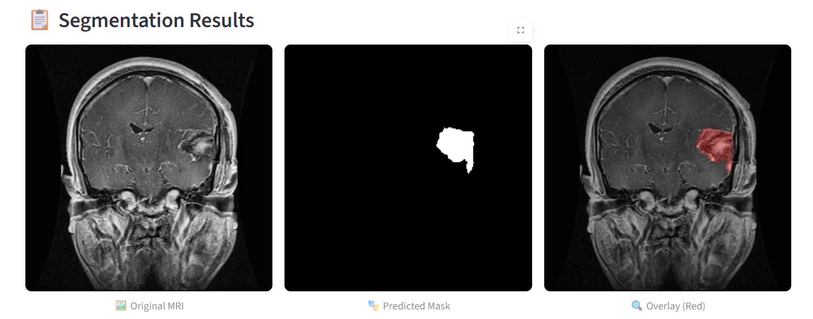

# 04 – Streamlit User Interface

## Overview

The final component of the project is a **Streamlit-based web application** that brings together all models in an intuitive and user-friendly interface. This lightweight and responsive UI allows users to seamlessly upload MRI images, get instant classification results, and visualize segmentation masks—all within a single platform.

The application ensures that advanced AI processing is accessible to non-technical users, such as medical professionals, researchers, and students.

---

## Key Features

* **Multi-step Pipeline Integration**: Validity check → Tumor classification → Tumor segmentation
* **Interactive Image Upload**: Drag and drop or file selector for uploading MRI scans
* **Live Feedback**: Instant model inference with prediction confidence
* **Segmentation Visualization**: Shows the original image, predicted mask, and overlay
* **Custom Mask Coloring**: User-selectable color overlays (e.g., red, green)
* **Performance Stats Display**: Model evaluation metrics accessible through toggle

---

## Layout Overview

The Streamlit app is structured using a wide layout with custom CSS for an enhanced visual experience. Below are the core sections:

### 1. Sidebar

* **Navigation Menu**: Choose between different stages (Classification, Segmentation)
* **Upload Section**: Upload single or batch images
* **Overlay Settings**: Select overlay color (Red, Green)

### 2. Main Interface

#### **Section A: Classification**

* Displays predicted label (e.g., Valid / Invalid, Tumor type)
* Shows prediction confidence and class probabilities

#### **Section B: Segmentation**

* Automatically triggered after classification (if valid)
* Displays:

  * Original MRI
  * Binary Mask
  * Mask Overlay (on original image)

#### **Section C: Insights Panel**

* Optionally displays:

  * Inference time
  * Model evaluation scores
  * Error logs or debug information

---

## Example Output (From Application)

---

## Backend Integration

The UI communicates with the TensorFlow models loaded in memory. Streamlit handles user interaction and triggers the appropriate backend function based on user inputs.

* `cv2` is used for real-time image preprocessing
* `PIL` handles display formatting
* `NumPy` supports image tensor manipulation
* `time` module tracks inference latency

---

## Hosting & Access

The Streamlit app is currently hosted and publicly accessible:

* **Platform**: Streamlit Community Cloud / Render
* **Status**: \[Live Demo Available]
* **Demo Video**: [Vimeo - Watch Here](https://vimeo.com/1106384259?share=copy)

---

## Summary

The Streamlit UI serves as the final interaction layer between users and our intelligent imaging pipeline. It ensures that:

* Complex AI models remain accessible and interpretable
* Predictions are transparent and explainable
* The full medical imaging workflow is presented in a clean and practical web interface

Whether it's verifying image validity, diagnosing tumor types, or highlighting regions of concern, the app offers a complete end-to-end solution from upload to insight.
