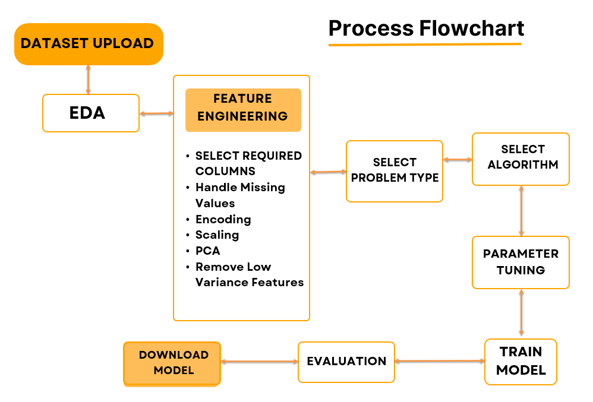

# System Architecture

## Overview

**Creation Ground** uses a **modular, three-layer architecture** that guides users from **data upload** to **model export** in a seamless, transparent process.

1. **User Interface Layer** – Interactive, beginner-friendly UI built with Streamlit.
2. **Processing & Logic Layer** – Python backend for preprocessing, model training, and evaluation.
3. **Hosting & Deployment Layer** – Flexible deployment via cloud or local environments.

---

## Architecture Diagram

*Figure: High-level architecture of Creation Ground.*

---

## Workflow Details

### 1. User Interface Layer

* **Technology:** Streamlit + streamlit-option-menu.
* **Functionality:**

  * Sidebar navigation with key modules: **Home**, **Train Your Model**, **Algorithm Information**, **Model Integration**, **ML PlayBook**, **Help**, and **About**.
  * Handles file uploads, preprocessing selections, algorithm choices, and hyperparameter inputs.
  * Displays interactive charts, tables, and evaluation results.

---

### 2. Processing & Logic Layer

* **Dataset Handling:** pandas reads and validates `.csv` or `.xlsx` files.
* **Preprocessing Pipeline:**

  * Missing value handling.
  * Categorical encoding.
  * Feature scaling.
  * Optional dimensionality reduction (PCA).
* **Model Training:**

  * Multiple scikit-learn algorithms for classification and regression.
  * Hyperparameter tuning directly from the UI.
* **Model Evaluation:**

  * Metrics: accuracy, precision, recall, F1-score, etc.
  * Visualizations: confusion matrices, performance plots.
* **Model Export:**

  * `.joblib` format for portability.
  * Preprocessing pipeline saved alongside the model for reproducibility.

---

### 3. Hosting & Deployment Layer

* **Streamlit Cloud** – primary live hosting.
* **Render** – alternative hosting for backend integrations.
* **Local Execution** – full offline capability in a Python environment.

---

## Data Flow

1. **Upload dataset** → File validation & preview.
2. **Configure preprocessing** → Pipeline creation.
3. **Select algorithm & hyperparameters** → Model training.
4. **Evaluate performance** → Metrics & visualizations displayed.
5. **Export trained model** → Downloadable `.joblib` file with preprocessing pipeline.

---

## Scalability & Extensibility

* **Modular** – new algorithms or preprocessing steps can be added with minimal changes.
* **Extensible** – supports future integration with TensorFlow, PyTorch, or advanced AutoML features.
* **Portable** – exported models run seamlessly in external Python environments.
