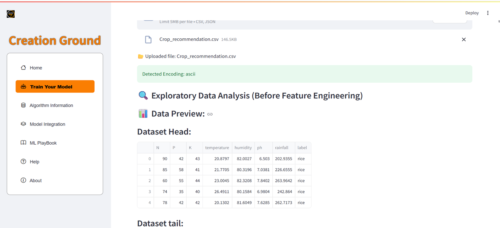

# Data Upload and Exploratory Data Analysis (EDA) Module

## Overview

The **Exploratory Data Analysis (EDA)** module serves as the foundation of the Creation Ground machine learning workflow, providing comprehensive data insights and quality assessment tools. This critical phase enables users to understand their data's characteristics, identify potential issues, and make informed decisions about preprocessing and model selection strategies.

---

## 1. Train Your Model Section - Data Upload Interface

The **Train Your Model** section acts as the primary entry point for the Creation Ground workflow, offering a streamlined approach to dataset management and initial exploration.

### Key Features

- **Multi-format Support**: Accepts CSV, Excel, JSON, and Parquet files
- **Drag-and-drop Interface**: Intuitive file upload with progress tracking
- **Automatic Data Type Detection**: Intelligently identifies numerical, categorical, and datetime columns
- **Memory Optimization**: Efficient handling of large datasets up to 500MB
- **Data Validation**: Real-time checks for file integrity and format compatibility

### Figure 5.4.2: Train Your Model Section

  

*The main interface featuring dataset upload controls, file format indicators, and immediate access to EDA functionality.*

---

## 2. Dataset Preview and Structure Analysis

Upon successful upload, the platform provides comprehensive dataset previews that go beyond simple data display to offer structural insights.

### 2.1 Data Head Preview

#### Figure 5.4.3 (a): Data Preview – Head

*Interactive table showing the first 5-10 rows with sortable columns and data type indicators.*

**Features:**

- **Column Headers**: Display data types (int64, float64, object, datetime)
- **Missing Value Indicators**: Visual markers for null/NaN values
- **Data Quality Flags**: Automatic detection of potential data issues
- **Interactive Sorting**: Click column headers to sort and explore data patterns

### 2.2 Data Tail Preview and Metadata

#### Figure 5.4.3 (b): Data Preview – Tail & Dataset Information

*Comprehensive view of dataset tail with detailed metadata panel.*

**Dataset Information Panel:**

- **Dimensions**: Total rows and columns count
- **Memory Usage**: Dataset size and memory footprint
- **Data Types Distribution**: Breakdown of numerical vs. categorical features
- **Missing Values Summary**: Count and percentage of null values per column
- **Duplicate Records**: Detection of identical rows
- **Date Range**: For datetime columns, shows min/max dates

---

## 3. Advanced Statistical Analysis

### 3.1 Descriptive Statistics

#### Figure 5.4.3 (c): Statistical Summary & Correlation Analysis

*Comprehensive statistical dashboard with interactive correlation heatmap.*

**Statistical Metrics Include:**

- **Central Tendency**: Mean, median, mode for numerical features
- **Variability**: Standard deviation, variance, range, IQR
- **Distribution Shape**: Skewness and kurtosis measurements
- **Percentiles**: 25th, 50th, 75th percentiles for outlier detection
- **Categorical Analysis**: Unique values, frequency counts, most common categories

### 3.2 Correlation Matrix Features

- **Interactive Heatmap**: Hover for exact correlation values
- **Color-coded Intensity**: Gradient scale from -1 to +1
- **Multicollinearity Detection**: Automatic flagging of highly correlated features (>0.8)
- **Feature Relationship Insights**: Identification of potential predictor variables

---

## 4. Feature Distribution and Pattern Analysis

### 4.1 Comprehensive Visualization Suite

#### Figure 5.4.3 (d): Feature Distribution Analysis

  

*Multi-panel visualization showing histograms, box plots, and distribution curves for all features.*

**Visualization Types:**

- **Histograms**: Frequency distribution with customizable bin sizes
- **Box Plots**: Quartile analysis with outlier identification
- **Density Curves**: Smooth distribution estimation
- **Q-Q Plots**: Normality assessment for statistical modeling
- **Categorical Bar Charts**: Frequency analysis for non-numerical features

### 4.2 Advanced Pattern Detection

- **Outlier Identification**: Statistical and visual outlier detection using IQR and Z-score methods
- **Distribution Testing**: Automatic normality tests (Shapiro-Wilk, Kolmogorov-Smirnov)
- **Seasonality Detection**: For time-series data, identifies periodic patterns
- **Class Imbalance Analysis**: For target variables, shows distribution balance

---

## 5. Data Quality Assessment

### 5.1 Automated Quality Checks

- **Missing Data Patterns**: Visualization of missing value patterns across features
- **Data Consistency**: Detection of inconsistent formatting or encoding issues
- **Range Validation**: Identification of values outside expected ranges
- **Duplicate Analysis**: Comprehensive duplicate record detection and analysis

### 5.2 Recommendations Engine

The platform provides intelligent suggestions based on data analysis:

- **Preprocessing Recommendations**: Suggested transformations for each feature type
- **Feature Engineering Opportunities**: Identification of potential new features
- **Model Suitability Hints**: Initial guidance on appropriate algorithm families
- **Data Collection Improvements**: Suggestions for additional data needs

---

## 6. Enhanced Benefits and Use Cases

### 6.1 For Data Scientists

- **Rapid Data Profiling**: Comprehensive data understanding in minutes
- **Hypothesis Generation**: Visual insights spark analytical questions
- **Quality Assurance**: Systematic data validation before modeling
- **Documentation**: Automatic generation of data summary reports

### 6.2 For Business Users

- **Intuitive Visualizations**: No technical expertise required for interpretation
- **Business Insights**: Discover patterns relevant to business objectives
- **Risk Assessment**: Early identification of data quality issues
- **Stakeholder Communication**: Clear visuals for presenting data insights

### 6.3 For ML Engineers

- **Pipeline Planning**: Informed decisions about preprocessing steps
- **Feature Selection**: Data-driven approach to feature importance
- **Model Architecture**: Insights inform algorithm selection
- **Performance Optimization**: Understanding data characteristics improves model tuning

---

## 7. Workflow Integration and Next Steps

### 7.1 Strategic Position in ML Pipeline

The EDA module strategically bridges **data ingestion** and **preprocessing**, serving as a critical decision point that influences all downstream activities.

**Workflow Sequence:**

1. **Data Upload** → 2. **EDA Analysis** → 3. **Preprocessing Decisions** → 4. **Feature Engineering** → 5. **Model Training**

### 7.2 Actionable Insights

Based on EDA results, users receive specific recommendations:

- **Preprocessing Strategies**: Scaling, encoding, and transformation suggestions
- **Feature Engineering**: Opportunities for creating derived features
- **Model Selection**: Algorithm recommendations based on data characteristics
- **Validation Approach**: Suggested cross-validation strategies

---

## 8. Best Practices and Tips

### 8.1 Effective EDA Workflow

1. **Start with Overview**: Review dataset dimensions and basic statistics
2. **Identify Issues**: Look for missing values, outliers, and inconsistencies
3. **Explore Relationships**: Analyze correlations and feature interactions
4. **Validate Assumptions**: Check distribution assumptions for planned analyses
5. **Document Findings**: Record insights and decisions for future reference

### 8.2 Common Pitfalls to Avoid

- **Rushing Through EDA**: Thorough exploration prevents downstream issues
- **Ignoring Data Quality**: Address quality issues before modeling
- **Over-relying on Automation**: Combine automated insights with domain knowledge
- **Neglecting Business Context**: Ensure statistical findings align with business logic
