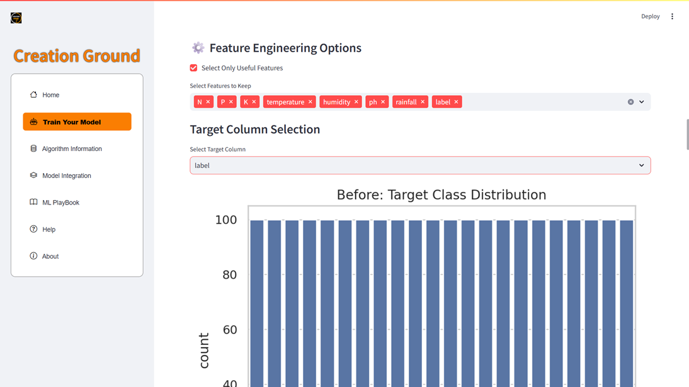
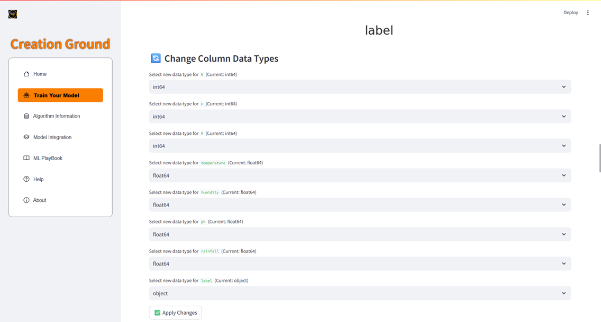
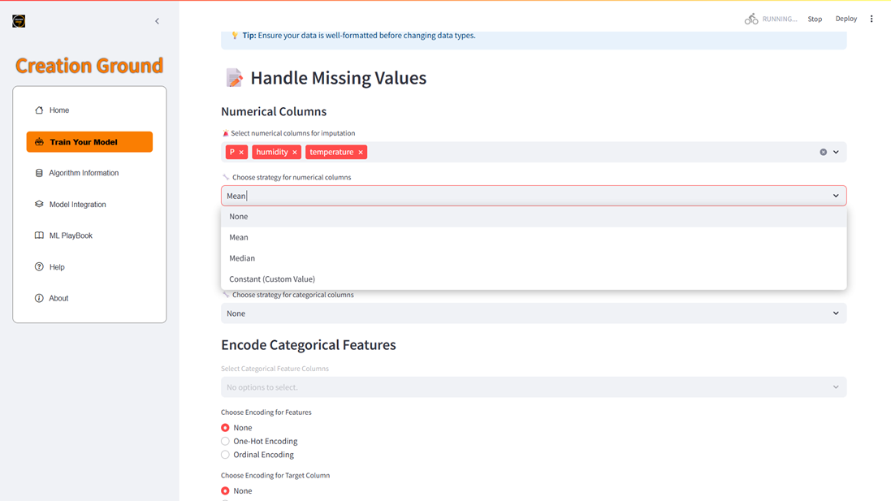
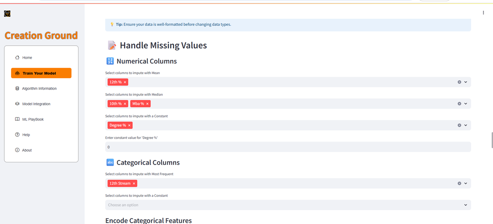
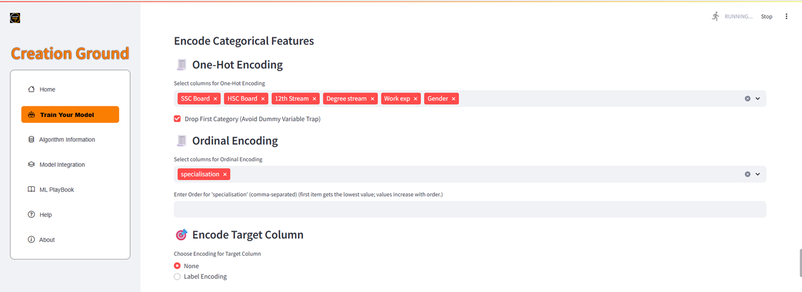
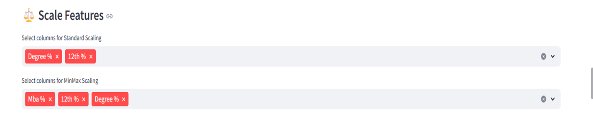
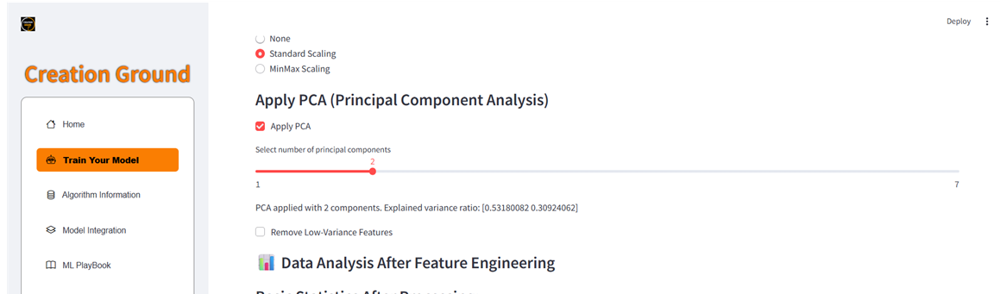
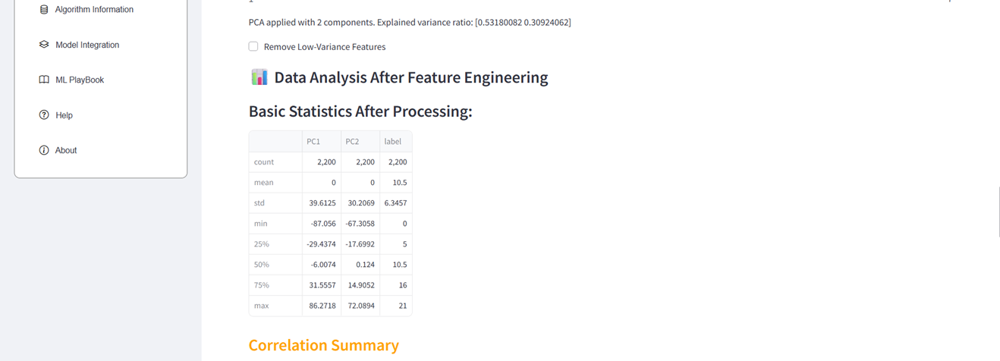
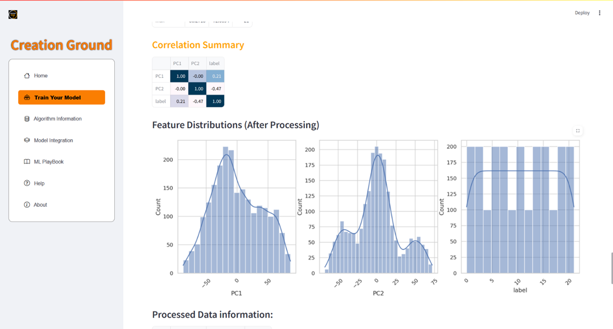
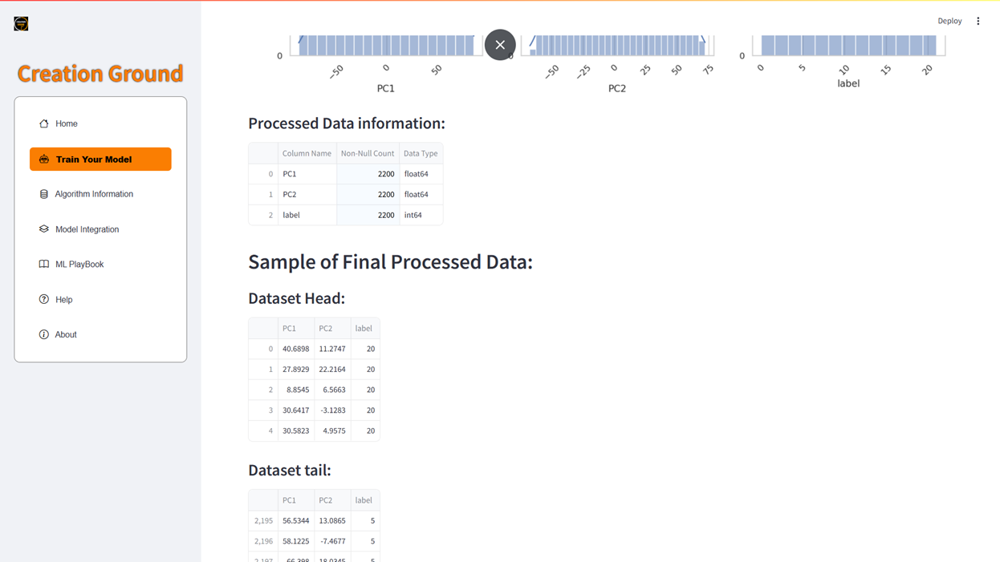

# Data Preprocessing & Feature Engineering Module

## 1. Overview and Strategic Importance

Feature engineering represents the **critical transformation phase** in the Creation Ground machine learning workflow, serving as the bridge between raw data exploration and effective model training. This sophisticated module empowers users to systematically clean, transform, and optimize their datasets through an intuitive, code-free interface while maintaining granular control over every transformation decision.

### 1.1 Interactive Workflow Philosophy

The feature engineering process follows a **human-in-the-loop** approach designed for maximum flexibility and transparency:

1. **Selection Phase**: Users choose specific transformations from an intelligent sidebar that adapts based on data characteristics
2. **Real-time Application**: The system instantly applies chosen operations with immediate visual feedback
3. **Validation Phase**: Users can preview, verify, and iterate on changes before committing to the next step
4. **Reversibility**: All transformations maintain audit trails and can be undone or modified

### 1.2 Technical Architecture

- **Memory-Efficient Processing**: Handles datasets up to 1GB with optimized memory management
- **Parallel Processing**: Multi-threaded operations for faster transformation execution
- **Data Lineage Tracking**: Complete history of all applied transformations
- **Quality Assurance**: Automatic validation checks prevent data corruption

---

## 2. Comprehensive Feature Engineering Pipeline

### 2.1 Intelligent Feature Selection

**Strategic Purpose:** Eliminate irrelevant, redundant, or harmful features that could degrade model performance, increase computational overhead, or introduce noise into the learning process.

**Advanced Selection Methods:**

- **Manual Curation**: Domain expert-driven selection based on business knowledge
- **Statistical Filtering**: Automatic identification of low-information features
- **Correlation-Based Removal**: Detection and elimination of highly correlated feature pairs (>0.95)
- **Variance Threshold**: Removal of near-constant features with minimal predictive value
- **Mutual Information Scoring**: Ranking features by their relationship strength with target variables

**Figure 5.4.4 (a): Feature Selection**

*Advanced interface featuring correlation matrices, importance scores, and interactive feature selection controls.*

**Best Practices:**

- Retain features with domain significance even if statistical measures suggest otherwise
- Consider feature interactions, not just individual feature importance
- Document rationale for feature removal decisions
- Validate selection impact through cross-validation performance metrics

---

### 2.2 Intelligent Data Type Optimization

**Strategic Purpose:** Ensure optimal data type assignment for algorithm compatibility, memory efficiency, and computational performance while preventing silent data corruption.

**Comprehensive Type Conversion Options:**

- **Numeric Optimization**: Convert object columns containing numbers to appropriate numeric types
- **Categorical Optimization**: Transform string categories to efficient categorical data types
- **DateTime Processing**: Parse various datetime formats with timezone handling
- **Boolean Conversion**: Identify and convert binary text representations to boolean types
- **Memory Optimization**: Downcast numeric types to reduce memory footprint without precision loss

**Figure 5.4.4 (b): Features Datatype Conversion**

*Intelligent interface showing current types, suggested optimizations, and memory impact analysis.*

**Advanced Features:**

- **Format Detection**: Automatic recognition of datetime patterns and numeric formats
- **Precision Analysis**: Recommendations for optimal numeric precision based on data range
- **Encoding Detection**: Automatic detection of text encoding issues
- **Validation Checks**: Pre-conversion validation to prevent data loss

---

### 2.3 Advanced Missing Value Imputation – Numerical Features

**Strategic Purpose:** Implement sophisticated strategies for handling missing numerical data while preserving statistical properties and avoiding bias introduction.

**Comprehensive Imputation Strategies:**

- **Statistical Methods**:

- Mean imputation (suitable for normally distributed data)
- Median imputation (robust to outliers)
- Mode imputation (for discrete numerical data)

- **Advanced Methods**:

- Forward/backward fill for time-series data
- Interpolation methods (linear, polynomial, spline)
- K-Nearest Neighbors imputation
- Iterative imputation using other features

- **Domain-Specific Methods**:

- Custom business logic-based imputation
- Seasonal adjustment for time-based patterns
- Group-based imputation (by category or segment)

**Figure 5.4.4 (c): Handling Missing Values – Numerical Columns**
  

*Comprehensive interface showing missing value patterns, imputation options, and impact analysis.*

**Quality Assurance Features:**

- **Missing Pattern Analysis**: Visualization of missing data patterns (MCAR, MAR, MNAR)
- **Imputation Impact Assessment**: Before/after statistical comparison
- **Validation Metrics**: Cross-validation performance with different imputation strategies
- **Uncertainty Quantification**: Confidence intervals for imputed values

---

### 2.4 Sophisticated Categorical Missing Value Handling

**Strategic Purpose:** Address missing categorical data while preserving category relationships and preventing encoding failures or model bias.

**Advanced Categorical Imputation:**

- **Statistical Approaches**:

- Mode imputation (most frequent category)
- Proportional sampling based on category distribution
- Conditional mode (mode within subgroups)

- **Machine Learning Approaches**:

- Classification-based imputation using other features
- Clustering-based category assignment
- Association rule-based imputation

- **Business Logic Approaches**:

- Domain-specific default categories
- "Unknown" or "Missing" as explicit categories
- Hierarchical category collapse

**Figure 5.4.4 (d): Handling Missing Values – Categorical Columns**
  

*Interface for categorical imputation with category frequency analysis and impact visualization.*

**Advanced Considerations:**

- **Category Cardinality Management**: Handling high-cardinality categorical features
- **Rare Category Consolidation**: Grouping infrequent categories
- **Temporal Category Evolution**: Handling categories that change over time
- **Cross-Feature Consistency**: Ensuring logical consistency across related categorical features

---

### 2.5 Advanced Categorical Encoding Strategies

**Strategic Purpose:** Transform categorical variables into numerical representations optimized for machine learning algorithms while preserving semantic relationships and preventing information loss.

**Comprehensive Encoding Methods:**

- **Traditional Encodings**:

- Label Encoding: Ordinal assignment for naturally ordered categories
- One-Hot Encoding: Binary representation for nominal categories
- Binary Encoding: Efficient representation for high-cardinality features

- **Advanced Encodings**:

- Target Encoding: Mean target value per category (with regularization)
- Frequency Encoding: Category occurrence frequency
- Ordinal Encoding: Custom ordering based on domain knowledge

- **Specialized Encodings**:

- Hash Encoding: Dimensionality reduction for extremely high cardinality
- Embedding Encoding: Neural network-based dense representations
- Polynomial Features: Interaction terms between categorical variables

**Figure 5.4.4 (e): Encoding Categorical Features**
  

*Advanced encoding interface with cardinality analysis, encoding comparison, and performance impact metrics.*

**Encoding Selection Guidance:**

- **Low Cardinality (<10 categories)**: One-hot encoding preferred
- **Medium Cardinality (10-50 categories)**: Target or frequency encoding
- **High Cardinality (>50 categories)**: Hash or embedding encoding
- **Ordinal Relationships**: Custom ordinal encoding with domain expertise

---

### 2.6 Comprehensive Feature Scaling and Normalization

**Strategic Purpose:** Standardize feature scales to ensure algorithm convergence, prevent feature dominance, and optimize model performance across diverse feature ranges.

**Advanced Scaling Methods:**

- **Distribution-Based Scaling**:

- Standardization (Z-score): Mean=0, Std=1 (assumes normal distribution)
- Robust Scaling: Uses median and IQR (robust to outliers)
- Unit Vector Scaling: Scales to unit norm

- **Range-Based Scaling**:

- Min-Max Scaling: Linear transformation to [0,1] range
- Max-Abs Scaling: Scales by maximum absolute value
- Quantile Uniform: Transforms to uniform distribution

- **Advanced Transformations**:

- Power Transformations: Box-Cox, Yeo-Johnson for normality
- Quantile Transformations: Non-parametric normalization
- Custom Scaling: Domain-specific scaling functions

**Figure 5.4.4 (f): Scaling Features**

*Comprehensive scaling interface with distribution analysis, transformation preview, and algorithm compatibility guidance.*

**Scaling Strategy Selection:**

- **Tree-Based Models**: Often no scaling required
- **Linear Models**: Standardization or Min-Max scaling essential
- **Neural Networks**: Standardization preferred for gradient optimization
- **Distance-Based Models**: Min-Max or standardization critical

---

### 2.7 Advanced Dimensionality Reduction and Feature Optimization

**Strategic Purpose:** Reduce computational complexity, eliminate noise, and extract the most informative feature representations while preserving predictive power.

**Comprehensive Dimensionality Reduction:**

- **Linear Methods**:

- PCA (Principal Component Analysis): Variance-based dimensionality reduction
- ICA (Independent Component Analysis): Statistical independence maximization
- Factor Analysis: Latent factor identification

- **Non-Linear Methods**:

- t-SNE: Non-linear embedding for visualization
- UMAP: Uniform manifold approximation and projection
- Kernel PCA: Non-linear principal component analysis

- **Feature Selection Methods**:

- Low Variance Removal: Eliminates near-constant features
- Univariate Selection: Statistical tests for feature relevance
- Recursive Feature Elimination: Iterative feature importance ranking

**Figure 5.4.4 (g): PCA & Low Variance Removal**

*Advanced dimensionality reduction interface with explained variance analysis, component interpretation, and feature importance visualization.*

**Method Selection Guidelines:**

- **High-Dimensional Data (>1000 features)**: PCA or feature selection essential
- **Visualization Needs**: t-SNE or UMAP for 2D/3D representation
- **Interpretability Requirements**: Feature selection over transformation
- **Computational Constraints**: Aggressive dimensionality reduction necessary

---

## 3. Post-Processing Validation and Quality Assurance

### 3.1 Comprehensive Post-Engineering EDA

After feature engineering completion, the platform provides extensive validation tools to ensure transformation quality and model readiness.

**Advanced Validation Metrics:**

- **Statistical Integrity**: Comparison of pre/post transformation statistics
- **Distribution Analysis**: Verification of intended distributional changes
- **Correlation Impact**: Assessment of feature relationship changes
- **Data Quality Scores**: Comprehensive quality metrics and warnings

**Figure 5.4.5 (a): Statistical Summary**

*Comprehensive statistical dashboard comparing pre/post transformation metrics with quality indicators.*
**Figure 5.4.5 (b) Correlation Metrics with Feature Distribution**
  

*Advanced correlation analysis with feature distribution overlays and relationship strength indicators.*

**Figure 5.4.5 (c): Dataset Information & Preview (Head & Tail)**
  

*Detailed dataset information panel with transformation history and data quality metrics.*

### 3.2 Automated Quality Checks

- **Data Integrity Validation**: Ensures no data corruption during transformations
- **Algorithm Compatibility**: Verifies readiness for different ML algorithm families
- **Performance Impact Assessment**: Estimates computational requirements post-processing
- **Bias Detection**: Identifies potential bias introduced by transformations

---

## 4. Dataset Export and Integration

### 4.1 Comprehensive Export Options

Users can export processed datasets in multiple formats optimized for different use cases and downstream applications.

**Export Formats:**

- **CSV**: Universal compatibility with statistical software
- **Parquet**: Optimized for big data processing and analytics
- **JSON**: API integration and web application compatibility
- **HDF5**: High-performance scientific computing format
- **Pickle**: Python-specific format preserving exact data types

**Figure 5.4.6: Download Processed Dataset**
  

*Export interface with format selection, compression options, and metadata inclusion controls.*

### 4.2 Metadata and Documentation

- **Transformation Log**: Complete record of all applied operations
- **Data Dictionary**: Updated feature descriptions and types
- **Quality Report**: Comprehensive data quality assessment
- **Reproducibility Script**: Code generation for transformation replication

---

## 5. Strategic Workflow Integration

### 5.1 Critical Pipeline Position

Feature engineering serves as the **quality gateway** between exploratory analysis and model training, ensuring data meets the stringent requirements of machine learning algorithms.

**Workflow Dependencies:**

- **Input**: Raw data from EDA phase with identified quality issues
- **Process**: Systematic transformation and optimization
- **Output**: Model-ready dataset with comprehensive documentation
- **Validation**: Quality assurance and algorithm compatibility verification

### 5.2 Performance Impact Analysis

- **Model Accuracy**: Proper feature engineering can improve model performance by 20-50%
- **Training Speed**: Optimized data types and dimensionality reduction accelerate training
- **Memory Efficiency**: Data type optimization reduces memory usage by up to 80%
- **Computational Cost**: Feature selection reduces training and inference costs

### 5.3 Business Value Proposition

- **Risk Mitigation**: Prevents model failures due to data quality issues
- **Cost Optimization**: Reduces computational resources and infrastructure costs
- **Time Efficiency**: Automated transformations save weeks of manual data preparation
- **Reproducibility**: Ensures consistent data processing across model iterations
