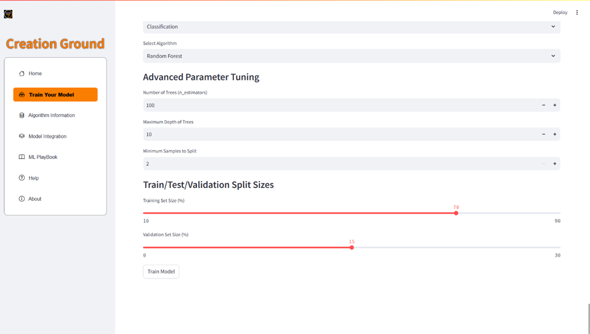
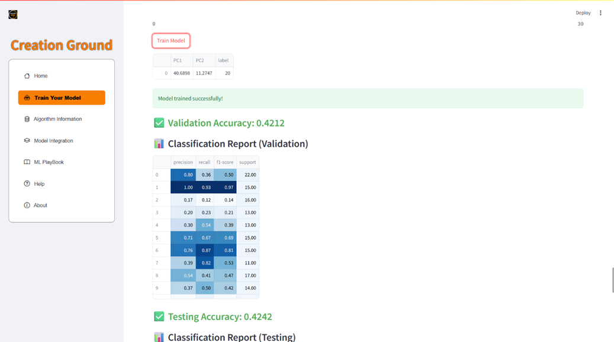
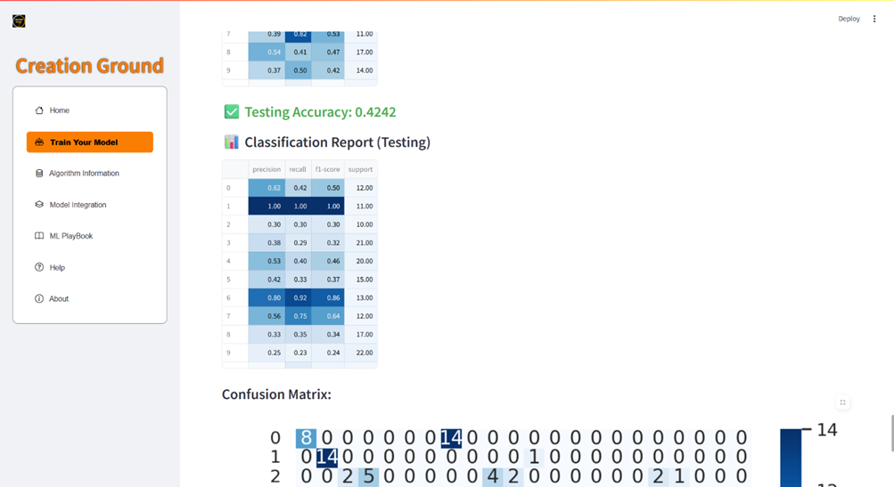
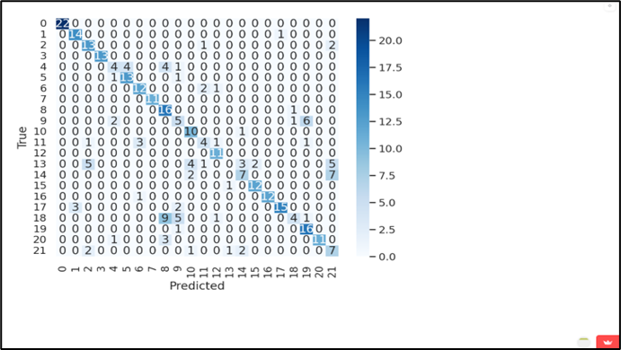
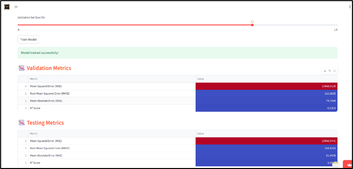
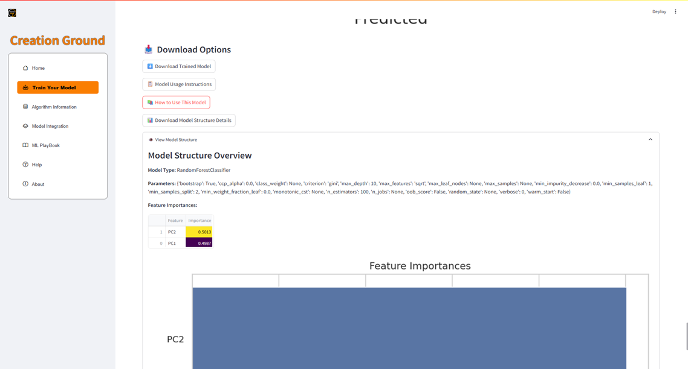
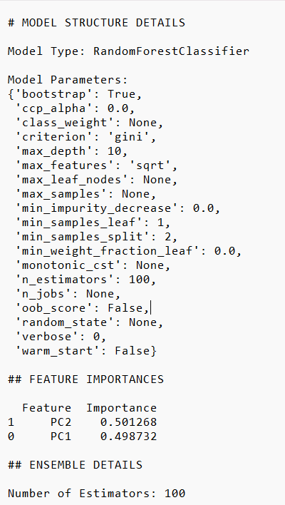
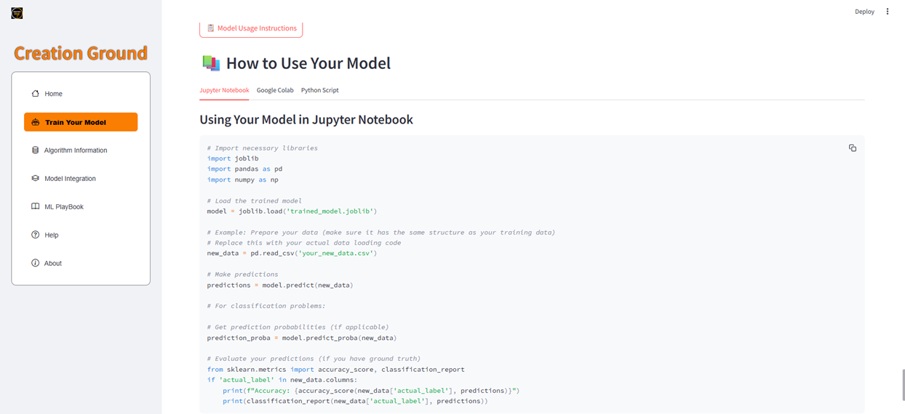
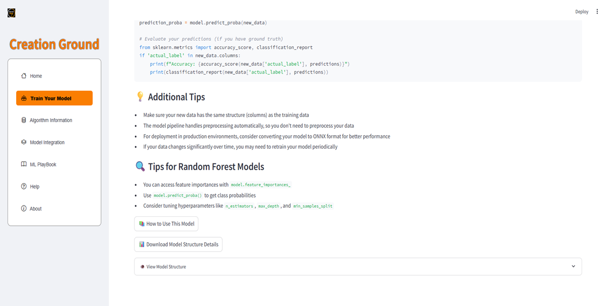
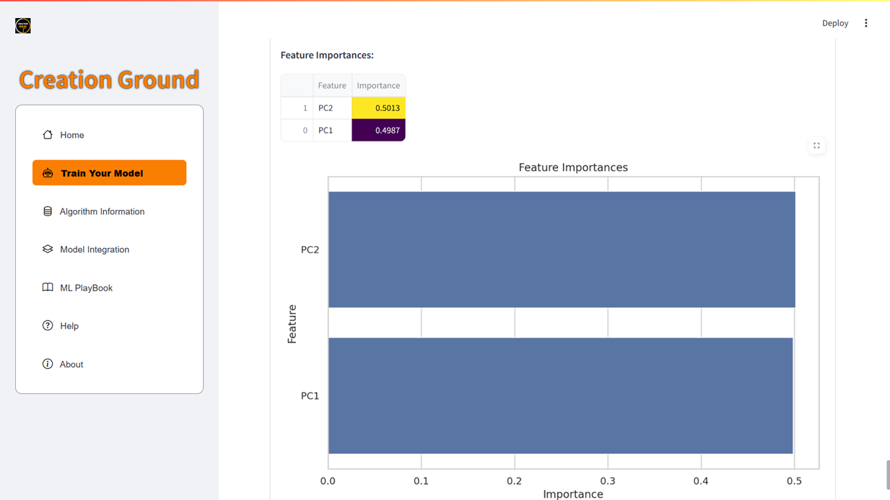

# Model Training & Evaluation

## 1. Overview

Once the dataset has been fully processed and verified, the **Model Training** stage of **Creation Ground** allows users to:

- Select an algorithm.
- Configure hyperparameters.
- Split the dataset for training, validation, and testing.
- Evaluate the trained model.
- Download both the trained model and its structure.
- Analyze feature importance.

This process is **completely customizable** — the user controls every parameter while still benefiting from a guided interface.

---

## 2. Model Training Interface

### 2.1 Algorithm Selection

**Purpose:** Choose the most suitable machine learning algorithm for the problem type (classification or regression).  
**Options include** (based on user-selected mode):

- Classification: Logistic Regression, Random Forest, Decision Tree, KNN, SVM, etc.
- Regression: Linear Regression, Ridge, Lasso, Random Forest Regressor, etc.

---

### 2.2 Hyperparameter Tuning

**Purpose:** Adjust parameters to optimize model accuracy and efficiency.  
**Examples:**

- Decision Tree depth, minimum samples per split.
- Random Forest number of estimators.
- Regularization strength for regression models.

---

### 2.3 Data Splitting

**Purpose:** Ensure the model is trained and evaluated on different subsets of the data to avoid overfitting.  
**Options:**

- Define percentage split for training, validation, and testing.

**Figure 5.4.7: Training Model – Algorithm Selection, Hyperparameter Tuning, Data Splitting**  
  
*Interface for selecting algorithm, tuning hyperparameters, and splitting data.*

---

## 3. Model Evaluation – Classification

When the problem type is **classification**, multiple evaluation metrics are available.

### 3.1 Classification Report – Validation Data

**Figure 5.4.8 (a): Classification Report of Validation Data**  
  
*Precision, recall, F1-score, and support for each class.*

---

### 3.2 Classification Report – Testing Data

**Figure 5.4.8 (b): Classification Report of Testing Data**  
  
*Final evaluation of model generalization capability.*

---

### 3.3 Confusion Matrix

**Figure 5.4.8 (c): Classification Model – Confusion Matrix**  
  
*Visualization of true vs. predicted classifications.*

---

## 4. Model Evaluation – Regression

For regression tasks, evaluation focuses on error metrics.

**Figure 5.4.9: Evaluation of Regression Problem**  
  
*Common metrics: Mean Squared Error (MSE), Root Mean Squared Error (RMSE), Mean Absolute Error (MAE), and R² Score.*

---

## 5. Downloading the Trained Model & Structure

### 5.1 Download Trained Model

**Purpose:** Export the fully trained model for use outside Creation Ground.  
Supported formats: `.pkl` (Pickle), `.joblib`.

**Figure 5.4.10: Download Trained Model and Model Structure**  
  

---

### 5.2 Viewing Model Structure

**Purpose:** Provide transparency into the model's internal configuration.  

- Shows layer details for deep learning models.
- Displays parameters for tree-based and regression models.

**Figure 5.4.12 (a): Downloaded Model Structure (.txt format)**  
  

---

## 6. Guide to Using the Model

After downloading, users are provided with a **basic integration guide**.

**Figure 5.4.11: Basic Guide**  
  
  

*This includes Python code snippets for loading the model and making predictions.*

---

## 7. Feature Importance

For algorithms like Random Forest, feature importance scores are generated.

**Figure 5.4.12 (b): Feature Importance**  
  

*Ranks features by their contribution to the model’s predictive performance.*

---

## 8. Workflow Position

Model training and evaluation occur **after preprocessing and feature engineering**, and before deployment or integration.  
This stage ensures the model is:

- **Optimized** through hyperparameter tuning.
- **Validated** through evaluation metrics.
- **Ready for real-world use** through export and usage guides.
