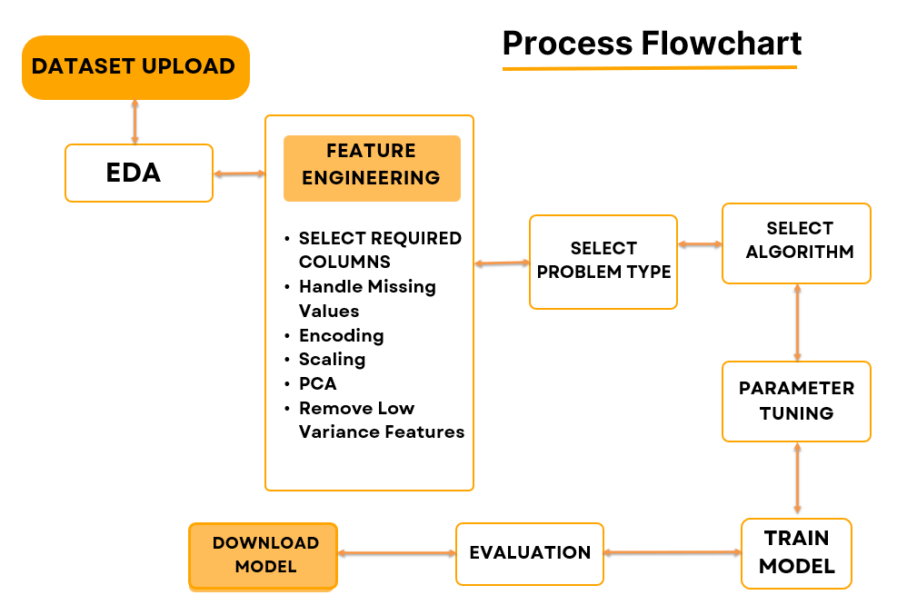

# { width="25" } Creation Ground: Machine Learning Experimentation Platform

## Welcome

**Creation Ground** is an interactive **no-code platform** for creating, customizing, and deploying **Machine Learning (ML) models**. It empowers users to **experiment, learn, and innovate** without requiring deep technical expertise or programming knowledge.

Whether you are a **student**, **researcher**, **data scientist**, or **business professional**, Creation Ground provides you with:

- Intuitive dataset upload and management capabilities
- Comprehensive **Exploratory Data Analysis (EDA)** and **feature engineering** tools
- Advanced model training with **full customization** options
- Detailed model evaluation and performance analysis
- Seamless model export for **production deployment**

---
{width="1000"} 

## Platform Highlights

- **No-Code Workflow** – Build complete ML pipelines without writing a single line of code
- **End-to-End Pipeline Control** – Complete workflow from data preprocessing to model deployment
- **Comprehensive Algorithm Library** – Multiple ML algorithms for classification and regression tasks
- **Interactive Visualizations** – Advanced EDA, feature analysis, and comprehensive evaluation reports
- **Flexible Deployment Options** – Support for local execution and cloud hosting environments
- **Professional Documentation** – Complete guides and best practices for all platform features

---

## Getting Started

### Video Tutorial
Watch our comprehensive platform walkthrough on Vimeo to get started quickly and understand all available features.

**[View Platform Tutorial on Vimeo →](https://vimeo.com/1109262360?share=copy)**

---

## Documentation Navigation

### Core Documentation
- [Platform Overview](00_overview.md)
- [Problem Statement & Solution](01_problem_statement.md)
- [Technology Stack](04_tech_stack.md)
- [System Architecture](05_architecture.md)

### User Guides
- [Data Upload & Exploratory Data Analysis](06_data_and_eda.md)
- [Model Training & Evaluation](08_training_and_evaluation.md)
- [Deployment & Integration](09_deployment_and_integration.md)

### Technical Documentation
- [Thesis Documentation](11_thesis_documentation.md)
- [Patent Documentation](12_patent.md)

---

## Live Platform Access

### Production Deployments
- **Primary Platform**: [creation-ground.streamlit.app](http://creation-ground.streamlit.app/)
- **Alternative Access**: [creation-ground.onrender.com](https://creation-ground.onrender.com)

> **Access Note:** If you encounter access restrictions, please contact the repository owner for permissions: [GitHub Repository](https://github.com/SAMxENGINEER/Creation-Ground)

---

## Platform Vision

Creation Ground draws inspiration from the creative freedom and experimental nature of sandbox environments, reimagined specifically for **machine learning experimentation and education**. Our platform philosophy centers on user empowerment: **you define the workflow**, **you control the process**, and **you learn through hands-on experience**.

> **"Democratizing Machine Learning through accessible, no-code experimentation."**

---

## Workflow Overview

The Creation Ground platform follows a systematic, user-guided approach to machine learning model development:

### Key Workflow Stages
1. **Data Upload & Validation** – Secure dataset import with automatic quality checks
2. **Exploratory Data Analysis** – Comprehensive data profiling and visualization
3. **Feature Engineering** – Intelligent preprocessing and feature optimization
4. **Model Training** – Algorithm selection and hyperparameter optimization
5. **Model Evaluation** – Performance assessment and validation
6. **Deployment Preparation** – Model export and integration guidance

---

## Support & Community

For technical support, feature requests, or collaboration opportunities, please reach out through our official channels or visit our GitHub repository for the latest updates and community discussions.
