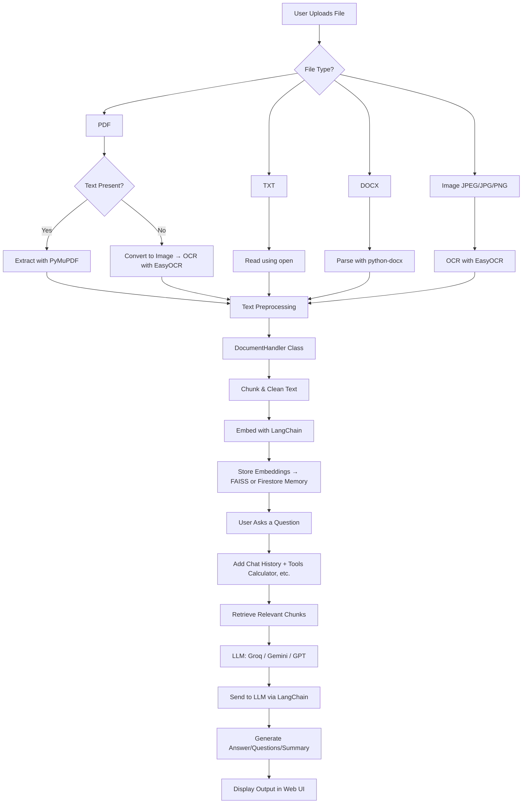

# Planning and Approach

## Overview

ExamPrompt AI is being developed as a comprehensive exam-preparation assistant that allows users to upload academic content—such as syllabi, notes, textbooks, or handwritten material—and receive AI-generated questions, answers, and summaries tailored to that content. The core idea is to transform static documents into interactive, personalized learning tools using a flexible and modular AI-driven pipeline.

---

## Document Handling Strategy

A key technical challenge lies in reliably extracting usable content from a wide range of document types. To address this, the system uses a hybrid extraction strategy based on file type and content structure.

### Supported Formats

| Format     | Strategy                                    |
|------------|---------------------------------------------|
| `.pdf`     | Extract text with PyMuPDF; fallback to OCR if scanned |
| `.txt`     | Directly read using Python file I/O         |
| `.docx`    | Parse using `python-docx`                   |
| `.jpg/.png`| OCR using EasyOCR                           |

### Smart Content Routing

- **Text-based files** are processed with direct parsers (`PyMuPDF`, `python-docx`, `open()`).
- **Scanned or handwritten content** is processed using **EasyOCR**.
- **Each page or section is auto-classified** to determine whether text is extractable or OCR is needed.

This layered approach ensures support for mixed documents and edge cases such as scanned PDFs with embedded tables or handwritten annotations.

---

## Processing Flow

---

1. **User Upload**
   - Supported formats: `.pdf`, `.txt`, `.docx`, `.jpg`, `.png`
   - Each file is inspected and routed to its appropriate parser

2. **Text Extraction**
   - Pages with digital text: parsed using PyMuPDF or python-docx
   - Image-only or scanned pages: processed using EasyOCR
   - Output is unified into a clean, structured format

3. **Preprocessing & Chunking**
   - Clean and normalize extracted text
   - Split into logical sections for easier embedding and context retrieval

4. **Embedding & Storage**
   - Use LangChain to generate vector embeddings
   - Store in memory or persistent store for similarity search

5. **Query & Generation**
   - User asks a question via frontend
   - Relevant chunks are retrieved and passed to the LLM
   - Response is generated using context-aware prompting

6. **Output**
   - Generated content is displayed (answers, summaries, or follow-up questions)
   - Users can interact further or modify input scope

---

## Design Principles

- **Robust Input Handling**: Built to support a wide variety of academic document formats
- **Modular Architecture**: Each processing stage is replaceable or upgradeable
- **User-Friendly Experience**: Minimal effort needed to get meaningful output
- **Scalability**: Designed to grow in complexity, scope, and performance
- **Extensibility**: Easy to integrate more file types, new models, or UI features

---

