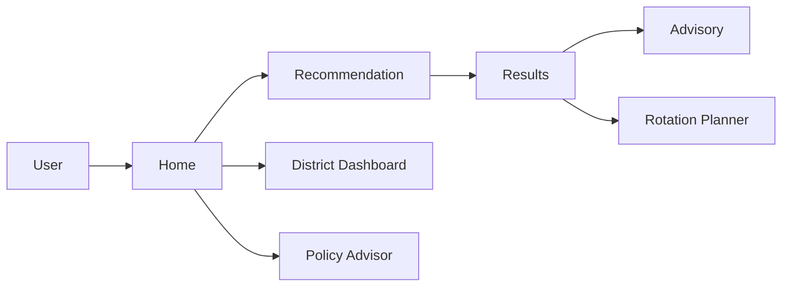

# Platform Overview

## Purpose

The platform provides district-aware agricultural decision support. It helps users identify crop opportunities, review district context, access advisory support, and explore policy resources in one unified experience.

## Core Capabilities

- Crop recommendation workflows using farmer-provided inputs.
- District intelligence view with region-specific planning context.
- Advisory interaction for practical field guidance.
- Crop rotation planning for season-to-season continuity.
- Policy and scheme discovery for public support programs.

## Product Modules

- **Home Experience**: Introduces value proposition and directs users into decision workflows.
- **Recommendation Experience**: Collects farming inputs and returns prioritized crop options.
- **Results Experience**: Presents recommendations with weather context and advisor access.
- **District Dashboard**: Displays district insights, risk highlights, and seasonal planning summaries.
- **Rotation Planner**: Guides next-crop selection from previous season crop.
- **Policy Advisor**: Organizes relevant support schemes and access routes.

## Functional Capability Graph

## Operational Value

- Reduces crop planning uncertainty with structured recommendations.
- Improves district-specific decision awareness.
- Connects planning with action through advisory and policy guidance.
- Supports repeated seasonal use with rotation and dashboard context.
