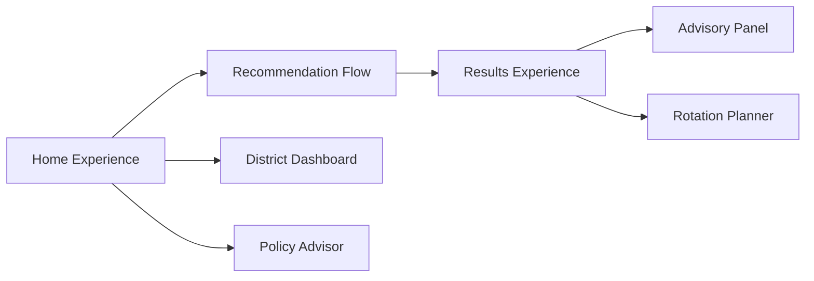
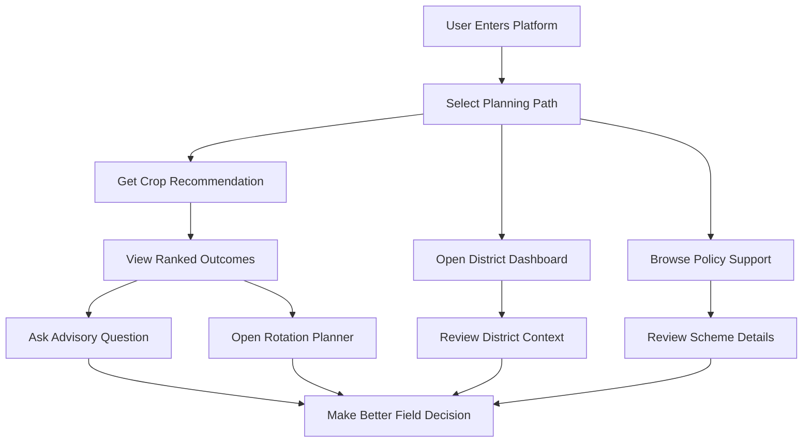

# Platform Overview

## Product Mission

The platform delivers district-aware agricultural planning support by combining recommendation workflows, contextual district information, advisory guidance, and policy access in one experience.

## Who This Platform Serves

- Farmers seeking seasonal crop decisions.
- Field support teams assisting local farming communities.
- Program coordinators guiding region-specific agricultural outcomes.

## Value Delivered

- Converts user-provided farm context into practical crop options.
- Connects recommendations with district-level planning intelligence.
- Enables follow-up advisory interaction for actionable clarity.
- Supports season-to-season continuity through crop rotation planning.
- Surfaces public support pathways through policy discovery.

## Capability Domains

### 1. Recommendation Intelligence

Provides structured crop suggestions using user and district context.

### 2. District Knowledge Access

Presents district summaries, risk indicators, and seasonal planning signals.

### 3. Advisory Guidance

Supports natural-language advisory prompts anchored in district context.

### 4. Rotation Continuity Planning

Guides users from prior crop choice to next-crop options and rationale.

### 5. Policy and Scheme Navigation

Provides searchable, categorized policy support references.

## Module Landscape

## Feature-Level Outcomes

- **Home Experience**: Enables quick entry into core workflows.
- **Recommendation Flow**: Captures farmer context and returns ranked crop options.
- **Results Experience**: Presents recommendations with situational context.
- **District Dashboard**: Supports planning with district-specific insights.
- **Advisory Panel**: Enables follow-up guidance after recommendations.
- **Rotation Planner**: Helps maintain healthy crop sequencing decisions.
- **Policy Advisor**: Helps users identify support schemes and access points.

## End-to-End Product Story

## Operational Principles

- User flows are designed for progressive decision support.
- District context is reused across multiple product interactions.
- Advisory and rotation capabilities extend recommendation decisions.
- Policy access complements technical guidance with support pathways.

## Success Indicators

A successful platform interaction is characterized by:

- User completion of at least one decision workflow.
- Clear understanding of recommended next action.
- Access to contextual information needed for local relevance.
- Ability to continue from recommendation to advisory or rotation planning.
