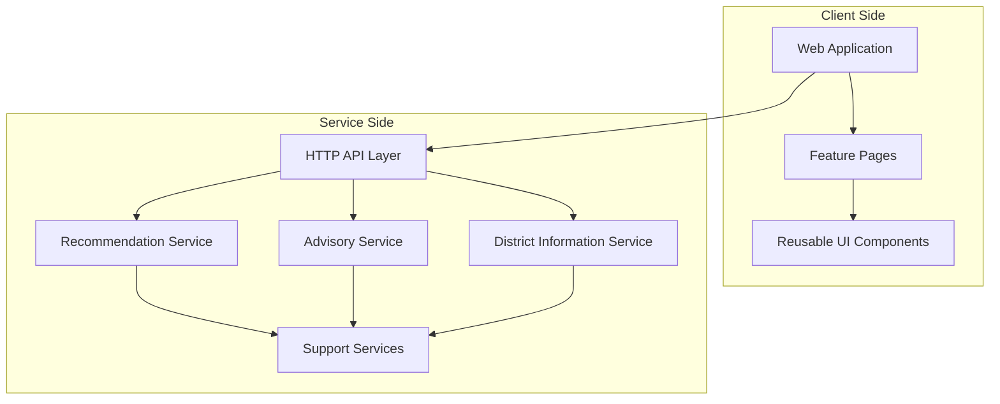
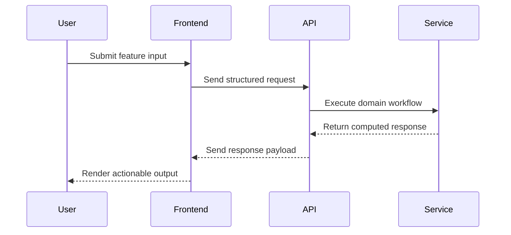

# System Architecture

## Architecture Summary

The platform follows a two-tier architecture:

- **Frontend Application Layer** for user interaction and journey orchestration.
- **Backend Service Layer** for recommendation logic, advisory generation, and district data delivery.

## Component Topology

## Runtime Interaction Model

1. User actions in the web interface trigger feature-specific API calls.
2. API layer routes requests to dedicated domain services.
3. Services assemble contextual outputs and return normalized responses.
4. Frontend renders recommendation, advisory, and district outcomes.

## Request Lifecycle Flow

## Cross-Cutting Concerns

- Unified API access model for all major product capabilities.
- Consistent district-context behavior across recommendation and advisory experiences.
- Shared language-aware interface behavior for multilingual usability.
