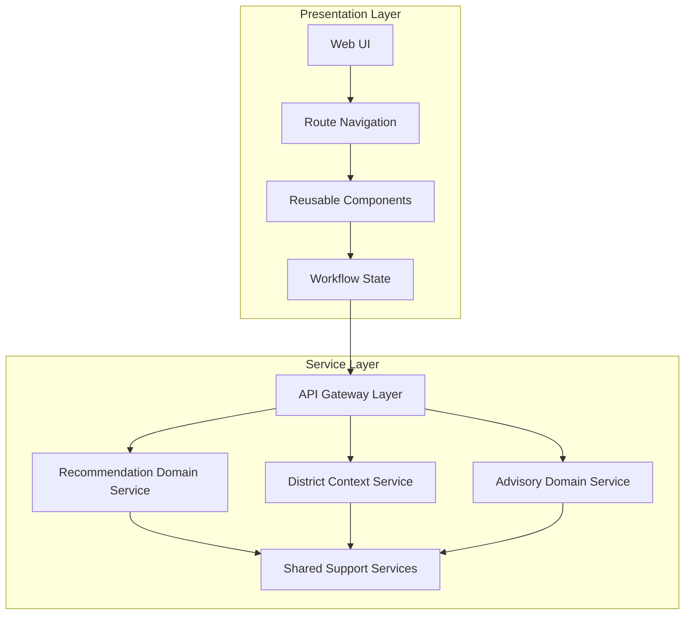
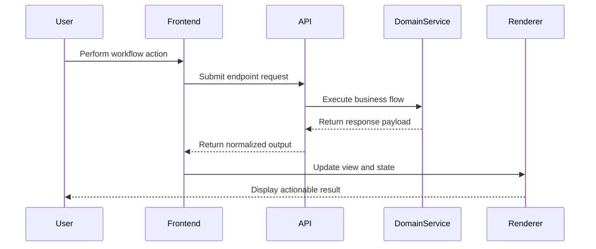
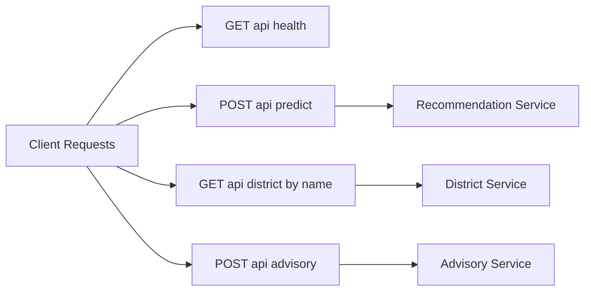

# System Architecture

## Architectural Style

The platform uses a client-service architecture with clear separation between user interaction and domain service execution.

- **Frontend Layer**: Handles navigation, forms, presentation, and workflow progression.
- **Backend Layer**: Handles recommendation processing, advisory generation, and district context delivery.

## Architecture Stack View

## Runtime Communication Model

- Frontend initiates request by user action.
- API endpoint resolves target domain workflow.
- Domain service executes context-driven logic.
- Response is normalized and returned to frontend.
- Frontend updates the active view and next possible actions.

## Core Domain Service Responsibilities

### Recommendation Domain Service

- Interprets recommendation request context.
- Produces prioritized crop options.
- Returns recommendation outputs with explanatory metadata.

### District Context Service

- Resolves district-specific information view.
- Supplies planning-oriented contextual payloads.

### Advisory Domain Service

- Interprets user advisory prompts.
- Composes context-aware response text.

## System Interaction Sequence

## Request Routing Topology

## Architectural Consistency Patterns

- Unified API prefix for domain endpoint discoverability.
- Consistent request-to-response lifecycle across features.
- Shared district context model reused by multiple workflows.
- Modular frontend pages aligned to domain capabilities.

## Reliability and Extensibility (High Level)

- Modular service partitioning supports capability evolution.
- Decoupled frontend modules support independent UX refinements.
- Contracted endpoint behavior supports integration stability.
