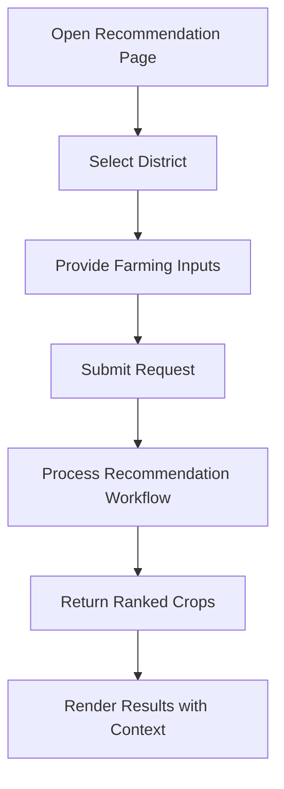
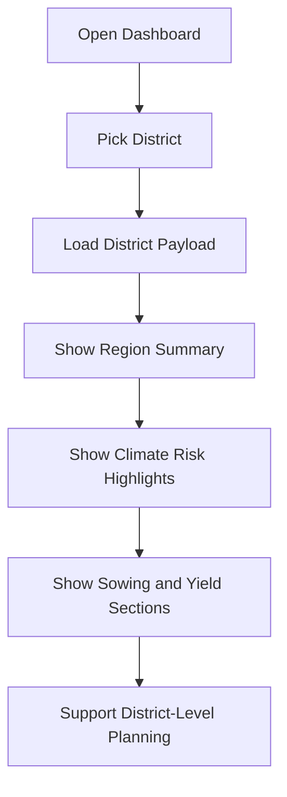
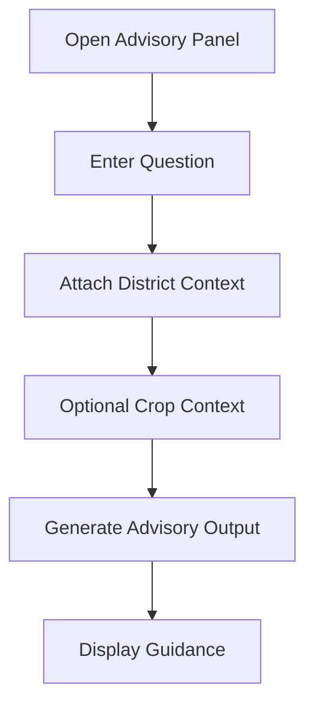
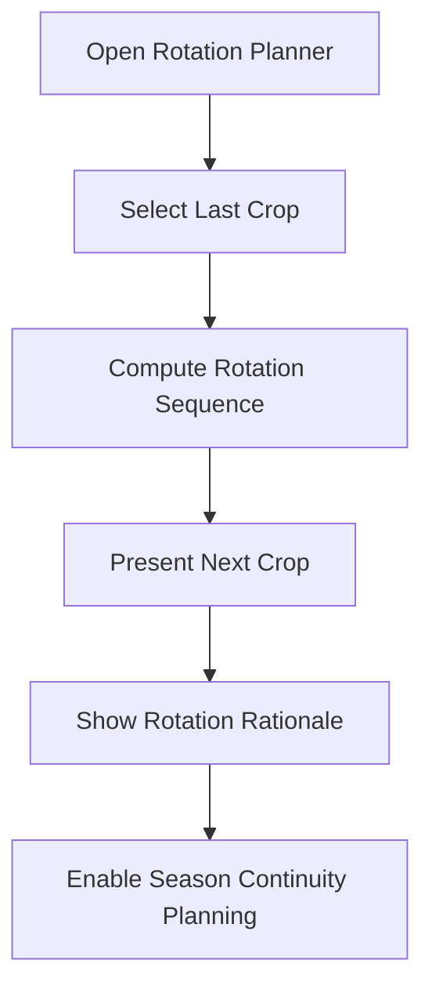
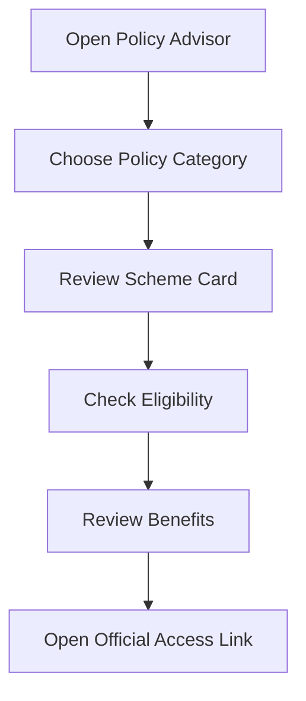
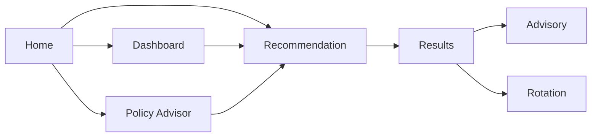
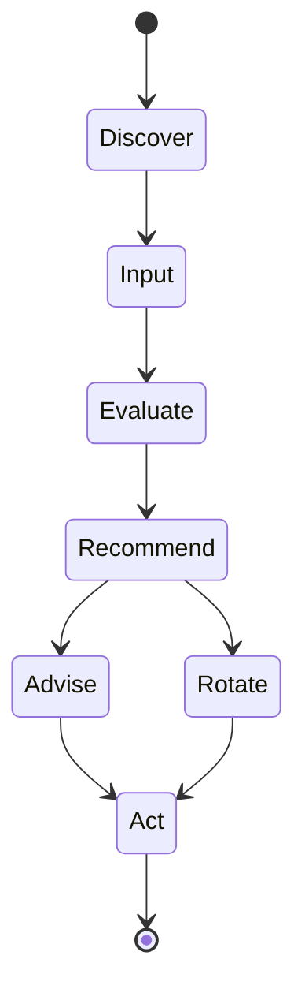

# User Journeys and Workflows

## Journey Catalog

1. Crop Recommendation Journey
2. District Intelligence Journey
3. Advisory Guidance Journey
4. Crop Rotation Journey
5. Policy Discovery Journey

## 1) Crop Recommendation Journey

### Objective

Help users obtain a practical ranked list of crop options using submitted context.

### Flow

### User Decisions Supported

- Compare top crop options.
- Choose next action: advisory follow-up or rotation planning.

## 2) District Intelligence Journey

### Objective

Provide planning context for a selected district.

### Flow

### User Decisions Supported

- Understand local planning context.
- Align crop planning with district conditions.

## 3) Advisory Guidance Journey

### Objective

Provide follow-up guidance in response to user questions.

### Flow

### User Decisions Supported

- Clarify recommended actions.
- Translate recommendation into field-level next steps.

## 4) Crop Rotation Journey

### Objective

Recommend next crop direction based on previously grown crop.

### Flow

### User Decisions Supported

- Plan what to grow next.
- Understand continuity logic between seasons.

## 5) Policy Discovery Journey

### Objective

Help users identify relevant support schemes and access channels.

### Flow

### User Decisions Supported

- Identify suitable support programs.
- Move from awareness to application channel.

## Cross-Journey Transition Map

## Lifecycle State View

## Journey Design Notes

- Journeys are independent yet connected.
- Recommendation and results act as the central decision hub.
- District and policy journeys can be entered directly or used as support context.
