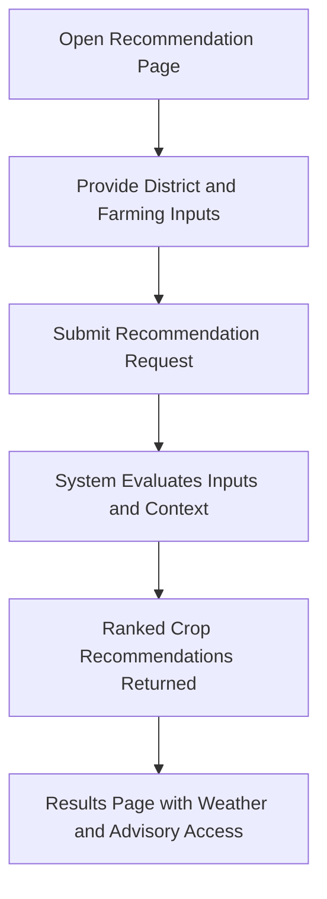
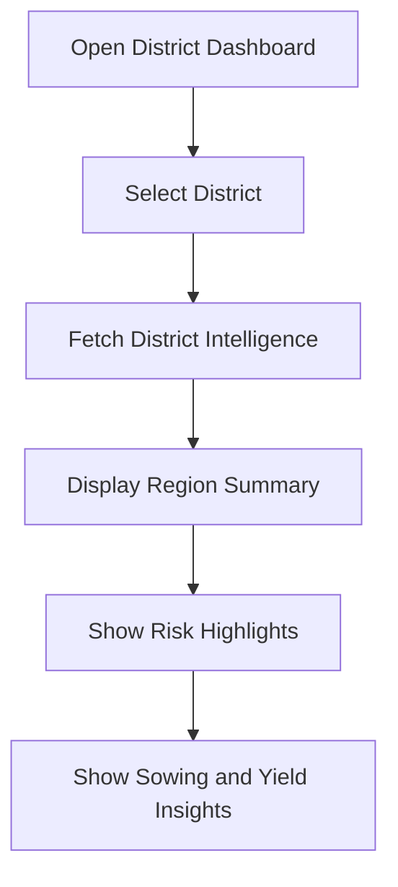
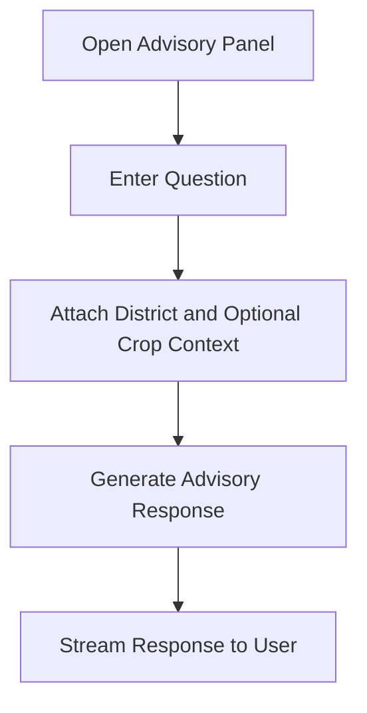
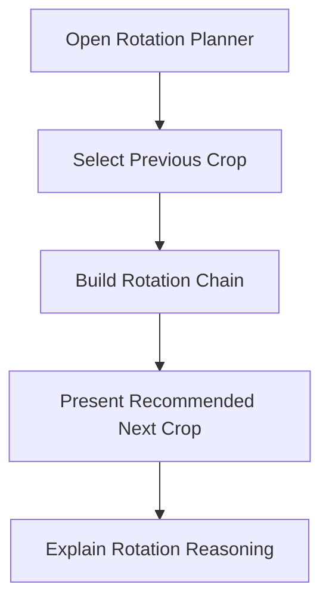
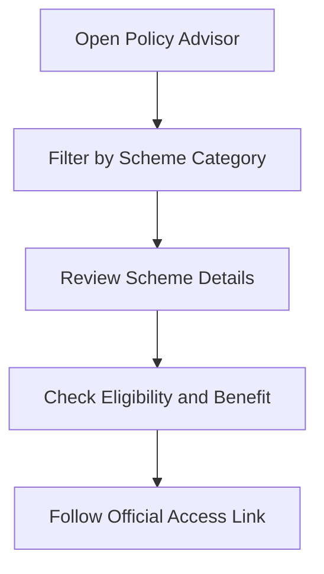
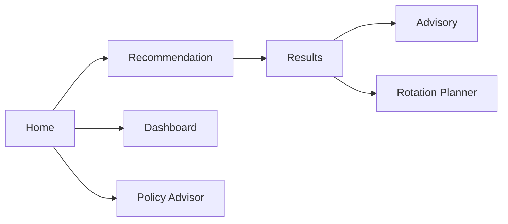

# User Journeys and Workflows

## Journey 1: Crop Recommendation

This journey supports users in obtaining a ranked set of crop options with current context.

## Journey 2: District Intelligence Review

This journey supports district-level planning and seasonal awareness.

## Journey 3: Advisory Interaction

This journey supports targeted question-based guidance.

## Journey 4: Crop Rotation Planning

This journey helps users identify next-season crop continuity.

## Journey 5: Policy Discovery

This journey helps users identify support schemes and official channels.

## End-to-End Multi-Journey Map

