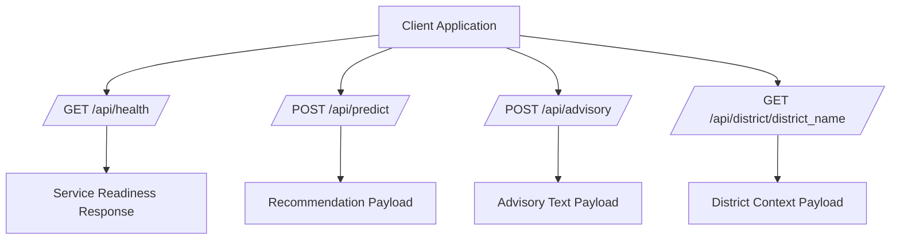
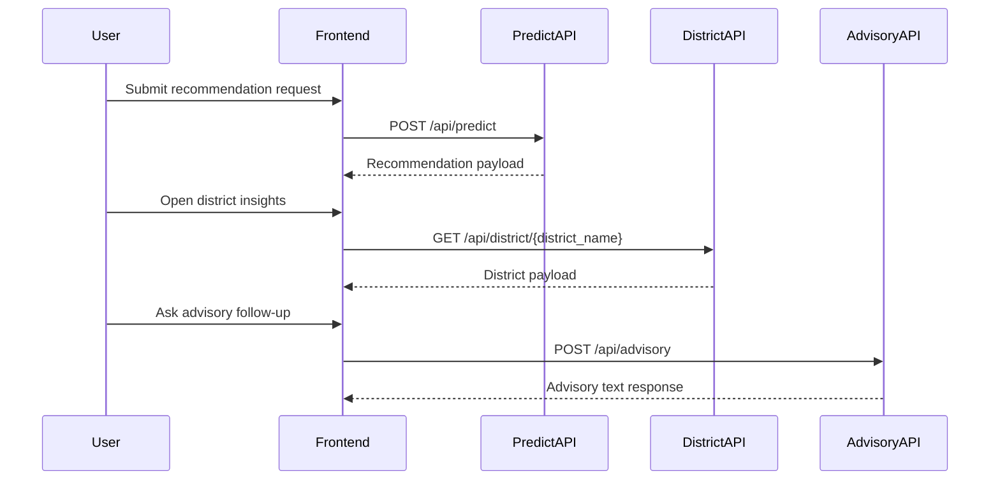

# Service Contracts

## Contract Philosophy

Service contracts are designed to be predictable, minimal, and integration-friendly. Each endpoint maps to a specific product capability and returns a response shape suitable for direct UI consumption.

## Endpoint Inventory

- `GET /api/health`
- `POST /api/predict`
- `POST /api/advisory`
- `GET /api/district/{district_name}`

## Contract Topology

## 1) Health Endpoint Contract

### Purpose

Expose service readiness for monitoring and runtime verification.

### Request

- Method: `GET`
- Path: `/api/health`

### Response Semantics

- Returns a simple status confirmation payload.
- Suitable for uptime checks and environment validation.

## 2) Recommendation Endpoint Contract

### Purpose

Return prioritized crop recommendations based on submitted planning context.

### Request

- Method: `POST`
- Path: `/api/predict`
- Conceptual request fields include:
  - District identifier
  - Input mode selection
  - Farming and seasonal context

### Response Semantics

- District label context.
- Current month context.
- Weather summary context.
- Ranked recommendation list with explanatory metadata.

### Behavioral Contract

- Valid inputs return structured recommendation output.
- Invalid or incomplete inputs return validation feedback.

## 3) Advisory Endpoint Contract

### Purpose

Generate contextual advisory guidance from user queries.

### Request

- Method: `POST`
- Path: `/api/advisory`
- Conceptual request fields include:
  - Advisory question
  - District context
  - Optional crop context

### Response Semantics

- Plain-text advisory response for direct rendering in advisory UI.

### Behavioral Contract

- Response is context-aware and tied to provided district/crop scope.
- Can be displayed progressively in interactive advisory interfaces.

## 4) District Endpoint Contract

### Purpose

Return district information used across planning and dashboard features.

### Request

- Method: `GET`
- Path: `/api/district/{district_name}`

### Response Semantics

- District-level context payload for dashboard rendering.
- Includes planning-oriented regional sections.

### Behavioral Contract

- Known district values return district payload.
- Unknown district values return not-found response behavior.

## End-to-End Interaction Sequence

## Integration Guidance

- Treat endpoints as capability-specific contracts.
- Preserve request field meaning across clients.
- Use response semantics as the source for UI rendering logic.
- Keep client-side fallback handling aligned with endpoint behavior.

## Contract Evolution Guidance

When extending services:

1. Maintain backward-compatible field meaning where possible.
2. Add new response elements as optional-first for client safety.
3. Update this document’s endpoint section and diagrams together.
4. Validate changes against all journey dependencies.
