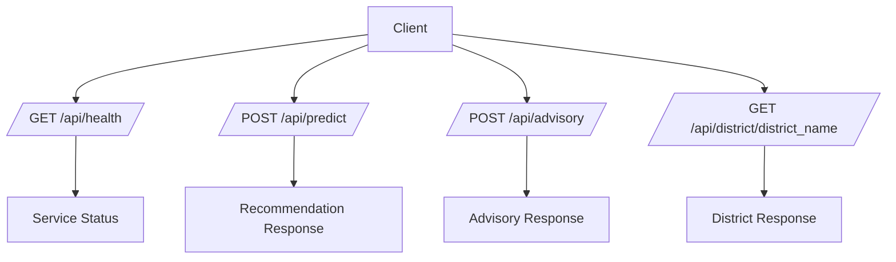
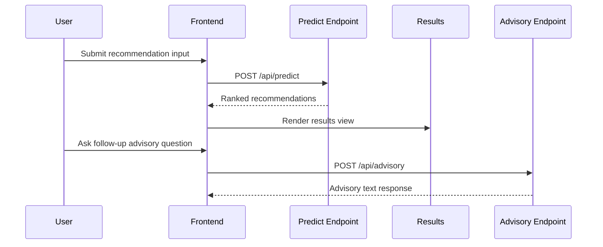

# Service Contracts

## Contract Style

All service interactions use clear request/response contracts over HTTP. Responses are normalized for frontend rendering and user decision clarity.

## Endpoint Catalog

- `GET /api/health`
- `POST /api/predict`
- `POST /api/advisory`
- `GET /api/district/{district_name}`

## Contract Diagram

## Health Contract

### Request

- Method: `GET`
- Path: `/api/health`

### Response

- Status indicator payload confirming service readiness.

## Recommendation Contract

### Request

- Method: `POST`
- Path: `/api/predict`
- Expected conceptual fields:
  - District context
  - Soil/farming inputs
  - Seasonal selection behavior

### Response

- District label and current month context.
- Weather context summary.
- Ranked recommendation list with reasoning metadata.

## Advisory Contract

### Request

- Method: `POST`
- Path: `/api/advisory`
- Expected conceptual fields:
  - Farmer question
  - District context
  - Optional crop context

### Response

- Text advisory output designed for practical field interpretation.

## District Information Contract

### Request

- Method: `GET`
- Path: `/api/district/{district_name}`

### Response

- District intelligence payload including planning-oriented regional context.

## Interaction Sequence for Recommendation + Advisory

