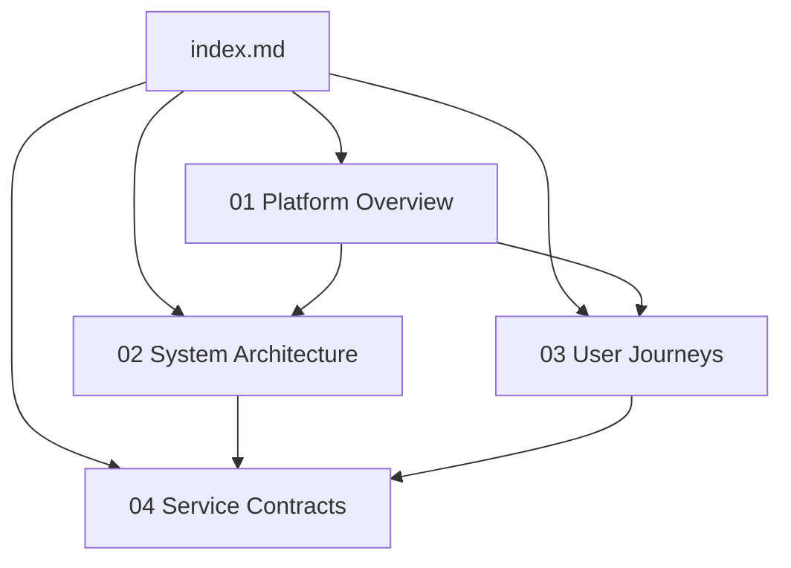

# Project Documentation Index

This documentation suite is the canonical guide for the platform. It documents the system as a complete product and explains how users, modules, and services interact to deliver agricultural decision support.

## Documentation Goals

- Provide a complete product-facing understanding of platform behavior.
- Enable onboarding for product, operations, and integration teams.
- Document stable contracts and end-to-end interaction flow.
- Preserve safety by excluding confidential implementation internals.

## Documentation Set

1. [Platform Overview](./01-platform-overview.md)
2. [System Architecture](./02-system-architecture.md)
3. [User Journeys and Workflows](./03-user-journeys.md)
4. [Service Contracts](./04-service-contracts.md)

## Suggested Reading Paths

### Product Orientation Path

1. Start with **Platform Overview**.
2. Read **User Journeys and Workflows**.
3. Review **Service Contracts**.

### Technical Orientation Path

1. Start with **System Architecture**.
2. Review **Service Contracts**.
3. Read **User Journeys and Workflows** for runtime behavior.

### Operations Orientation Path

1. Start with **Platform Overview**.
2. Review **System Architecture**.
3. Use **Service Contracts** for interface validation.

## Scope Boundaries

This suite intentionally focuses on:

- Product capabilities and module behavior.
- Integration-facing service interfaces.
- User and system workflow sequencing.

This suite intentionally excludes:

- Source-level coding details.
- Internal persistence structures.
- Confidential operational limitations.

## Documentation Dependency Graph

## Responsibility Model

- `index.md` is the navigation root.
- `01-platform-overview.md` defines product scope and module purpose.
- `02-system-architecture.md` defines runtime structure and service topology.
- `03-user-journeys.md` defines user-centered process behavior.
- `04-service-contracts.md` defines integration-level API expectations.

## Maintenance Guidance

When platform behavior changes:

1. Update the affected module section first.
2. Update related diagrams in the same file.
3. Re-check cross-links in `index.md`.
4. Confirm terminology consistency across all documents.
