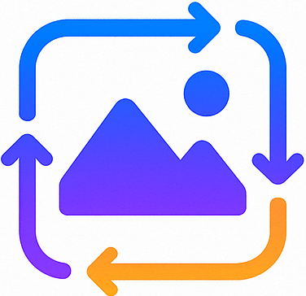

# {width="30"} Features

**ImgTechAI** brings together a wide range of image processing and computer vision techniques under a single, user-friendly web interface. The following categories summarize the core features:

---

## 🧠 Segmentation & Edge Detection

* **Binary Thresholding** – Simple segmentation using fixed intensity threshold.
* **Adaptive Thresholding** – Localized thresholding suitable for varying illumination.
* **Otsu Thresholding** – Automatic optimal threshold selection.
* **Watershed Segmentation** – Separates touching or overlapping objects.
* **K-Means Clustering** – Color-based segmentation into clusters.
* **Canny Edge Detection** – Standard edge detection method.
* **Sobel Edge Detection** – Gradient-based edge detection.

## 🌀 Fourier Transform & Frequency Analysis

* **2D FFT (Fast Fourier Transform)** – Frequency domain conversion.
* **Magnitude Spectrum** – Visualization of frequency components.
* **Phase Spectrum** – Display of phase information.
* **Frequency Filtering** – Low-pass, high-pass, and band-pass filters.
* **Inverse FFT** – Reconstruction of image from frequency domain.

## 🔍 Filtering & Smoothing

* **Gaussian Blur** – Noise reduction using Gaussian kernel.
* **Image Sharpening** – Enhances edges and details.
* **Median Filter** – Removes salt-and-pepper noise.

## 🎨 Color & Pixel Transformations

* **Grayscale Conversion** – Monochrome image conversion.
* **Color Jitter** – Adjust brightness and contrast.
* **Channel Shuffle** – Reorder RGB channels (6 variations + random).
* **Hue Shift** – Modify image hue.
* **Saturation Adjustment** – Control color intensity.

## 🧪 Noise Injection

* **Gaussian Noise** – Add normally distributed noise.
* **Salt & Pepper Noise** – Add random black and white pixels.
* **Uniform Noise** – Add uniformly distributed random noise.

## 🌈 Histogram & Contrast Enhancements

* **Histogram Equalization** – Improve global contrast.
* **Gamma Correction** – Non-linear brightness adjustments.
* **CLAHE** – Adaptive contrast enhancement.
* **Logarithmic Transform** – Enhance dark regions.

## 🔄 Geometric Transformations

* **Rotation** – Rotate images at custom angles.
* **Scaling** – Resize with smart cropping/padding.
* **Shear Transform** – Apply geometric shear.

## 📦 Image Augmentations

* **Cutout (Random Erasing)** – Mask out rectangular patches.
* **Mixup Effect** – Blend with random patterns.

---

## Visual Identity

To improve readability and branding, images and icons should be included in the documentation:

* **Logo Placement**: Add the `static/IMAGE_TECH_AI.png` logo at the top of **index.md** and **00\_idea\_spark.md** to establish project identity.
* **Favicon**: Use `static/IMAGE_TECH_AI_favicon.png` in browser previews and optionally include it in **03\_features.md** as a small inline icon.
* **Feature Illustrations**: Screenshots of transformations (e.g., before & after Gaussian Blur, Canny Edge Detection) should be embedded in this file after each feature category.

> ✅ Suggested placement: After each major feature section (Segmentation, Fourier, Filtering, etc.), insert a representative example image. This will help users connect textual descriptions with visual outcomes.
