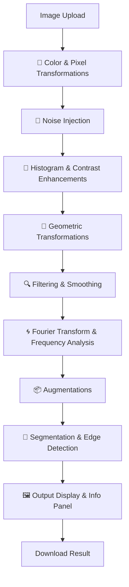

# Architecture

The architecture of **ImgTechAI** is intentionally lightweight, prioritizing simplicity, modularity, and real-time interactivity. It follows a client-server model enabled by Streamlit.

---

## 📁 Project Structure

```
ImgTechAI/
├── app.py                          # Main Streamlit application
├── static/
│   ├── IMAGE_TECH_AI.png          # Application logo
│   └── IMAGE_TECH_AI_favicon.png  # Browser favicon
├── README.md                       # Project overview and instructions
└── requirements.txt                # Python dependencies
```

---

## 🏗️ Core Components

1. **Frontend Layer (Streamlit UI)**

   * Provides the interactive web interface.
   * Sidebar for selecting transformations and tuning parameters.
   * Main area for displaying original and transformed images.
   * Real-time image information and transformation summary.

2. **Processing Layer (Image Operations)**

   * Powered by **OpenCV**, **NumPy**, **scikit-image**, and **Pillow**.
   * Handles transformations such as filtering, segmentation, augmentation, and Fourier analysis.
   * Organized into categories: color/pixel, noise, histogram, geometric, smoothing, augmentations, Fourier, segmentation.

3. **Output Layer**

   * Displays processed images alongside the original.
   * Provides detailed image information (size, channels, format, memory usage).
   * Enables download of final results as PNG.

---

## 🔄 Processing Pipeline

The internal pipeline ensures consistent ordering of transformations for predictable results:

1. **Image Input** – Upload via file uploader (JPG/JPEG/PNG).
2. **Color & Pixel Transformations**
3. **Noise Injection**
4. **Histogram & Contrast Enhancements**
5. **Geometric Transformations**
6. **Filtering & Smoothing**
7. **Fourier Transform & Frequency Analysis**
8. **Augmentations**
9. **Segmentation & Edge Detection**
10. **Result Output** – Display, info panel, download option.

---

## 🌐 Deployment Model

* **Local Execution** – Run `streamlit run app.py` on any machine with Python and dependencies installed.
* **Cloud Hosting** – Deploy seamlessly to **Streamlit Cloud**, making ImgTechAI accessible through a web link.

---

## Visual Representation


