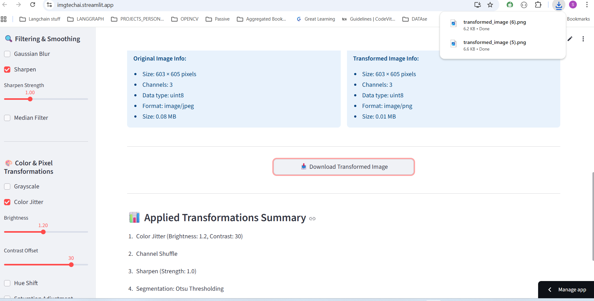

# Usage Guide


This section provides a detailed walkthrough of how to use **ImgTechAI** for image transformation and exploration.

---

### Step 1: Launch the Application

* Run the application locally using:

  ```bash
  streamlit run app.py
  ```

* Open [http://localhost:8501](http://localhost:8501) in your web browser.
* Alternatively, try the **live deployed version** here: [https://imgtechai.streamlit.app/](https://imgtechai.streamlit.app/)

---

### Step 2: Upload an Image

* Click **Upload an Image**.
* Select a file in **JPG, JPEG, or PNG** format.
* The uploaded image will appear in the main display area.

---

### Step 3: Explore Transformations

* Use the **sidebar** on the left to select transformations.
* Categories include:

  * Segmentation & Edge Detection
  * Fourier Transform
  * Filtering & Smoothing
  * Color & Pixel Transformations
  * Noise Injection
  * Histogram & Contrast Enhancements
  * Geometric Transformations
  * Image Augmentations

> Each transformation provides adjustable sliders and controls for parameters.


---

### Step 4: Adjust Parameters

* Fine-tune transformations interactively.
* Example:

  * Adjust brightness and contrast in **Color Jitter**.
  * Set threshold values in **Canny Edge Detection**.
  * Modify cluster count in **K-Means Segmentation**.

Changes update in real-time on the **Transformed Image** panel.

---

### Step 5: Compare Results

* The interface shows:

  * **Original Image** (left column)
  * **Transformed Image** (right column)
* Image information is displayed below each preview:

  * Dimensions (width × height)
  * Number of channels
  * Data type
  * Format
  * File size

---

### Step 6: Download Transformed Image

* Scroll down and click **Download Transformed Image**.
* The image will be saved in PNG format for reuse.

---

### Step 7: Review Transformation Summary

* At the bottom, a **📊 Applied Transformations Summary** section lists:

  * Names of applied transformations
  * Parameter values used
  * Order of processing



This summary is especially useful for reproducibility and research workflows.

---

With these steps, users can easily transform, analyze, and download images using ImgTechAI’s intuitive interface.
