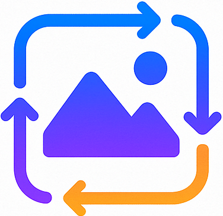

# ImgTechAI Documentation

Welcome to the official documentation of **ImgTechAI** — a web-based image processing and computer vision application built with Streamlit. This documentation provides insights into the motivation, design, features, setup, and deployment of the project.

---

## 🌟 Quick Links

* **Live App**: [https://imgtechai.streamlit.app/](https://imgtechai.streamlit.app/)
* **Source Code**: [https://github.com/SAMxENGINEER/ImgTechAI](https://github.com/SAMxENGINEER/ImgTechAI)
* **Demo Video**: [Vimeo Link](https://vimeo.com/1114447021?share=copy#t=60.019)

---

## 📑 Documentation Structure

* [00\_idea\_spark.md](00_idea_spark.md) – Project inspiration and motivation
* [01\_problem\_statement.md](01_problem_statement.md) – Challenges identified and problem framing
* [02\_planning.md](02_planning.md) – Planning, objectives, scope, and milestones
* [03\_features.md](03_features.md) – Comprehensive list of features and capabilities
* [04\_tech\_stack.md](04_tech_stack.md) – Technologies and libraries powering ImgTechAI
* [05\_architecture.md](05_architecture.md) – Application structure and processing pipeline
* [06\_setup\_and\_usage.md](06_setup_and_usage.md) – Setup instructions and usage details
* [07\_usage\_guide.md](07_usage_guide.md) – Step-by-step guide for using the application
* [08\_transformation\_reference.md](08_transformation_reference.md) – Transformation catalog and parameter details
* [09\_deployment.md](09_deployment.md) – Deployment methods and best practices

---

## Visual Identity

* **Logo**
  
{width="500"}

* **Favicon**:

{width="200"}

---

## Purpose

ImgTechAI was created to bridge the gap between **advanced computer vision algorithms** and **accessible, no-code interfaces**. It empowers students, researchers, developers, and creatives to experiment with transformations interactively, without needing deep coding knowledge.

---

## 🙌 Acknowledgments

* Built with [Streamlit](https://streamlit.io/)
* Powered by [OpenCV](https://opencv.org/) and [scikit-image](https://scikit-image.org/)
* Image handling by [Pillow](https://python-pillow.org/)
* Numerical computing by [NumPy](https://numpy.org/)

---

Ready to try ImgTechAI? Head over to the **[Live App](https://imgtechai.streamlit.app/)** and explore image transformations right from your browser!
