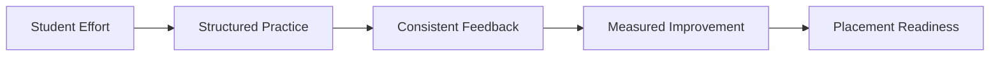
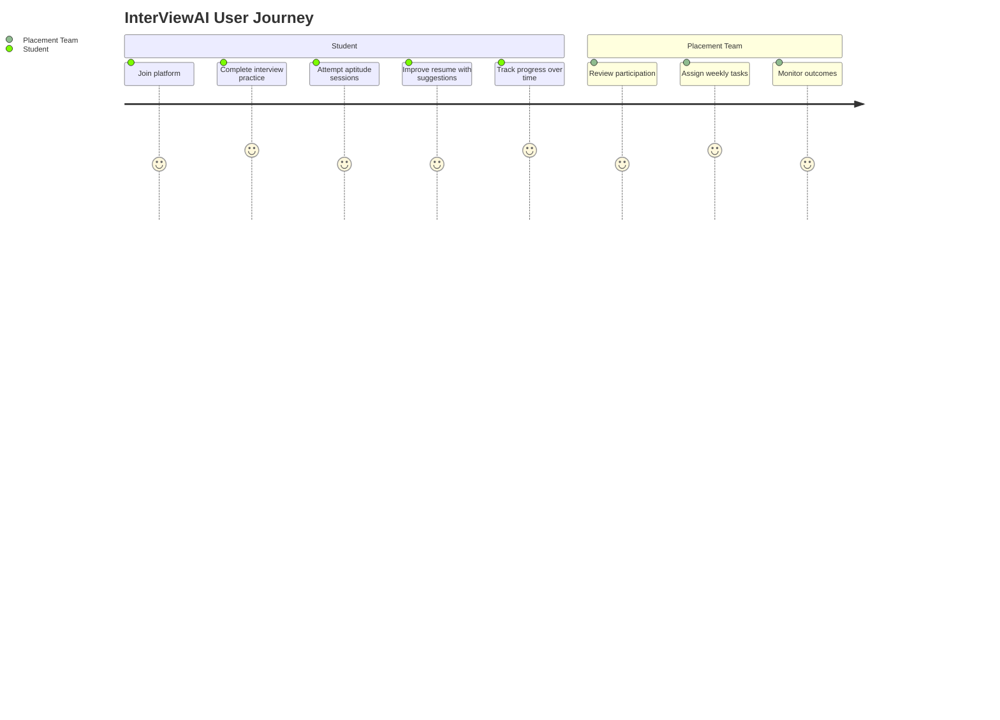

# 01. Project Overview

## What is InterViewAI?

InterViewAI helps students prepare for placements through guided interview practice, aptitude preparation, and resume improvement.

It is built for two primary users:

- Students: Practice, improve, and track readiness.
- Placement Teams: Organize preparation activities and monitor progress.

## Why this project exists

Many students do not get enough structured interview practice before campus drives. InterViewAI solves this by creating a consistent preparation flow in one place.

Common gaps InterViewAI targets:

- Irregular mock interview exposure before real placement rounds
- Limited structured feedback after practice attempts
- No single workspace for interview, aptitude, and resume readiness
- Difficulty for placement teams to track cohort-level preparedness

## Core value

- Better preparation through regular practice
- Faster feedback loops
- Clear progress visibility for students and staff

## Vision

InterViewAI aims to become a practical preparation companion that turns scattered pre-placement effort into a repeatable weekly system.

## Who can use it

- Colleges and training cells
- Final-year students preparing for internships and full-time roles
- Placement coordinators managing interview readiness programs

## Primary user profiles

### Student persona

- Wants realistic interview practice before company rounds
- Needs quick feedback and clear next steps for improvement
- Prefers one place to track interview and aptitude readiness

### Placement team persona

- Needs visibility into how prepared students are each week
- Wants a workflow to assign and monitor preparation tasks
- Requires simple reporting for mentoring and planning

## Problem-to-solution mapping

| Problem | InterViewAI approach |
|---|---|
| Practice is inconsistent | Weekly and repeatable practice workflow |
| Feedback is delayed or generic | Session-based feedback for each attempt |
| Students are unsure of progress | Progress view across attempts |
| Staff cannot track everyone quickly | Centralized student activity and outcomes |

## High-level journey

## Success outcomes

InterViewAI is built to drive outcomes that matter to both users:

- Students practice more consistently before real interviews
- Preparation quality improves through repeated feedback cycles
- Placement teams make decisions using visible progress signals
