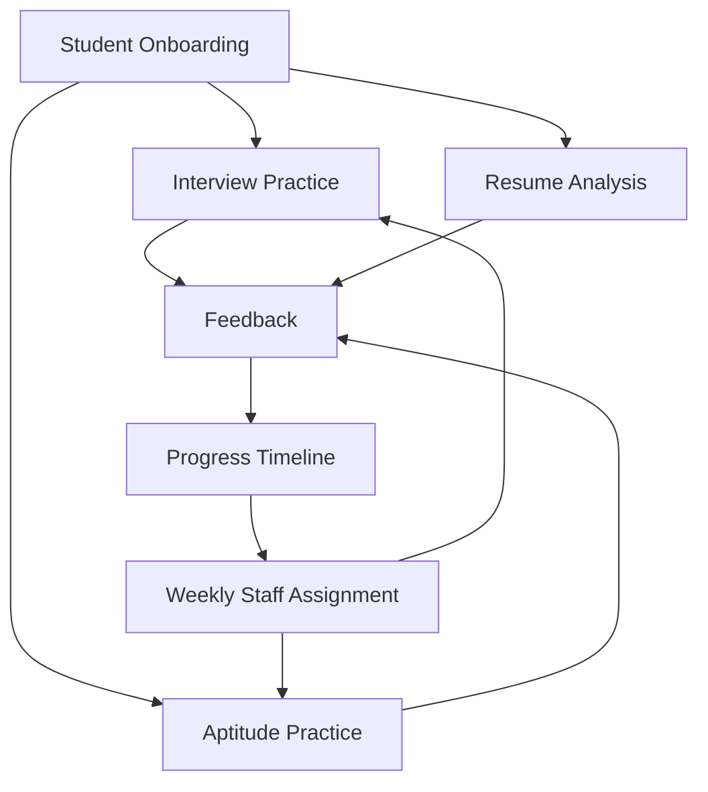
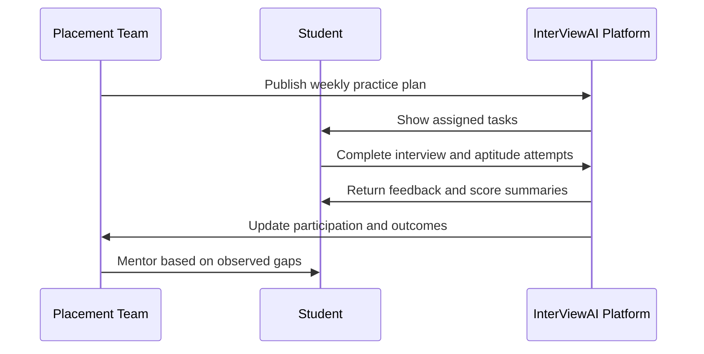

# 02. Features and Experience

## Student experience

InterViewAI currently provides:

- Mock interview practice for multiple interview styles
- Aptitude practice sessions
- Resume upload and analysis with actionable suggestions
- Progress timeline to review past attempts and improvement trends
- Weekly assigned practice tasks from placement staff

### Student value by feature

| Feature | What the student gets |
|---|---|
| Mock interviews | Practice in interview-like flow with guided response structure |
| Aptitude sessions | Fast preparation for objective and problem-solving rounds |
| Resume analysis | Actionable improvement points for stronger application quality |
| Progress timeline | Confidence through visible attempt history and trends |
| Scheduled tasks | Clear weekly focus instead of random preparation |

## Placement team experience

Placement teams can:

- Review and manage student participation
- Create weekly preparation activities
- Maintain question sets for aptitude practice
- View performance summaries for better mentoring

### Placement team outcomes

- Better consistency in student preparation activity
- Easier identification of students needing extra support
- Structured mentoring conversations based on actual attempts

## Typical user flow

1. Student joins the platform.
2. Student starts practice sessions (interview, aptitude, resume).
3. Student receives feedback and improvement suggestions.
4. Placement team tracks readiness and assigns next-week activities.

## Feature groups

### Practice layer

- Interview preparation
- Aptitude preparation
- Guided task completion

### Feedback layer

- Session-level feedback summaries
- Resume improvement suggestions
- Attempt-based performance signals

### Management layer

- Weekly assignment workflow for staff
- Student participation overview
- Cohort progress visibility

## Example weekly cycle

## What users get immediately

- A clearer picture of interview readiness
- Regular practice structure
- Practical feedback instead of only theoretical preparation

## Experience principles

InterViewAI documentation and product direction follow these principles:

- Keep preparation practical and repeatable
- Keep feedback understandable and actionable
- Keep staff workflows simple and trackable
