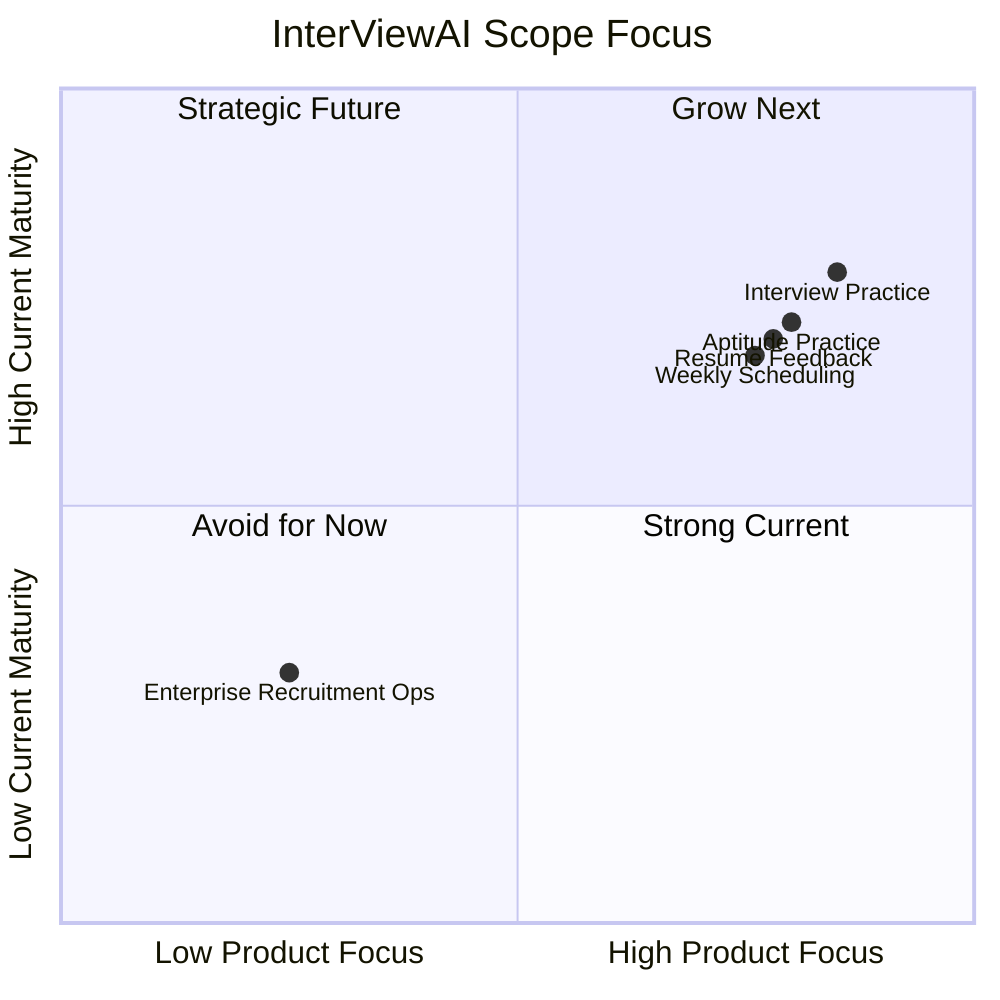
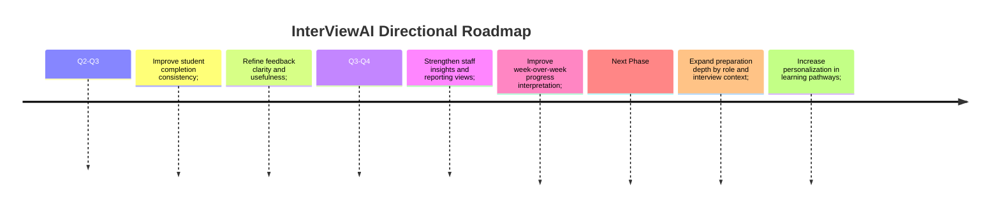

# 03. Current Scope

## What is available now

InterViewAI is focused on interview readiness and preparation workflows.

Current scope includes:

- Interview practice support
- Aptitude preparation support
- Resume feedback support
- Progress tracking support
- Staff-led schedule and activity management

## Scope boundaries

The current release is intentionally focused and does not try to solve every placement workflow.

In scope today:

- Interview and aptitude readiness support
- Resume improvement support
- Weekly preparation orchestration
- Student progress visibility for mentoring

Out of scope for now:

- Public benchmarking against external institutions
- Deep recruiter-side enterprise workflow automation
- Full end-to-end campus hiring operations suite

## Public-safe note

This documentation intentionally avoids internal implementation details, private configurations, and system-level technical specifics.

Content deliberately excluded:

- Internal architecture diagrams and infrastructure topology
- Private API contracts and endpoint-level behavior
- Security internals, credentials strategy, and environment setup specifics
- Proprietary logic that could create product or operational risk if published

## Product direction (high level)

Near-term focus is to make the learning loop stronger:

- More consistent student engagement
- Better feedback quality
- Smoother staff monitoring and reporting

## Roadmap themes

## How to read this documentation

- Start with `01_project_overview.md` for purpose and user fit
- Continue with `02_features_and_experience.md` for usage and flows
- Use this page to understand the current limits and direction

## Status

InterViewAI is actively evolving, and feature depth will continue to expand based on user feedback and placement outcomes.
