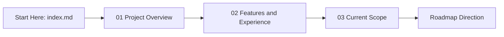

# InterViewAI

InterViewAI is an AI-powered interview preparation platform designed for students and placement teams.

This documentation is intentionally public-safe and focuses on what users can do today.

## Live Deployment

- Current live app: [https://interviewai-q5ip.onrender.com/](https://interviewai-q5ip.onrender.com/)

## Documentation Purpose

This section explains InterViewAI from a product and user perspective:

- What problem the project solves
- What features are currently available
- What is in scope right now and what is intentionally out of scope
- Where the product is heading next

## Read Order

- [01. Project Overview](./01_project_overview.md)
- [02. Features and Experience](./02_features_and_experience.md)
- [03. Current Scope](./03_current_scope.md)

## Quick Navigation Map

## What You Will Learn

By reading these pages, a new viewer should quickly understand:

- Who InterViewAI is built for
- How students and placement teams use it
- What outcomes it is designed to improve
- What to expect from the current release

## Public-safe Coverage

This documentation intentionally excludes sensitive internal details, including:

- Internal architecture internals
- Private API details
- Security and configuration specifics

It is designed to communicate product value clearly while protecting implementation-sensitive information.
