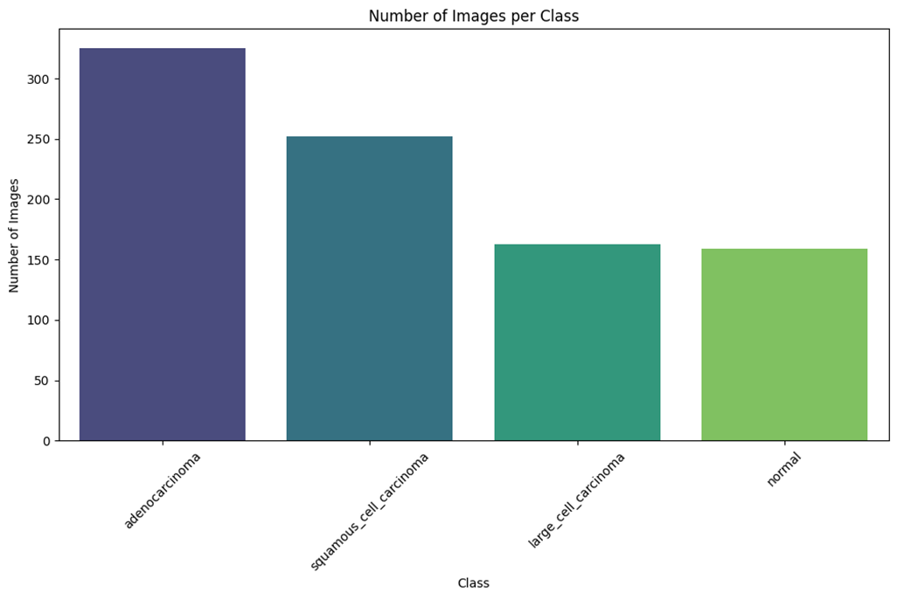
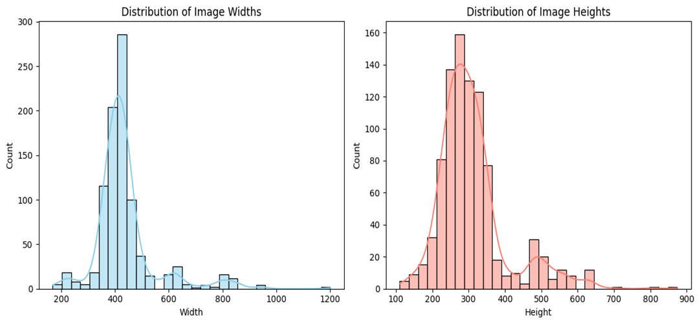
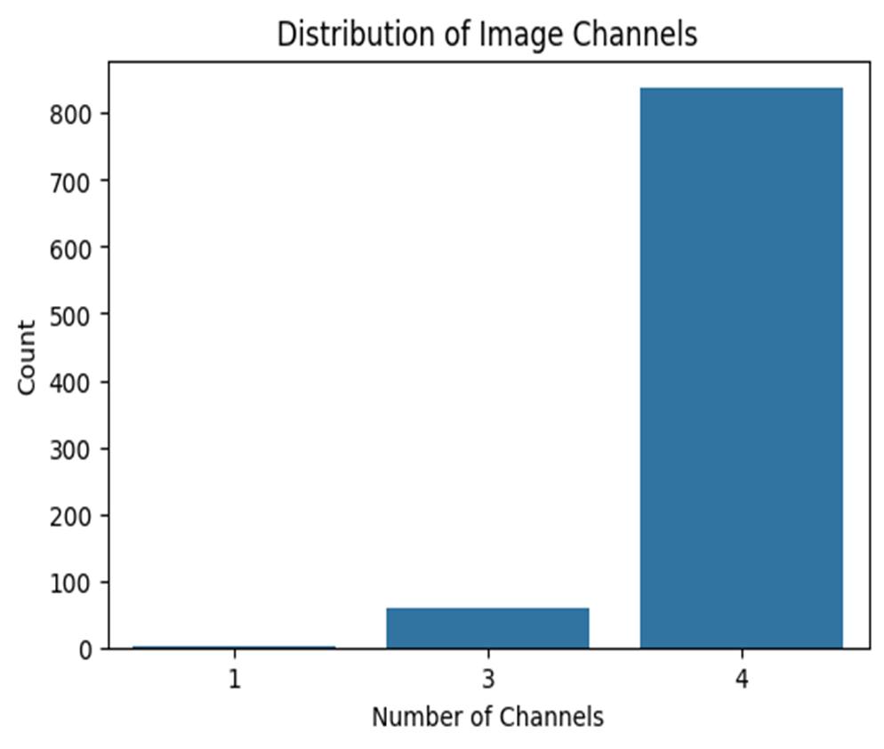
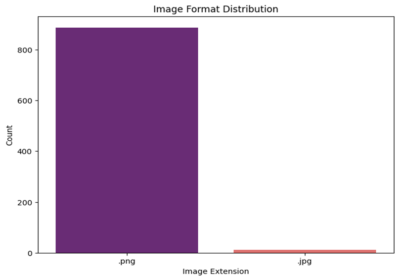
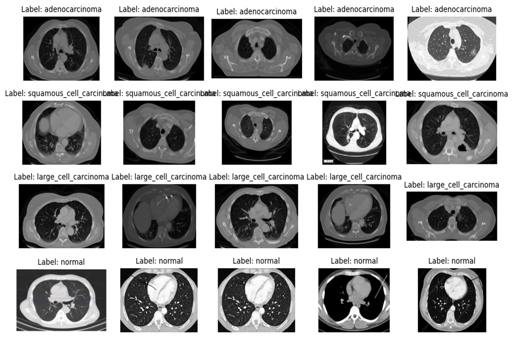

# Dataset

## 1. Dataset Overview

 The primary source was **[Chest CT-Scan Images Dataset on Kaggle](https://www.kaggle.com/datasets/mohamedhanyyy/chest-ctscan-images)**, supplemented with data from other medical imaging resources.

The dataset consists of **four categories**:

1. **Adenocarcinoma** – The most common type of lung cancer, often found in the outer regions of the lung.
2. **Large Cell Carcinoma** – A rapidly spreading cancer that can occur anywhere in the lung.
3. **Squamous Cell Carcinoma** – Typically found in central lung regions, often linked to smoking.
4. **Normal** – CT scans of healthy lungs (control group).

---

## 2. Dataset Structure

The dataset is organized into three main folders:

* **train/** – 70% of the dataset (used for model training)
* **test/** – 20% of the dataset (used for performance evaluation)
* **valid/** – 10% of the dataset (used for fine-tuning and preventing overfitting)

Each of these folders contains **four subfolders**, one for each class:

```txt
Data/
│
├── train/
│   ├── adenocarcinoma/
│   ├── squamous_cell_carcinoma/
│   ├── large_cell_carcinoma/
│   └── normal/
│
├── test/
│   ├── adenocarcinoma/
│   ├── squamous_cell_carcinoma/
│   ├── large_cell_carcinoma/
│   └── normal/
│
└── valid/
    ├── adenocarcinoma/
    ├── squamous_cell_carcinoma/
    ├── large_cell_carcinoma/
    └── normal/
```

The images are in **PNG** and **JPG** formats instead of DICOM (`.dcm`), making them directly compatible with deep learning frameworks like TensorFlow and PyTorch.

---

## 3. Exploratory Data Analysis (EDA)

To better understand the dataset, we performed **Exploratory Data Analysis (EDA)**. Since the dataset was originally split into **train, test, and valid**, we **combined all three parts** to analyze the complete dataset before preprocessing.

### 3.1 Class Distribution

The class counts after combining all dataset splits are:

| Class                   | Count |
| ----------------------- | ----- |
| Adenocarcinoma          | 325   |
| Squamous Cell Carcinoma | 252   |
| Large Cell Carcinoma    | 163   |
| Normal                  | 159   |

**Observations:**

* The dataset is **imbalanced**, with **Adenocarcinoma** being the majority class and **Normal** having the least samples.
* This imbalance can introduce bias in training and may require **class weighting** or **data augmentation**.

**Visualization:**


---

### 3.2 Image Dimension Analysis

We analyzed image widths and heights:

* **Width:** min = 168 px, max = 1200 px, avg = 436 px
* **Height:** min = 110 px, max = 874 px, avg = 310 px

**Observations:**

* Significant variation in dimensions — all images will be **resized to a fixed size** for CNN input.

**Visualization:**


---

### 3.3 Image Channel Analysis

We analyzed the number of channels (color format):

| Channels | Count |
| -------- | ----- |
| 4 (RGBA) | 837   |
| 3 (RGB)  | 59    |
| 1 (Gray) | 3     |

**Observations:**

* Most images are in **RGBA**, meaning an alpha (transparency) channel is present.
* All images will be **converted to RGB** for uniformity.

**Visualization:**


---

### 3.4 Image Format Analysis

We examined file formats:

| Format | Count |
| ------ | ----- |
| PNG    | 887   |
| JPG    | 12    |

**Observation:**

* Most images are **PNG**; standardization to a single format is optional.

**Visualization:**


---

### 3.5 Sample Images from Each Class

A random selection of sample images from each category:



---

## 4. EDA Conclusions

* The dataset is **imbalanced**, requiring augmentation or weighted loss.
* Images vary in size, so **resizing** is necessary.
* Most images have **4 channels** (RGBA) and will be converted to RGB.
* The dataset is **clean** — no corrupt or unreadable files.


