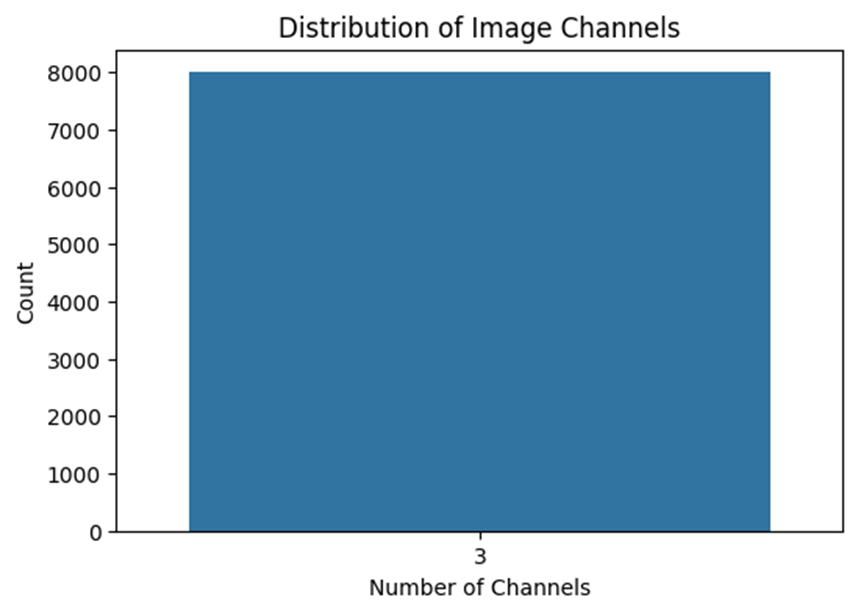
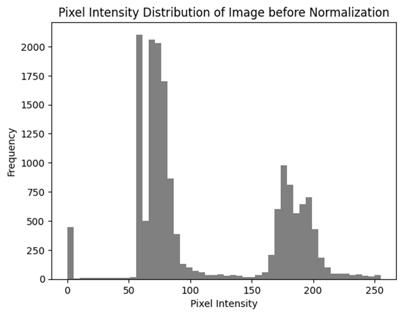

# **Data Preprocessing**

## **Introduction**

For the machine learning (ML)–based approach, preprocessing focused on **extracting meaningful features from lung CT scan images** and preparing them for traditional classifiers. Since ML models like Random Forests, SVMs, and Logistic Regression require fixed-length feature vectors rather than raw image grids, the preprocessing pipeline involved cleaning, format standardization, feature extraction, scaling, and dataset balancing.

---

## **Step 1 – Data Cleaning**

### **1.1 Removing Duplicate Images**

**Purpose:** Duplicates could bias feature statistics and overfit traditional models.
**Method:**

* Calculated hash values for each image file (MD5/SHA-256).
* Removed files with identical hashes.

**Result:** Only unique images were retained, improving generalization.

---

### **1.2 Handling Corrupt Images**

**Purpose:** Prevent feature extraction errors.
**Method:**

* Attempted to load each file with OpenCV/PIL.
* Removed any unreadable files.

**Result:** Dataset had **zero corrupt images**.

---

### **1.3 Standardizing Image Formats**

**Purpose:** Ensure consistent reading and feature extraction.
**Process:**

* Converted RGBA → RGB by removing alpha channel.
* Converted Grayscale → RGB by channel replication.

**Result:** All images were standardized to RGB.

*Example:*

---

## **Step 2 – Feature Extraction**

Since ML models do not learn directly from raw pixels, handcrafted or pre-trained feature descriptors were used:

* **Resize:** All images resized to **128 × 128 px**.
* **Flatten:** RGB pixel values flattened into 1D vector.
* **Statistical Features:** Computed mean, standard deviation, and intensity histograms for each channel.
* **Texture Features:** Extracted GLCM (Gray Level Co-occurrence Matrix) features such as contrast, homogeneity, and entropy.

---

## **Step 3 – Data Augmentation & Class Balancing**

Unlike deep learning, heavy augmentation is less common in ML pipelines, but to balance the dataset:

* Minor rotation and flipping applied.
* Synthetic oversampling performed using **SMOTE** on extracted features.

*Example Class Distribution After Balancing:*

---

## **Step 4 – Data Scaling & Normalization**

### **4.1 Standardization**

* Applied **StandardScaler** to center features at zero mean and unit variance.
* Improved convergence for gradient-based models like Logistic Regression.

### **4.2 Min–Max Scaling**

* Alternative scaling to map features to `[0, 1]`, useful for distance-based models like KNN.

*Example Before:*

*Example Before:*

---

## **Step 5 – Train–Test Split**

The dataset was split as:

* **80%** Training
* **20%** Testing

Split performed **after feature extraction** to avoid leakage.

---

## **Conclusion**

The ML dataset is now:

* **Cleaned** of duplicates and corrupt images.
* **Standardized** to RGB and resized for uniformity.
* **Feature-extracted** into fixed-length vectors.
* **Balanced** across all classes.
* **Scaled and split** for optimal training.

This ensures that traditional ML classifiers can efficiently process the lung cancer dataset and achieve competitive performance.