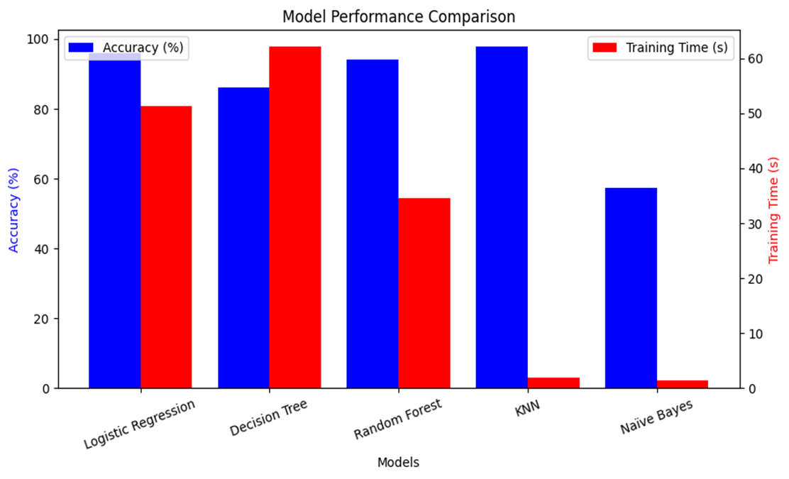

# Machine Learning Model Training & Evaluation**

## **Introduction**

Five machine learning algorithms from **Scikit-Learn** were trained and evaluated for **lung cancer classification** using extracted features from CT scan images.
The models tested were:

1. Logistic Regression
2. Decision Tree Classifier
3. Random Forest Classifier
4. K-Nearest Neighbors (KNN)
5. Gaussian Naïve Bayes

Each model’s **parameters, training time, and performance** were recorded to identify the most suitable approach.

---

## **9.1 Logistic Regression**

**Used Parameters:**

* `max_iter=1000` – Ensured convergence during optimization.

**Default Parameters in Scikit-Learn:**

* `penalty='l2'` – Ridge regularization.
* `solver='lbfgs'` – Efficient for medium-sized datasets.
* `multi_class='auto'` – Automatic strategy for multi-class problems.

**Training Time:** 51.25 seconds
**Accuracy:** 95.81%

**Performance Analysis:**

* Performed exceptionally well, showing strong decision boundaries.
* Slightly longer training time due to iterative optimization.
* High accuracy indicates near-linear separability in feature space.

---

## **9.2 Decision Tree Classifier**

**Used Parameters:**

* `random_state=42` – Ensured reproducibility.

**Default Parameters:**

* `criterion='gini'`, `splitter='best'`, `max_depth=None`, `min_samples_split=2`.

**Training Time:** 62.05 seconds
**Accuracy:** 86.06%

**Performance Analysis:**

* Provided interpretable rules but suffered from overfitting.
* Slower training due to deep recursive splits.
* Accuracy notably lower than ensemble methods.

---

## **9.3 Random Forest Classifier**

**Used Parameters:**

* `n_estimators=100`, `random_state=42`.

**Default Parameters:**

* `criterion='gini'`, `bootstrap=True`.

**Training Time:** 34.57 seconds
**Accuracy:** 94.00%

**Performance Analysis:**

* Strong accuracy with reduced overfitting compared to a single decision tree.
* Balanced training time thanks to parallel computation.
* Well-suited for handling complex feature interactions.

---

## **9.4 K-Nearest Neighbors (KNN)**

**Used Parameters:**

* `n_neighbors=3`.

**Default Parameters:**

* `weights='uniform'`, `algorithm='auto'`, `p=2` (Euclidean distance).

**Training Time:** 1.85 seconds
**Accuracy:** **97.69%**

**Performance Analysis:**

* Achieved **highest accuracy** among all models.
* Extremely fast training as KNN stores training data rather than optimizing parameters.
* Computationally heavy at inference time for large datasets.

---

## **9.5 Gaussian Naïve Bayes**

**Default Parameters:**

* `var_smoothing=1e-9`.

**Training Time:** 1.30 seconds
**Accuracy:** 57.31%

**Performance Analysis:**

* Lowest accuracy due to strong independence assumptions.
* Fastest training time, making it useful as a quick baseline.
* Not suitable for high-accuracy medical imaging classification.

---

## **9.6 Model Performance Comparison**

| Model                | Accuracy   | Training Time |
| -------------------- | ---------- | ------------- |
| **KNN**              | **97.69%** | 1.85 s        |
| Logistic Regression  | 95.81%     | 51.25 s       |
| Random Forest        | 94.00%     | 34.57 s       |
| Decision Tree        | 86.06%     | 62.05 s       |
| Gaussian Naïve Bayes | 57.31%     | 1.30 s        |

---

## **9.7 Visual Performance Analysis**

**Model Accuracy Comparison:**

---

## **Conclusion**

* **Best Overall Model:** **K-Nearest Neighbors (KNN)** – Highest accuracy (97.69%), very fast training.
* **Runner-Up:** Logistic Regression – Strong performance with good generalization.
* **Balanced Choice:** Random Forest – Good accuracy and reasonable training time.
* **Not Recommended:** Gaussian Naïve Bayes for this dataset due to poor accuracy.

While KNN offers the best accuracy, it requires more computation at prediction time. For deployment scenarios where **inference speed** is critical, **Random Forest or Logistic Regression** may be better suited.
