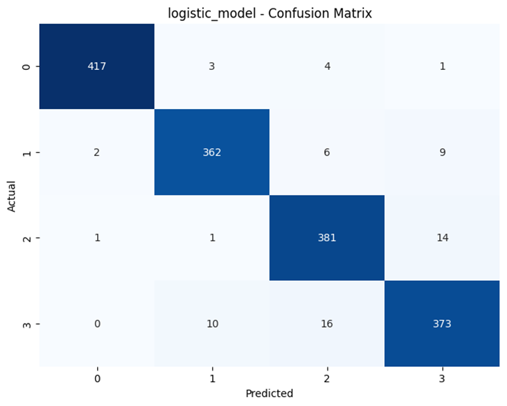
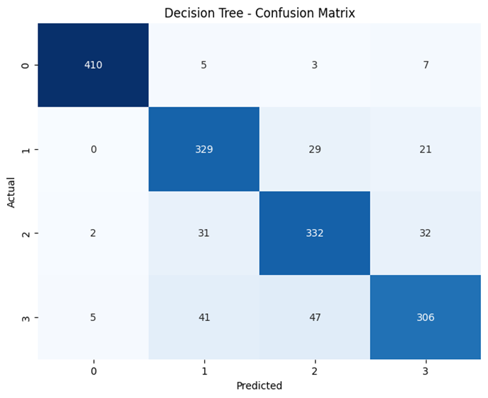
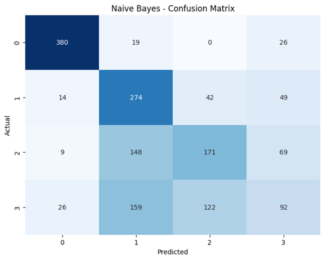

# Machine Learning Model Evaluation**

## **11.1 Introduction**

Following the training and tuning phases, the machine learning models were evaluated using key performance metrics: **accuracy, precision, recall, F1-score**, and **confusion matrix**.
This step ensures an objective comparison of each model’s predictive capabilities on **unseen test data**.

---

## **11.2 Evaluation Metrics**

* **Accuracy** – Proportion of correctly classified instances.
* **Precision** – Proportion of predicted positives that are correct.
* **Recall (Sensitivity)** – Proportion of actual positives correctly identified.
* **F1-score** – Harmonic mean of precision and recall, balancing both metrics.
* **Confusion Matrix** – Shows correct and incorrect predictions per class.

---

## **11.3 Model-by-Model Performance**

### **1) K-Nearest Neighbors (KNN)**

* **Accuracy:** **97.69%** *(Highest ML model accuracy)*
* **Training Time:** 1.85s *(fastest after Naïve Bayes)*
* **Strengths:** Simple implementation, high accuracy, balanced precision & recall (0.98).
* **Weaknesses:** High inference cost due to distance calculations for each prediction.
* **Observations:** Strong across all classes, making it the most reliable model overall.

---

### **2) Logistic Regression**

* **Accuracy:** 95.81%
* **Training Time:** 51.25s
* **Strengths:** Interpretable, good for linearly separable data, balanced precision & recall (0.96).
* **Weaknesses:** Struggles with complex non-linear patterns.
* **Observations:** Excellent baseline model, competitive with more complex methods.

---

### **3) Random Forest Classifier**

* **Accuracy:** 94.00%
* **Training Time:** 34.57s
* **Strengths:** High robustness, interpretable feature importance, reduced overfitting.
* **Weaknesses:** Slower training than simpler models.
* **Observations:** Consistent performance across classes, making it a strong second choice after KNN.

---

### **4) Decision Tree Classifier**

* **Accuracy:** 86.06%
* **Training Time:** 62.05s *(slowest ML model)*
* **Strengths:** Easy to interpret, handles non-linear boundaries well.
* **Weaknesses:** Prone to overfitting, especially without depth limits.
* **Observations:** Reasonable accuracy but overshadowed by Random Forest’s better performance.

---

### **5) Gaussian Naïve Bayes**

* **Accuracy:** 57.31% *(lowest performance)*
* **Training Time:** 1.30s *(fastest)*
* **Strengths:** Very fast training, simple implementation.
* **Weaknesses:** Strong independence assumption limits performance on complex datasets.
* **Observations:** Performs poorly in this dataset due to feature correlations.

---

### **6) Gaussian Naïve Bayes (Tuned with Optuna)**

* **Accuracy:** 57.56% *(slight improvement)*
* **Training Time:** 1.37s
* **Observations:** Marginal gains from tuning, confirming this model’s unsuitability for the task.

---

## **11.4 Comparative Performance**

*(Refer to attached image: `ml_model_comparison_bar.png`)*

| Rank | Model               | Accuracy   | Training Time (s) | Avg. Precision | Avg. Recall | Avg. F1-score |
| ---- | ------------------- | ---------- | ----------------- | -------------- | ----------- | ------------- |
| 1    | KNN                 | **97.69%** | 1.85              | 0.98           | 0.98        | 0.98          |
| 2    | Logistic Regression | 95.81%     | 51.25             | 0.96           | 0.96        | 0.96          |
| 3    | Random Forest       | 94.00%     | 34.57             | 0.94           | 0.94        | 0.94          |
| 4    | Decision Tree       | 86.06%     | 62.05             | 0.86           | 0.86        | 0.86          |
| 5    | Naïve Bayes (Tuned) | 57.56%     | 1.37              | 0.57           | 0.58        | 0.56          |
| 6    | Naïve Bayes         | 57.31%     | 1.30              | 0.57           | 0.57        | 0.56          |

---

## **11.6 Conclusion**

* **Best Performer:** KNN – highest accuracy and balanced performance.
* **Close Competitors:** Logistic Regression and Random Forest – strong accuracy and reliability.
* **Poor Performer:** Naïve Bayes – unsuitable for complex medical imaging datasets.
* **Key Insight:** While KNN dominates in accuracy, Random Forest offers a better trade-off between speed and generalization for large-scale deployment.