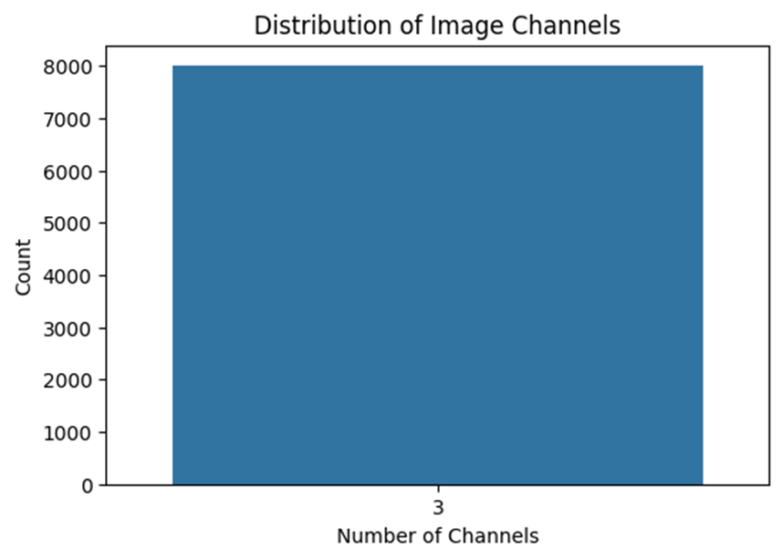
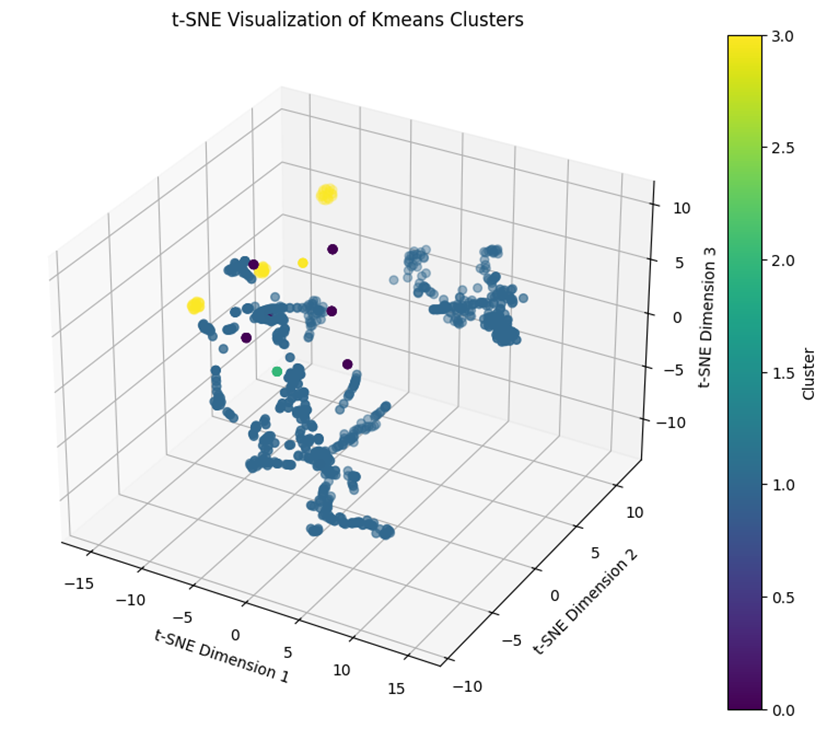
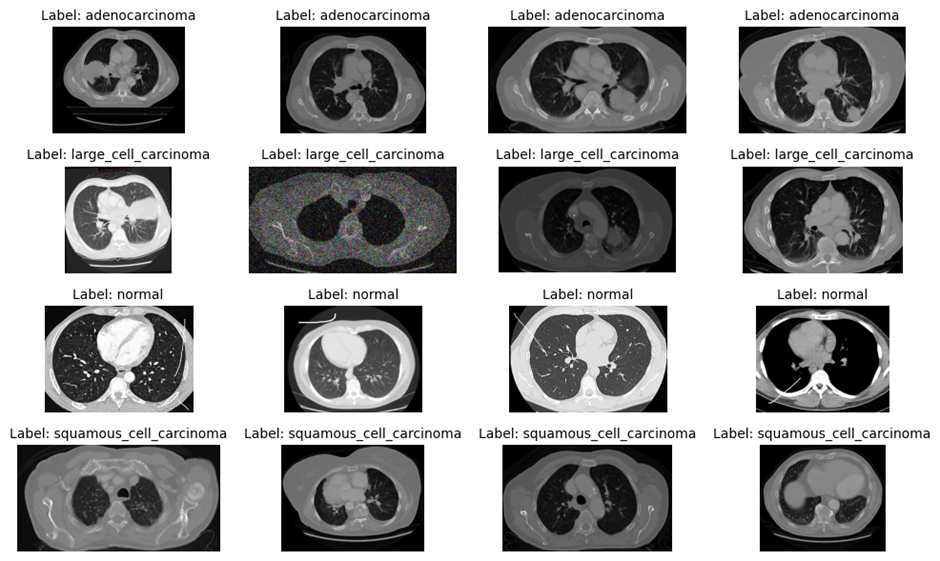
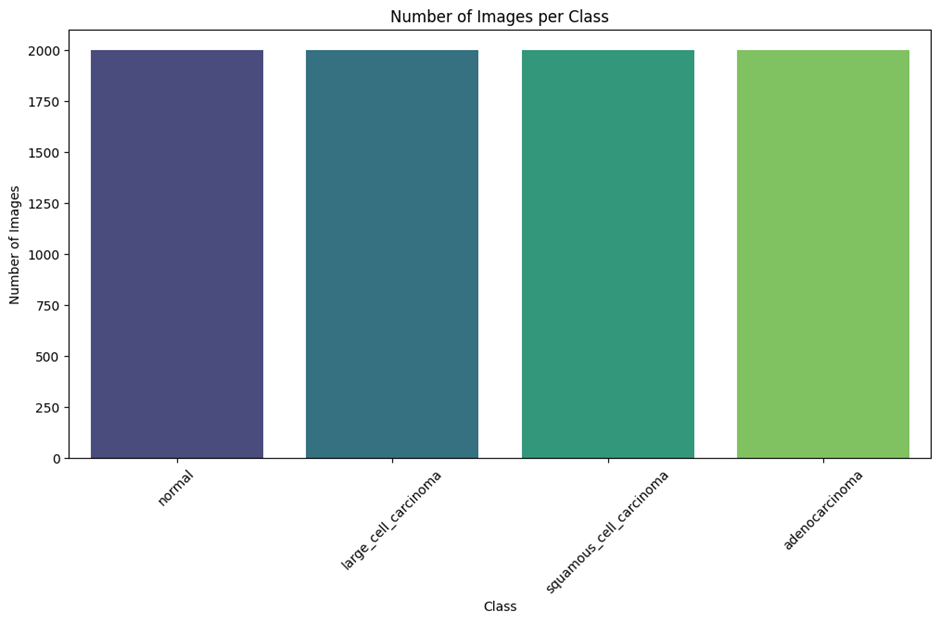
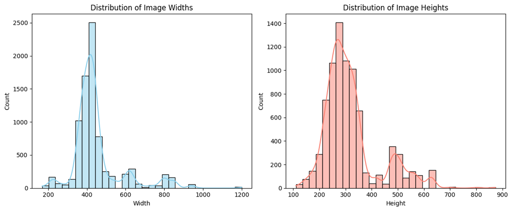
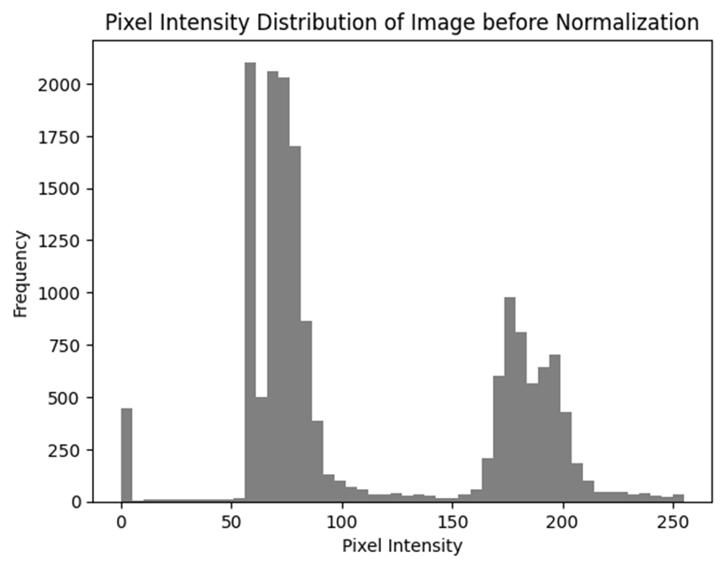

# Data Preprocessing**

## **Introduction**

Data preprocessing is a crucial step in developing a deep learning–based lung cancer detection model. It ensures that the dataset is clean, balanced, and formatted correctly for efficient and effective training. This phase included data cleaning, clustering analysis, augmentation, exploratory analysis, and preparation for model input.

---

## **Step 1 – Data Cleaning**

### **1.1 Removing Duplicate Images**

**Purpose:** Duplicate images can cause bias by making the model see repeated patterns too often, which may lead to overfitting.
**Method:**

* Used hashing (MD5/SHA-256) to generate unique signatures for each image.
* Identified and removed files with identical hash values.

**Result:** Reduced redundancy and ensured every image contributed unique information to the training process.

---

### **1.2 Handling Corrupt Images**

**Purpose:** Corrupt files can disrupt training or cause batch processing errors.
**Method:**

* Attempted to open each file using image loading libraries.
* Removed unreadable images after logging their filenames.

**Result:** Zero corrupt images found in the dataset.

---

### **1.3 Standardizing Image Formats**

**Purpose:** CNN models require consistent image formats.
**Issues Found:**

* **RGBA (4 channels):** Had unnecessary transparency channel.
* **Grayscale (1 channel):** Needed expansion to RGB format.
* **RGB (3 channels):** Already in correct format.

**Method:**

* Converted RGBA → RGB by removing alpha channel.
* Converted Grayscale → RGB by replicating channel data.

**Result:** All images now in **RGB format (3 channels)**.

*Example:*


---

## **Step 2 – Clustering Analysis**

### **2.1 Feature Extraction (VGG16)**

* Used **VGG16** pretrained on ImageNet, removing fully connected layers (`include_top=False`).
* Resized images to `224 × 224` before feature extraction.
* Generated flattened feature vectors for clustering.

---

### **2.2 Dimensionality Reduction (UMAP)**

* Reduced feature dimensions from thousands to **50** using **UMAP** to preserve structure and reduce noise.
* Chose UMAP over PCA for better handling of nonlinear relationships.

---

### **2.3 Clustering with K-Means**

* Applied **K-Means** with 4 clusters (matching dataset classes).
* Silhouette Score: **0.64**, indicating good separation.

---

### **2.4 Visualization with t-SNE**

* Reduced UMAP output to **3D** using **t-SNE**.
* Generated 3D scatter plot with colors representing clusters.

*Example:*


---

## **Step 3 – Data Augmentation**

To prevent overfitting and balance class sizes, each category was expanded to **2000 images** using **Albumentations**.

**Techniques Applied:**

1. **Horizontal Flip (p=0.4)** – Adds orientation variation.
2. **Brightness/Contrast Adjustment (p=0.1)** – Simulates lighting changes.
3. **Rotation ±5° (p=0.2)** – Handles small misalignments.
4. **Gaussian Noise (p=0.1)** – Improves robustness to noisy scans.

*Example Augmented Images:*


---

## **Step 4 – EDA Post-Augmentation**

### **4.1 Class Distribution**

Each class now has **2000 images**.


---

### **4.2 Image Size Analysis**

* **Width:** 168–1200 px (Mean: 449.2 px)
* **Height:** 110–874 px (Mean: 320.0 px)

*Histograms:*


---

### **4.3 Sample Images**

Randomly sampled augmented dataset images for quality inspection.


---

## **Step 5 – Data Loading**

**Directory Structure:**

```
dataset/
    train/
        adenocarcinoma/
        squamous_cell_carcinoma/
        large_cell_carcinoma/
        normal/
    valid/
    test/
```

## **Step 6 – Data Preparation**

### **6.1 Image Resizing**

* Resized all images to **128 × 128 px**.

### **6.2 Normalization**

* Pixel values scaled from `[0, 255]` to `[0, 1]`.

| Metric           | Before Norm | After Norm |
| ---------------- | ----------- | ---------- |
| Mean Pixel Value | 78.88       | 0.30       |
| Std Deviation    | 67.56       | 0.264      |

*Example Before:*



*Example Before:*


---

## **Conclusion**

After preprocessing:

* Dataset is **clean**, **balanced**, and **standardized**.
* Suitable for CNN architectures like VGG16, ResNet, and custom deep learning models.
* Ready for training with minimized risk of overfitting or data inconsistencies.