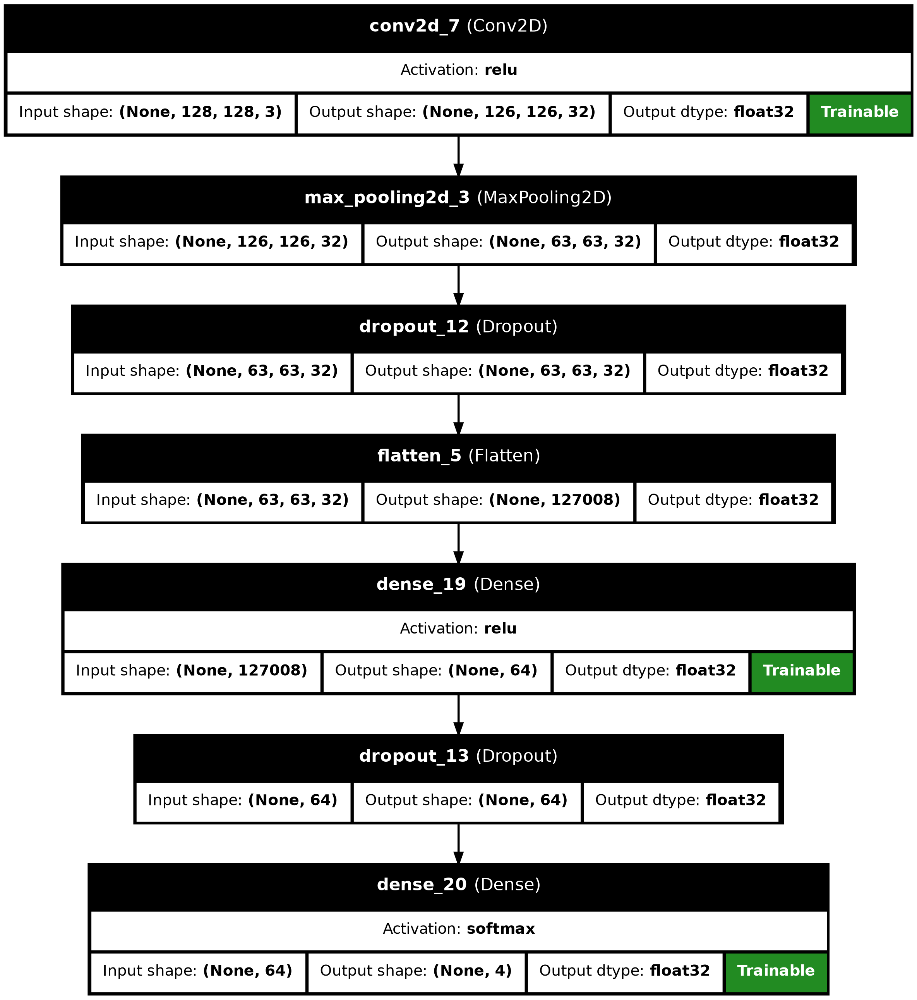
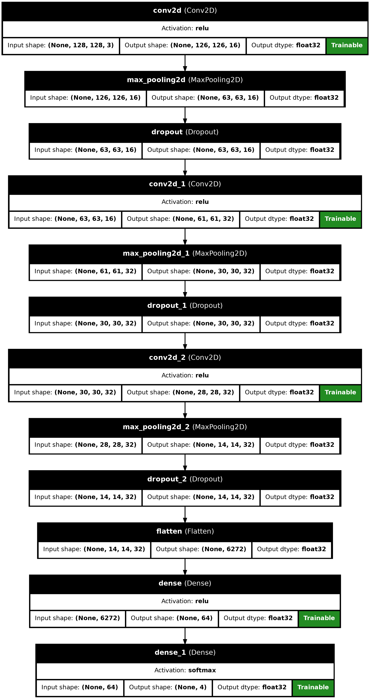
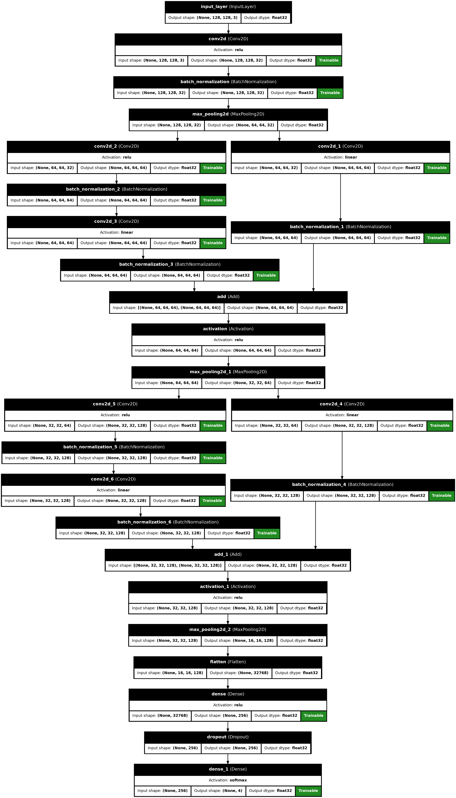
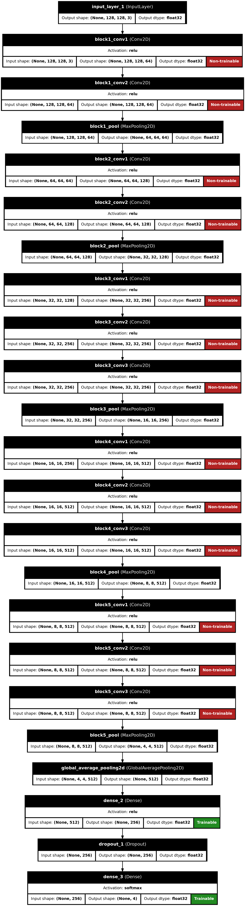
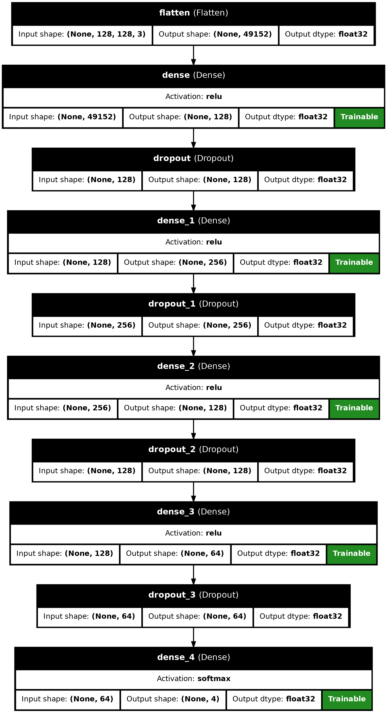

# **Model Building**

## **Introduction**

To identify the most effective approach for lung cancer classification, five deep learning models were implemented and compared.
Each architecture brought a different balance between complexity, feature extraction ability, and training requirements.
The models ranged from simple CNN baselines to advanced transfer learning using VGG16.

---

## **8.1 Single Layer CNN – Baseline Model**

**Purpose:**
A simple CNN to serve as a benchmark for comparison.

**Architecture:**

* Conv2D (32 filters, ReLU activation)
* MaxPooling2D
* Dropout (0.2)
* Flatten
* Dense (64 neurons, ReLU)
* Dropout (0.5)
* Dense (4 neurons, Softmax)

**Compilation:**

* Optimizer: Adam
* Loss: Binary Crossentropy *(Note: Categorical Crossentropy is preferred for multi-class tasks)*
* Metric: Accuracy

**Architecture Diagram:**

---

## **8.2 Multi-Layer CNN – Deeper Feature Extraction**

**Purpose:**
A deeper network for capturing more complex patterns.

**Architecture:**

* Conv2D (16 filters) → MaxPooling2D → Dropout (0.1)
* Conv2D (32 filters) → MaxPooling2D → Dropout (0.3)
* Conv2D (32 filters) → MaxPooling2D → Dropout (0.3)
* Flatten → Dense (64 neurons, ReLU) → Dense (4 neurons, Softmax)

**Compilation:**

* Optimizer: Adam
* Loss: Categorical Crossentropy
* Metric: Accuracy

**Architecture Diagram:**

---

## **8.3 ResNet-like Model – Residual Learning**

**Purpose:**
Mitigate vanishing gradients and allow deeper architectures through shortcut connections.

**Architecture:**

* Initial Conv2D (32 filters) + BatchNorm
* **Residual Block 1:**

  * Shortcut via 1×1 Conv2D
  * Two Conv2D (64 filters) + BatchNorm
  * Add shortcut connection
* **Residual Block 2:**

  * Similar to Block 1, but with 128 filters
* Flatten → Dense (256 neurons, ReLU) → Dropout (0.5)
* Dense (4 neurons, Softmax)

**Compilation:**

* Optimizer: Adam
* Loss: Categorical Crossentropy
* Metric: Accuracy

**Architecture Diagram:**

---

## **8.4 VGG16 – Transfer Learning**

**Purpose:**
Leverage pretrained features from ImageNet to improve accuracy and reduce training time.

**Architecture:**

* Load VGG16 (ImageNet weights, frozen layers)
* Global Average Pooling
* Dense (256 neurons, ReLU)
* Dropout (0.5)
* Dense (4 neurons, Softmax)

**Compilation:**

* Optimizer: Adam
* Loss: Categorical Crossentropy
* Metric: Accuracy

**Architecture Diagram:**

---

## **8.5 Artificial Neural Network (ANN)**

**Purpose:**
Evaluate non-convolutional fully connected network performance.

**Architecture:**

* Flatten input image
* Dense (128 neurons, ReLU) → Dropout (0.2)
* Dense (256 neurons, ReLU) → Dropout (0.5)
* Dense (128 neurons, ReLU) → Dropout (0.3)
* Dense (64 neurons, ReLU) → Dropout (0.3)
* Dense (4 neurons, Softmax)

**Compilation:**

* Optimizer: Adam
* Loss: Categorical Crossentropy
* Metric: Accuracy

**Architecture Diagram:**

---

## **8.6 Summary Table**

| Model            | Conv Layers       | Residual Learning | Transfer Learning | Dense Layers | Dropout                  | Notes                            |
| ---------------- | ----------------- | ----------------- | ----------------- | ------------ | ------------------------ | -------------------------------- |
| Single Layer CNN | 1                 | No                | No                | 2            | Yes (0.2, 0.5)           | Simple baseline                  |
| Multi-Layer CNN  | 3                 | No                | No                | 1            | Yes (0.1, 0.3, 0.3)      | Deeper feature extraction        |
| ResNet-like      | 2 Residual Blocks | Yes               | No                | 1            | Yes (0.5)                | Avoids vanishing gradients       |
| VGG16            | Pretrained        | No                | Yes               | 1            | Yes (0.5)                | Fast convergence                 |
| ANN              | None              | No                | No                | 4            | Yes (0.2, 0.5, 0.3, 0.3) | Lacks spatial feature extraction |