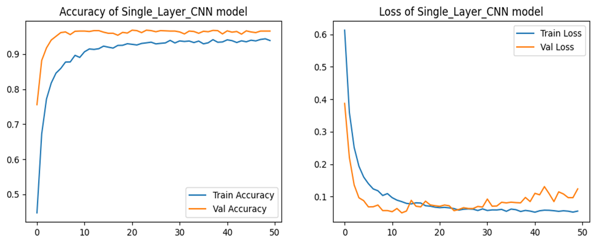
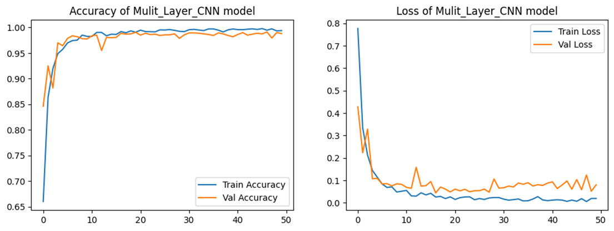
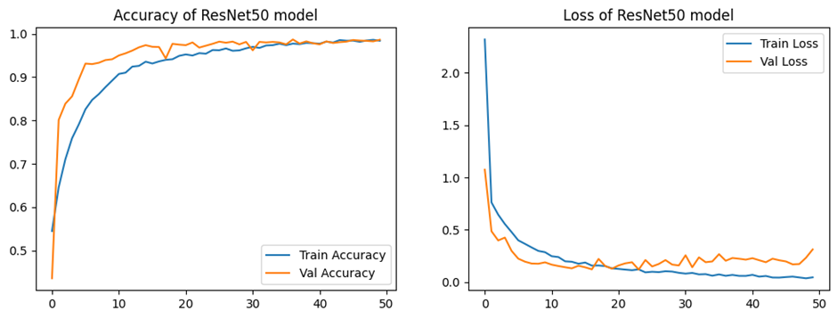
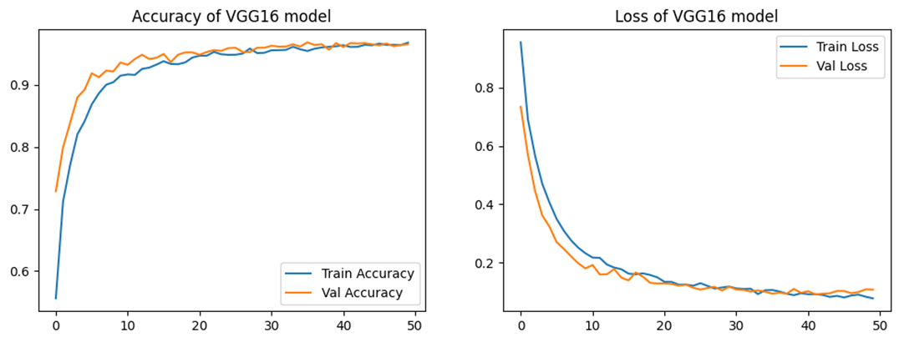
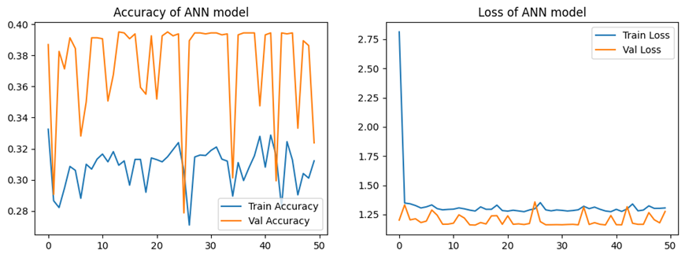
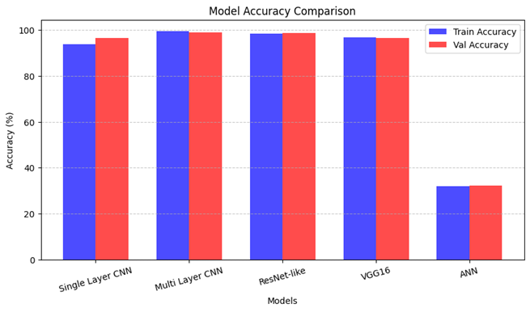
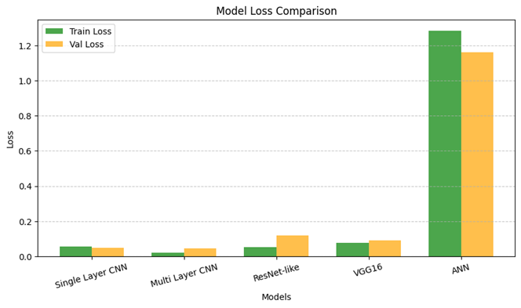

# **05 – Deep Learning Model Training & Evaluation**

## **Introduction**

Five deep learning models were trained for **lung cancer classification** and compared in terms of **training speed, accuracy, loss trends, and generalization performance**.
The models were:

1. Single Layer CNN
2. Multi-Layer CNN
3. ResNet-like Model
4. VGG16 (Transfer Learning)
5. Artificial Neural Network (ANN)

Training curves and evaluation metrics were recorded for each model.

---

## **9.1 Single Layer CNN**

**Epoch Time:** \~13s initially, reduced to \~8s per epoch

**Training Progress:**

* **First Epoch:** Accuracy 36.37%, Loss 0.9736 | Val\_Accuracy 75.56%, Val\_Loss 0.3872
* **Last Epoch:** Accuracy 93.86%, Loss 0.0558 | Val\_Accuracy 96.56%, Val\_Loss 0.0498

**Observations:**

* Started with moderate accuracy but improved quickly.
* Validation accuracy was initially higher than training accuracy, suggesting fast feature learning.
* No major overfitting detected.

---

## **9.2 Multi-Layer CNN**

**Epoch Time:** \~15s initially, reduced to \~8s

**Training Progress:**

* **First Epoch:** Accuracy 51.43%, Loss 1.0275 | Val\_Accuracy 84.62%, Val\_Loss 0.4275
* **Last Epoch:** Accuracy 99.40%, Loss 0.0208 | Val\_Accuracy 98.81%, Val\_Loss 0.0445

**Observations:**

* Learned faster than the Single Layer CNN due to increased depth.
* Very low validation loss, indicating excellent generalization.
* Achieved the **best overall performance** in this experiment.

---

## **9.3 ResNet-like Model**

**Epoch Time:** \~21s initially, reduced to \~10s

**Training Progress:**

* **First Epoch:** Accuracy 48.60%, Loss 6.3097 | Val\_Accuracy 43.56%, Val\_Loss 1.0737
* **Last Epoch:** Accuracy 98.34%, Loss 0.0535 | Val\_Accuracy 98.62%, Val\_Loss 0.1199

**Observations:**

* Initially struggled with very high loss.
* Improved steadily, but validation loss remained higher than Multi-Layer CNN.
* Slight overfitting possible, but still a strong performer.

---

## **9.4 VGG16 (Transfer Learning)**

**Epoch Time:** \~18s initially, reduced to \~15s

**Training Progress:**

* **First Epoch:** Accuracy 46.97%, Loss 1.1041 | Val\_Accuracy 72.87%, Val\_Loss 0.7339
* **Last Epoch:** Accuracy 96.86%, Loss 0.0779 | Val\_Accuracy 96.56%, Val\_Loss 0.0917

**Observations:**

* Good improvement trend, leveraging pre-trained ImageNet features.
* Slightly higher validation loss compared to Multi-Layer CNN.
* Suitable for smaller datasets due to transfer learning benefits.

---

## **9.5 ANN Model**

**Epoch Time:** \~18s initially, reduced to \~9s

**Training Progress:**

* **First Epoch:** Accuracy 31.13%, Loss 6.4439 | Val\_Accuracy 38.69%, Val\_Loss 1.2017
* **Last Epoch:** Accuracy 31.92%, Loss 1.2823 | Val\_Accuracy 32.37%, Val\_Loss 1.1592

**Observations:**

* Failed to learn meaningful features.
* Accuracy plateaued after a few epochs.
* Not suitable for image-based tasks without convolutional layers.

---

## **9.6 Model Performance Comparison**

| Model            | Train Accuracy | Train Loss | Val Accuracy | Val Loss   |
| ---------------- | -------------- | ---------- | ------------ | ---------- |
| Single Layer CNN | 93.86%         | 0.0558     | 96.56%       | 0.0498     |
| Multi-Layer CNN  | **99.40%**     | **0.0208** | **98.81%**   | **0.0445** |
| ResNet-like      | 98.34%         | 0.0535     | 98.62%       | 0.1199     |
| VGG16            | 96.86%         | 0.0779     | 96.56%       | 0.0917     |
| ANN              | 31.92%         | 1.2823     | 32.37%       | 1.1592     |

---

## **9.7 Final Ranking**

1. **Best Model:** Multi-Layer CNN – Highest Val Accuracy & lowest Val Loss
2. **Second Best:** ResNet-like Model – High accuracy but higher Val Loss
3. **Good Alternative:** VGG16 – Competitive accuracy, slightly higher loss
4. **Decent:** Single Layer CNN – Solid results for a shallow network
5. **Worst Performer:** ANN – Ineffective for this dataset

---

## **9.8 Visual Performance Analysis**

**Model Accuracy Comparison:**

**Model Loss Comparison:**

---

## **Conclusion**

The **Multi-Layer CNN** emerged as the most effective architecture for this lung cancer classification task, demonstrating:

* Excellent convergence speed
* High validation accuracy (98.81%)
* Minimal overfitting

While ResNet-like and VGG16 performed well, their slightly higher validation losses suggest that the simpler Multi-Layer CNN achieved the best balance between accuracy and generalization.