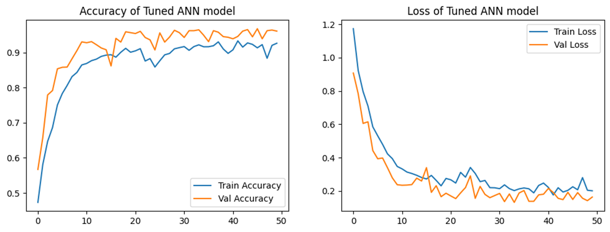
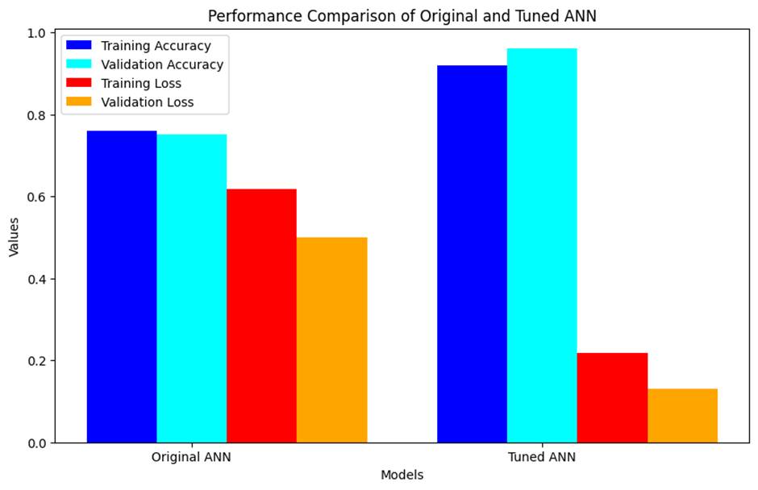

# Deep Learning Model Hyperparameter Tuning**

## **10.1 Introduction**

The **initial ANN model** performed poorly, with low accuracy and high loss.
To address this, **hyperparameter tuning** was applied using **Keras Tuner** with the **Hyperband** search algorithm.
The objective was to **maximize validation accuracy** while improving efficiency and generalization.

---

## **10.2 Tuning Process**

### **Parameters Tuned**

* **First Dense Layer Neurons:** Range 64 → 512
* **Dropout Rate after First Dense Layer:** Range 0.2 → 0.5
* **Second Dense Layer Neurons:** Range 64 → 512
* **Dropout Rate after Second Dense Layer:** Range 0.2 → 0.5
* **Learning Rate (Adam Optimizer):** \[0.01, 0.001, 0.0001]

### **Optimization Objective**

* **Metric:** Validation Accuracy
* Goal: Maximize performance on unseen validation data.

### **Tuning Strategy**

* **Algorithm:** Hyperband
* Runs multiple configurations for a limited number of epochs, progressively eliminating weaker candidates.
* **Max Epochs per Configuration:** 10

---

## **10.3 Best Hyperparameters Found**

* **First Layer Neurons:** 320
* **First Dropout Rate:** 0.3
* **Second Layer Neurons:** 448
* **Second Dropout Rate:** 0.2
* **Learning Rate:** 0.0001

---

## **10.4 Training the Tuned Model**

The tuned ANN model was **trained for 50 epochs** to evaluate improvements.

### **Performance Progress**

**Epoch 1:**

* Training Accuracy: 42.70%
* Training Loss: 1.3293
* Validation Accuracy: 56.69%
* Validation Loss: 0.9071
* Time per epoch: \~17s

**Epoch 50:**

* Training Accuracy: **91.93%**
* Training Loss: **0.2182**
* Validation Accuracy: **96.13%**
* Validation Loss: **0.1315**
* Time per epoch: \~9s

---

## **10.5 Performance Comparison**

| Model        | Train Accuracy | Train Loss | Val Accuracy | Val Loss   |
| ------------ | -------------- | ---------- | ------------ | ---------- |
| Original ANN | 31.92%         | 1.2823     | 32.37%       | 1.1592     |
| Tuned ANN    | **91.93%**     | **0.2182** | **96.13%**   | **0.1315** |

---

## **10.6 Observations**

* **Accuracy Improvement:** +60% (Train) and +63% (Validation)
* **Loss Reduction:** Significant decrease, showing better convergence.
* **Training Efficiency:** Epoch time reduced from 17s → 9s.
* **Generalization:** Validation performance now closely matches training performance.

---

## **10.7 Visual Results**

* **Training vs Validation Accuracy & Loss Curve:**

* **Performance Comparison Bar Chart:**

---

## **10.8 Conclusion**

The **hyperparameter tuning process** transformed the ANN from an ineffective classifier into a **highly accurate and efficient** model.
This highlights the importance of **systematic hyperparameter search** in deep learning workflows, particularly when initial results are unsatisfactory.

