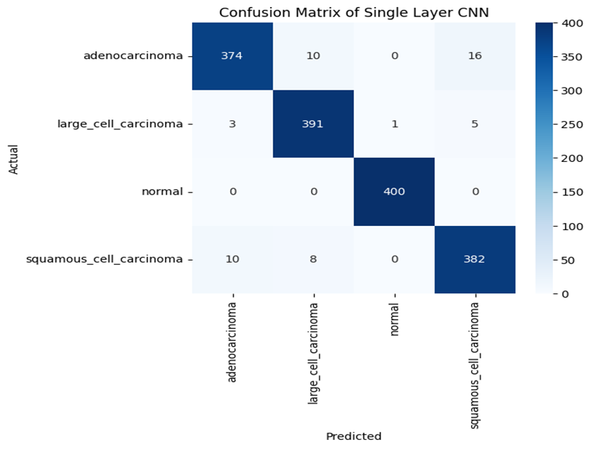
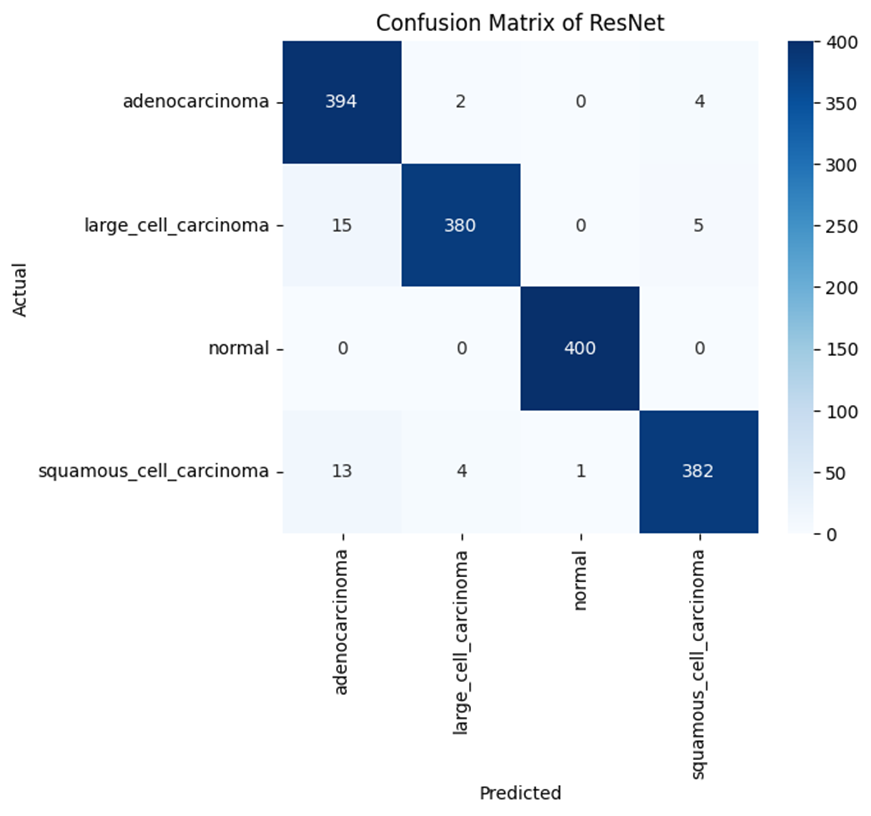
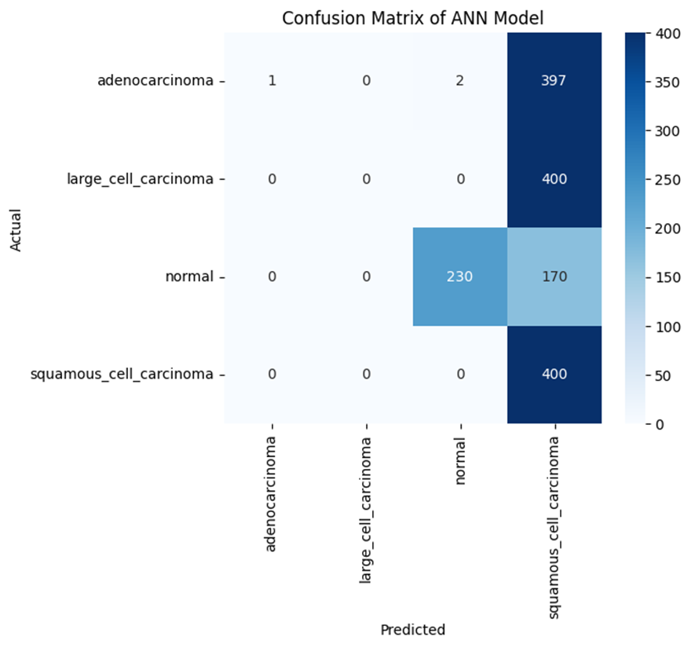
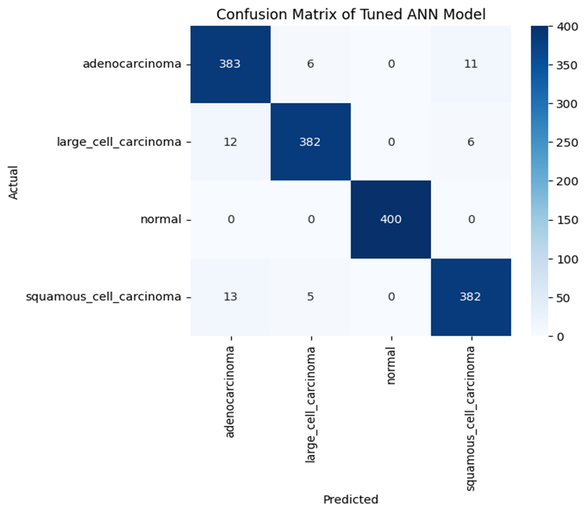
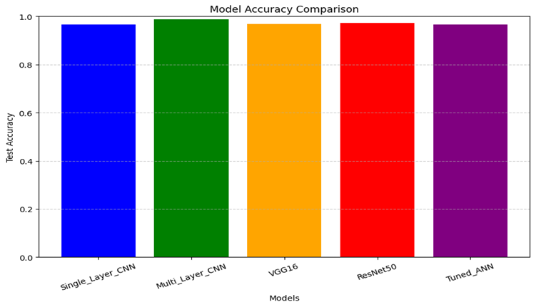

# Deep Learning Model Evaluation**

## **11.1 Introduction**

After training and hyperparameter tuning, the deep learning models were evaluated using **accuracy, precision, recall, F1-score**, and **confusion matrices**.
This step ensures a clear understanding of how each model performs on **unseen test data**.

---

## **11.2 Model-by-Model Evaluation**

### **1) Single-Layer CNN**

* **Test Accuracy:** 96.69%
* **Macro F1-score:** 97%
* **Best Class:** Normal (100% precision & recall)

* **Observation:**
     * Early misclassifications mainly occurred between **adenocarcinoma** and **squamous cell carcinoma**.
     * **16 adenocarcinoma cases** were incorrectly labeled as squamous cell carcinoma.

---

### **2) Multi-Layer CNN**

* **Test Accuracy:** **98.88%** *(Highest CNN performance)*
* **Best Class:** Normal (100% precision & recall) 

* **Observation:**
    * Significant reduction in misclassifications compared to Single-Layer CNN.
    * Only a few adenocarcinoma ↔ squamous cell carcinoma confusions remained.

---

### **3) VGG16 (Transfer Learning)**

* **Test Accuracy:** 96.75%
* **Best Class:** Normal (99% recall)

* **Observation:**
     * Strong generalization with balanced class performance.
     * Adenocarcinoma recall dropped to 94%, suggesting occasional mislabeling.

---

### **4) ResNet50**

* **Test Accuracy:** 97.25%
* **Best Class:** Normal (100% recall)  

* **Observation:**
      * Improved adenocarcinoma recall compared to VGG16.
      * Slightly lower recall for large cell carcinoma (95%).

---

### **5) ANN (Original)**

* **Test Accuracy:** 39.44% *(Worst performance)*

* **Observation:**
      * Completely failed to learn meaningful patterns.
      * Adenocarcinoma recall = 0% (all cases misclassified).
      * 400 large cell carcinoma cases mislabeled as squamous cell carcinoma.

---

### **6) ANN (Tuned with Keras Tuner)**

* **Test Accuracy:** 96.69% *(Massive improvement)*

* **Observation:**
      * Recall and precision improved across all classes.
      * Confusions between adenocarcinoma and squamous cell carcinoma reduced drastically.

---

## **11.3 Comparative Performance**

**Final Accuracy Ranking:**

| Rank | Model            | Accuracy   |
| ---- | ---------------- | ---------- |
| 1    | Multi-Layer CNN  | **98.88%** |
| 2    | ResNet50         | 97.25%     |
| 3    | VGG16            | 96.75%     |
| 4    | Single-Layer CNN | 96.69%     |
| 5    | Tuned ANN        | 96.69%     |
| 6    | ANN (Original)   | 39.44%     |

---

## **11.4 Conclusion**

* **Best Performer:** Multi-Layer CNN – highest accuracy & lowest misclassification rate.
* **Close Competitors:** ResNet50 & VGG16 – strong generalization with high accuracy.
* **Poor Performer:** Original ANN – ineffective for image-based classification.
* **Key Insight:** Hyperparameter tuning can **rescue underperforming models** like ANN.
