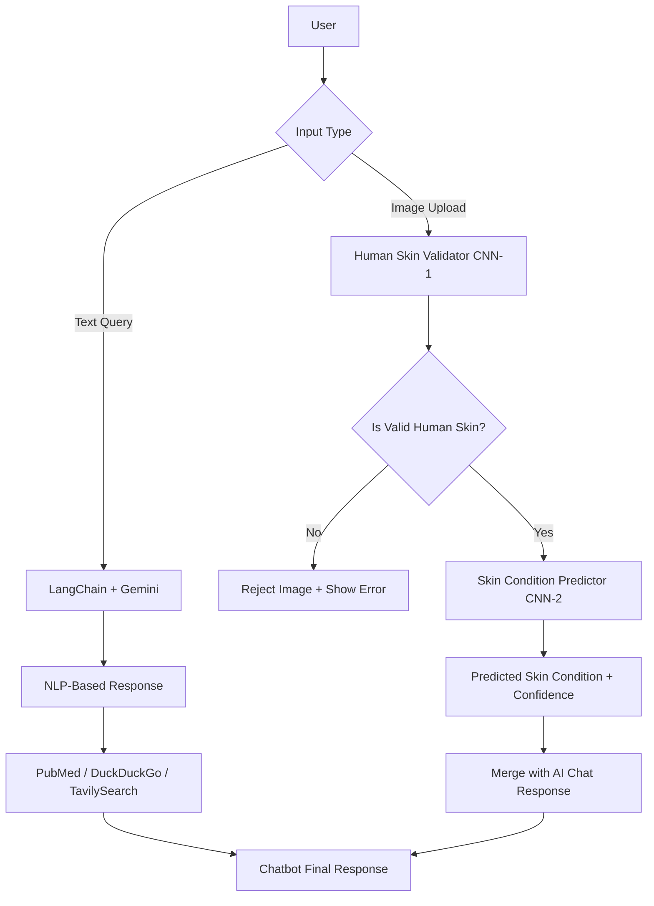

# Planning and Objectives

## Project Goals

The primary goal of MedAI was to design and develop a multi-modal AI assistant that could:

1. Handle natural language conversations around skin health using advanced language models.
2. Accept user-uploaded images to analyze and predict visible skin conditions.
3. Ensure image validity through a dedicated human skin verification model.
4. Deliver research-backed, contextually relevant responses using trusted sources like PubMed.
5. Offer a secure, session-based experience through Firebase authentication and message storage.

This project also served as a technical exercise to apply multiple AI, ML, and web technologies together in a cohesive, production-ready application.

---

## Project Scope

**In Scope:**
- A working Flask web app with login, chat, and image upload.
- Integration of dual CNN models (image validation + skin condition prediction).
- Text-based AI chat using LangChain + Gemini.
- Search tool integration: PubMed, DuckDuckGo, and TavilySearch.
- Firebase integration for authentication and history tracking.

**Out of Scope (for this version):**
- Real-time video/image capture.
- Backend training of models (models are pre-trained and loaded).
- A full-scale dermatology-grade diagnostic engine.
- Native mobile app support.

---

## Development Phases

| Phase | Description |
|-------|-------------|
| Phase 1 | Initial research and problem analysis |
| Phase 2 | Planning project scope and tech stack |
| Phase 3 | Building the Flask app and basic UI |
| Phase 4 | Integrating LangChain + Gemini for conversational logic |
| Phase 5 | Building and testing CNN models |
| Phase 6 | Firebase setup for user management and session history |
| Phase 7 | Final testing, UI improvements, and deployment |

---

## System Flow (High-Level)

The flowchart below outlines how the system processes both text and image inputs in a unified pipeline.

