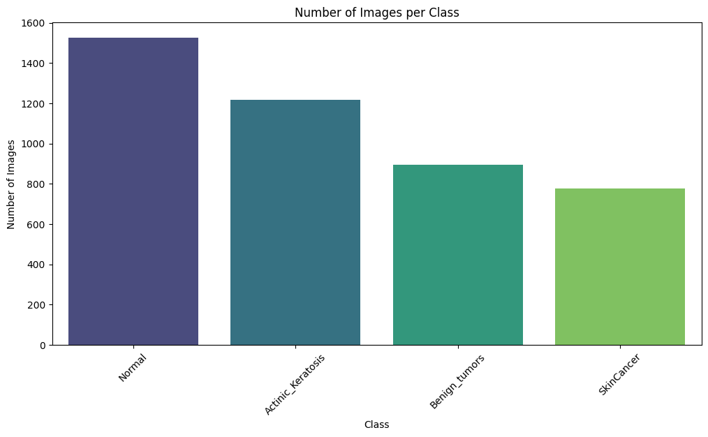
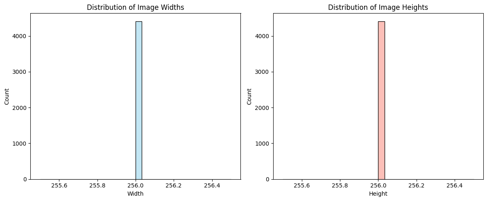
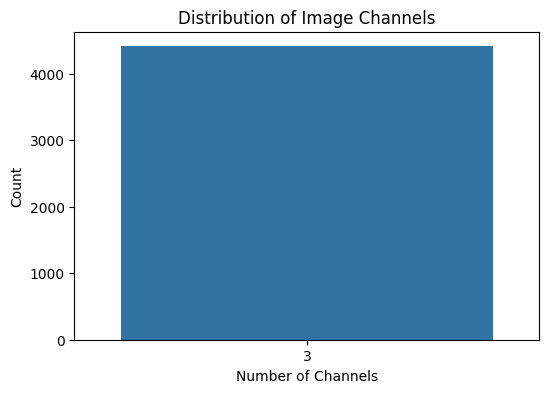
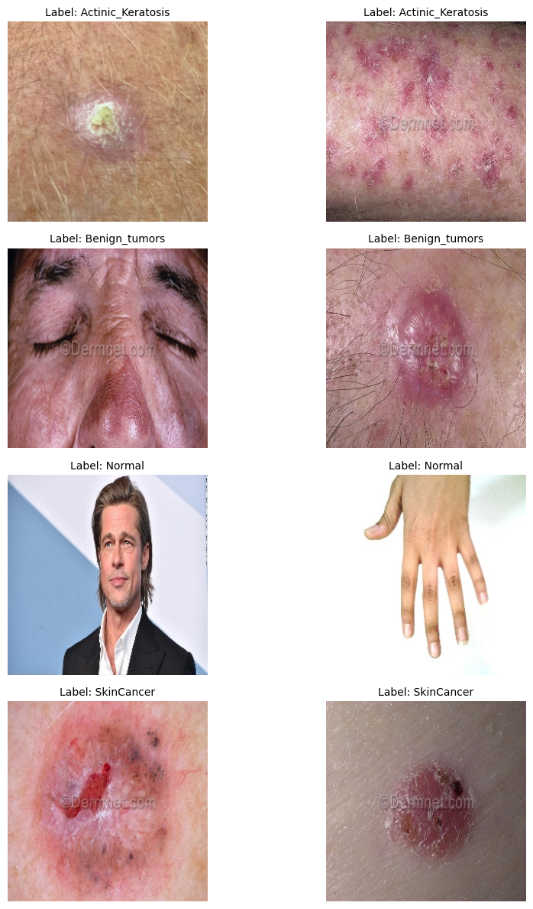
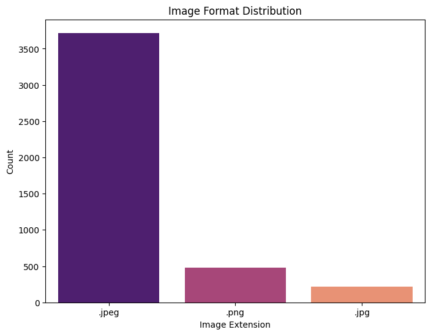
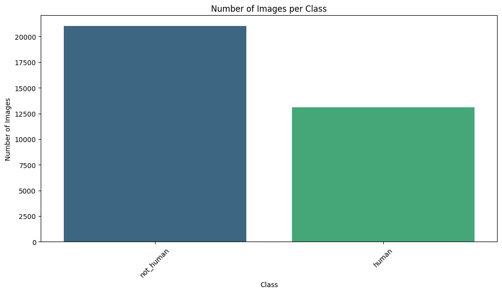
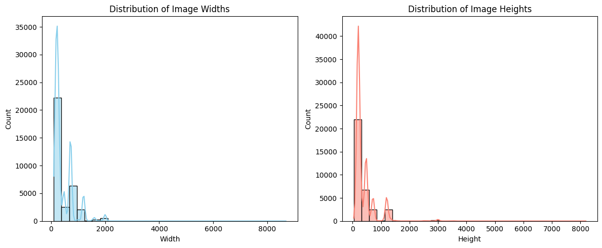
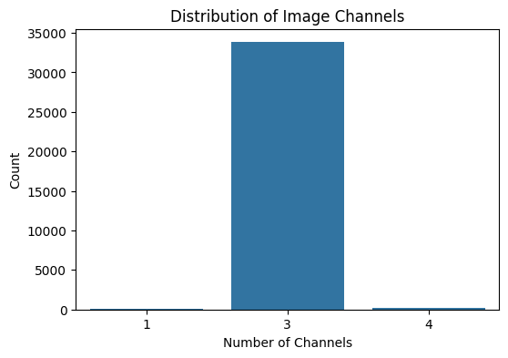
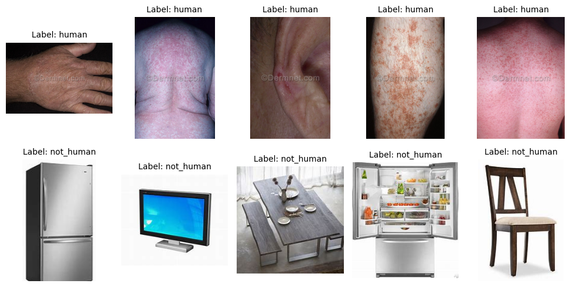

# Exploratory Data Analysis

## Skin Condition Classifier

### Dataset Overview

This analysis was conducted **after preprocessing** and focuses specifically on the dataset used to train the **skin condition classifier CNN model**. The dataset includes four classes:

* **Actinic\_Keratosis**
* **Benign\_tumors**
* **Normal**
* **SkinCancer**

All samples were verified to be valid human skin images before being included.

---

### Class Distribution

The number of samples per class is as follows:

```
Normal               1525
Actinic_Keratosis    1216
Benign_tumors         895
SkinCancer            777
```



---

### Image Dimensions

All images were resized to 256x256 pixels during preprocessing. Thus:

```
Image Width  - Min: 256, Max: 256, Mean: 256.0
Image Height - Min: 256, Max: 256, Mean: 256.0
```



---

### Channel Information

All images have RGB channels:

```
3-channel (RGB): 4413 images
```



---

### Sample Images per Class

The figure below displays representative samples from each class:



---

### Data Quality Notes

* No corrupt or unreadable images were found.
* All images had a consistent format, primarily `.jpeg`, `.png`, and `.jpg`:

```
.jpeg: 3717
.png:   482
.jpg:   214
```



---

## Exploratory Data Analysis – Human Validator Model


### Dataset Overview

This EDA focuses on the data used to train the **CNN model that validates whether an uploaded image contains human skin**. This acts as a filter step before proceeding to disease classification.

Classes in this dataset:

* **human**
* **not\_human**

---

### Class Distribution

The dataset is imbalanced, with more non-human images:

```
not_human    21000
human        13114
```



---

### Image Dimensions

Images vary significantly in resolution:

```
Width  - Min: 97, Max: 8688, Mean: ~434
Height - Min: 41, Max: 8192, Mean: ~394
```



---

### Channel Information

Most images are RGB, but a few have 1 or 4 channels:

```
3 channels (RGB): 33809
4 channels:        197
1 channel:         108
```



---

### Sample Images: Human vs Not Human

Examples of both classes used in training:



---

### Data Quality Notes

* Minor presence of grayscale (1-channel) and alpha (4-channel) images.
* Preprocessing included resizing and channel standardization.
* These variations were handled before model training.

---
