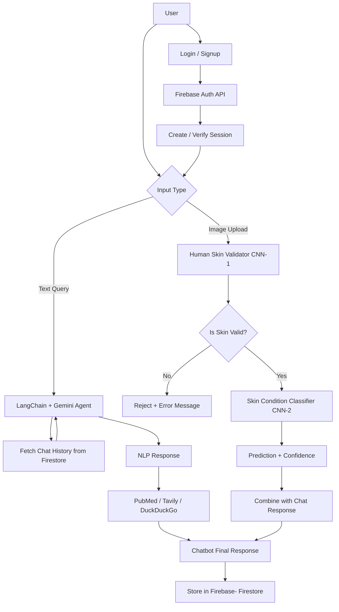

# System Architecture

MedAI is built with a modular, multi-layered architecture that enables intelligent conversations, image analysis, and secure user management — all in a single web application.

---

## High-Level Architecture

MedAI handles **two types of inputs** — natural language queries and skin image uploads — which are processed through distinct but coordinated subsystems.

---

## ⚙️ Component Overview

### 1. Frontend (User Interface)

- Built using Flask with Jinja2-rendered HTML templates (`login.html`, `chat.html`)
- Allows users to:
  - Log in / sign up
  - Enter text queries
  - Upload skin images

### 2. Backend (Flask Server)

- **Flask App** handles routing, session control, and API endpoints
- Manages input type:
  - **Text** → routed to **LangChain agent**
  - **Image** → routed to **TensorFlow CNN models**

### 3. Conversational Agent (LangChain + Gemini)

- Powered by **LangChain ReAct agent**
- Uses **Gemini LLM** for language reasoning
- Connected with tools:
  - `PubMedQueryRun` for scientific articles
  - `TavilySearch` and `DuckDuckGo` for general web results

### 4. Image Analysis Pipeline

- Uploaded image → processed by **CNN-1**:
  - Checks if it contains valid **human skin**
- If valid → passed to **CNN-2**:
  - Predicts type of **skin condition**
- Returns confidence score and prediction string

### 5. Authentication & Storage (Firebase)

- **Authentication**: Handled via Firebase Auth REST API
- **Firestore**:
  - Stores user session IDs
  - Logs user & AI messages to maintain context

---

## System Flow



---

## 🛡️ Privacy Consideration

While MedAI stores **text-based chat history** in Firebase Firestore to maintain conversational context, **uploaded skin images are never stored** — neither locally nor in the cloud.

- Images are processed **in-memory** only for prediction.
- After analysis, they are immediately discarded.
- No image data is linked to user accounts or persisted in any way.

This ensures that sensitive medical imagery remains private and secure.

---

## 🔐 Firebase Integration

| Feature         | Details                                                |
| --------------- | ------------------------------------------------------ |
| Authentication  | Sign-up and login through Firebase REST API            |
| Firestore       | Stores chat history per user and session               |
| Session Control | Flask `session` used to persist user state during chat |

---

## Deployment Notes

- **Host**: [Render](https://render.com/)
- **Runtime**: Python 3.10, TensorFlow backend
- **Startup**: App launched via `gunicorn` or `python app.py`
- **Memory Consideration**: Image inference may occasionally fail due to Render’s memory limit (\~512MB free tier)

---

## Folder Structure (Key Files)

```plaintext
.
├── app.py                     # Main Flask server
├── skin_predictor.py         # CNN model logic
├── templates/
│   ├── login.html
│   └── chat.html
├── .env                      # Environment secrets (not committed)
├── requirements.txt
└── README.md
```

---

## Summary

This architecture supports real-time multimodal interaction by combining:

- Language models (Gemini)
- Tool-enabled agents (LangChain)
- Deep learning models (CNNs via TensorFlow)
- And secure backend services (Firebase)

into a cohesive system that can **chat intelligently**, analyze medical imagery in **real-time**, and **prioritize user privacy**.
