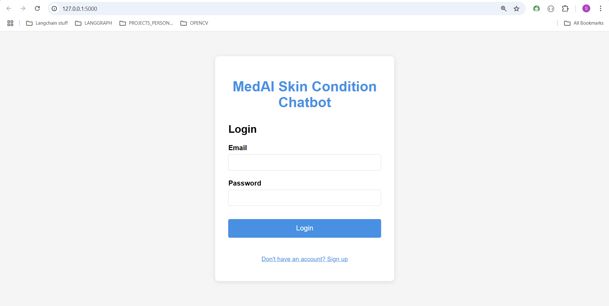
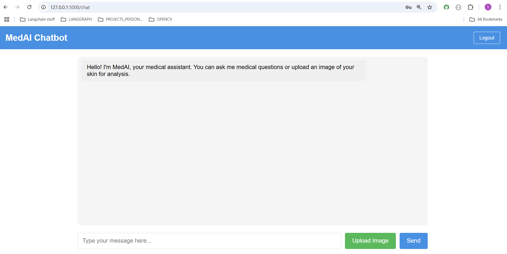
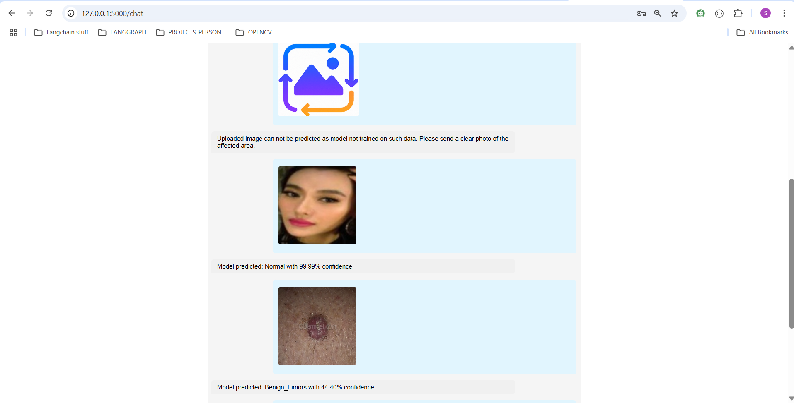

# Usage Guide

This guide walks you through how to use the **MedAI** application for both text-based queries and image-based skin diagnostics.

---

## Accessing the Application

Once the app is deployed (e.g., on Render), navigate to the provided URL in any modern browser:

```
https://med-ai-bot-70qb.onrender.com
```

---

## User Authentication

### 1. Sign Up

* New users must register using an email and password.
* All credentials are handled securely via Firebase Auth API.

### 2. Login

* Existing users can log in with their credentials.
* Session management is handled securely using Flask's `session`.

---

## Submitting Text Queries

1. After login, you’ll land on the **Chat Interface**.
2. Type your medical or general health-related question in the text box.
3. Hit **Send** to receive a detailed response.

**Backend Handling:**

* Your query is passed to a LangChain agent (powered by Gemini).
* The agent may pull information from:

  * PubMed (for academic resources)
  * DuckDuckGo / Tavily (for web-based sources)

---

## Uploading Skin Images

1. Use the **Upload** button in the chat interface to select a skin image from your device.
2. The app will:

   * First verify if the image contains valid human skin (CNN-1).
   * If valid, proceed to predict the skin condition (CNN-2).
3. You'll receive a prediction with confidence percentage in chat.

> Images that fail the human skin check will be rejected with an appropriate message.

---

## Chat Memory

* Your previous messages are stored temporarily in **Firestore**.
* This allows the model to maintain **context awareness** and provide better responses.

> Images are NOT stored for privacy reasons. Only message content is logged to preserve conversational continuity.

---

## Logging Out

* Click the **Logout** button to securely end your session.
* Your session is cleared from the server-side as well.

---

## Troubleshooting

| Issue                       | Solution                                                                  |
| --------------------------- | ------------------------------------------------------------------------- |
| “Login failed” error        | Ensure correct credentials. Try signing up again if you're a new user.    |
| Image rejected unexpectedly | Upload a clear, well-lit image of the affected skin area.                 |
| Prediction taking too long  | App may experience latency due to hosting constraints (Render free tier). |

---

## Visual Guide

### 🎥 Watch Demo

Watch the full walkthrough video:  
👉 [MedAI – Smart Skin Disease Detection & Chatbot](https://vimeo.com/1101410221?share=copy)

---

###  Sample UI Preview

#### 1. Login / Signup Page



#### 2. Chat Interface



#### 3. Image Upload Result



