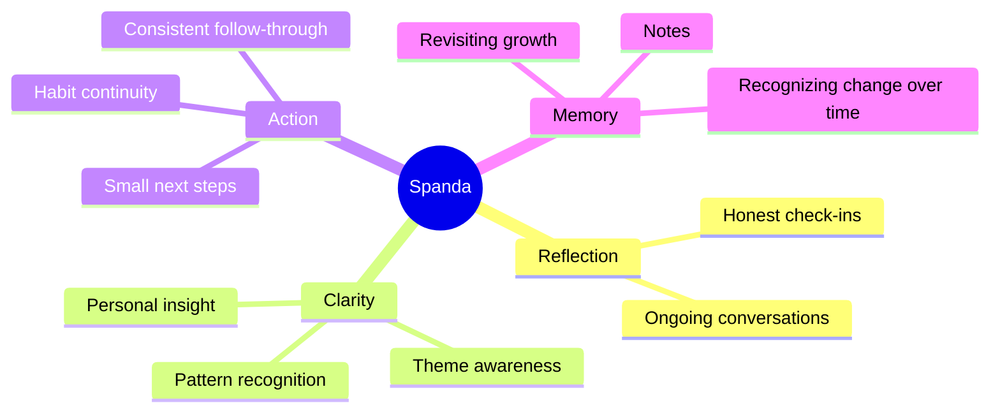

# Product Overview

## What Spanda Is

Spanda is a personal reflection companion that helps users make sense of recurring thoughts, repeated emotional themes, and real-life follow-through.

It is designed for people who want clarity, not noise. Instead of collecting disconnected entries, Spanda helps reveal an evolving pattern map of what matters most in day-to-day life.

## Product Promise

Spanda helps users move from:

- scattered reflection to visible patterns
- private thoughts to practical next steps
- intention-heavy thinking to action-aware growth

## Core Experience

Spanda follows a clear reflection loop:

1. You share what is present in your mind.
2. Spanda helps organize and connect your inputs.
3. You see recurring themes and relationships.
4. You choose one small action to stay aligned.
5. You return and observe how your map evolves.

## Key User Outcomes

- Better awareness of what keeps repeating internally
- Clearer distinction between what is felt and what is acted on
- More consistent personal follow-through
- A gentler, less judgmental reflection habit

## What You Can Do

- Start private reflection conversations
- Build an evolving visual map of thought and action
- Track light commitments such as tasks and habits
- Capture meaningful notes for later review
- Review periodic insight summaries for direction

## Experience Principles

- Clarity over complexity
- Reflection over performance
- Progress over perfection
- Support over pressure

## Experience Map

## Who It Is For

- People building a personal reflection practice
- People who want clearer thought-to-action alignment
- People navigating recurring emotional or motivational patterns
- People who prefer visual, calm, and structured self-awareness

## What Spanda Is Not

Spanda is not a replacement for professional medical, legal, or mental health services.

It is a reflection support product intended for personal insight and gentle behavior alignment.

## Current Stage

Spanda is currently private and pre-release.

The product, wording, and workflows are being refined before broader availability.
