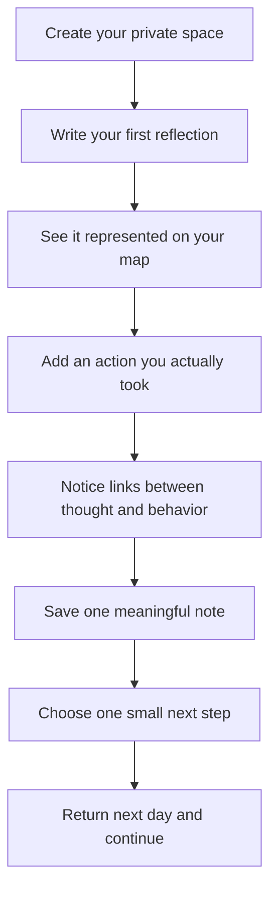

# User Journey

## Overview

This journey describes how a typical user may experience Spanda in practical, everyday use.

Live experience: http://spanda-one.vercel.app/

## First Week Journey

## Day 1: Starting Simple

1. Open Spanda and create your first check-in.
2. Write one honest thought in plain language.
3. Add one real action from your day.
4. Observe how both appear as part of one story.

Goal: Build trust with the process, not perfect entries.

## Days 2-3: Building Continuity

- Repeat short check-ins once or twice daily.
- Add thoughts when emotionally loaded moments happen.
- Add actions when you complete meaningful steps.
- Save notes when you want to remember context later.

Goal: Begin creating enough data for pattern visibility.

## Days 4-5: Pattern Recognition

- Review your map for repeated themes.
- Notice what gets more attention over time.
- Compare inner intention vs external follow-through.
- Identify one recurring friction point.

Goal: Move from expression to structured insight.

## Days 6-7: Gentle Adjustment

- Keep one helpful pattern active.
- Reduce one unhelpful repeated loop.
- Choose one realistic action for the coming week.
- End the week with a short reflection note.

Goal: Convert awareness into small consistent change.

## Daily Rhythm (Recommended)

1. Morning or evening check-in (2-5 minutes).
2. Add one thought and one action.
3. Review your map briefly for emerging themes.
4. Pick one practical next step.
5. Close with a note if needed.

## Weekly Reflection Rhythm

- Review what became stronger this week.
- Track where thought and action aligned.
- Spot where intention repeatedly stalled.
- Carry one habit and one insight into next week.

## Healthy Use Guidelines

- Keep entries short, specific, and honest.
- Focus on consistency, not volume.
- Avoid over-analyzing every entry.
- Use the map for clarity, not self-criticism.
- Celebrate small evidence of movement.

## Common Use Scenarios

- Personal growth journaling with structure
- Habit stabilization and accountability
- Emotional theme tracking across days
- Decision reflection before major choices
- Re-centering after stressful periods
