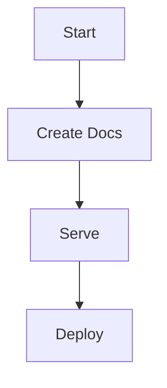

### 📘 Learn & Use MkDocs

Here’s a clean template you can copy-paste into your file:

````markdown
# 📚 MkDocs: Project Documentation to Website

---

## 🧠 What is MkDocs?

**MkDocs** is a fast, static site generator that's perfect for creating **project documentation** using **Markdown** files.  
You write `.md` files, and MkDocs turns them into a searchable website.

---

## ⚙️ Step-by-Step: Getting Started

### 1️⃣ Install MkDocs

```bash
pip install mkdocs
````

To verify:

```bash
mkdocs --version
```

---

### 2️⃣ Create a New MkDocs Project

```bash
mkdocs new my-project-docs
cd my-project-docs
```

You'll see:

```
my-project-docs/
├── docs/
│   └── index.md
└── mkdocs.yml
```

---

### 3️⃣ Serve the Docs Locally

```bash
mkdocs serve
```

Then open [http://127.0.0.1:8000](http://127.0.0.1:8000) in your browser. You'll see your site live!

---

### 4️⃣ Customize Your Docs

#### ✏️ Add More Markdown Files

Create more files like `intro.md`, `usage.md`, `troubleshooting.md` inside the `docs/` folder.

#### 🧭 Update `mkdocs.yml` Navigation

```yaml
site_name: My Project Docs

nav:
  - Home: index.md
  - Introduction: intro.md
  - Usage: usage.md
  - Troubleshooting: troubleshooting.md
```

---

## 🎨 Optional: Use the Material Theme

```bash
pip install mkdocs-material
```

Update `mkdocs.yml`:

```yaml
theme:
  name: material
```

---

## 🧪 Add Mermaid Flowcharts (Optional)

### Install Plugin:

```bash
pip install mkdocs-mermaid2-plugin
```

Update `mkdocs.yml`:

```yaml
plugins:
  - search
  - mermaid2
```

Now use Mermaid in any `.md` file:

````markdown



````

---

## 🚀 Deploy to GitHub Pages

Make sure your project is a Git repo:

```bash
git init
git remote add origin <your-repo-url>
```

Deploy:

```bash
mkdocs gh-deploy
```

---

## 🖼️ How to Add Images in MkDocs

### ✅ Step 1: Place Image in `docs/assets/`

Example:

```
my-project-docs/
├── docs/
│   ├── assets/
│   │   └── flowchart.png
```

### ✅ Step 2: Use Markdown to Display Image

```markdown

```

### ✨ Optional Enhancements (HTML)

**Center + Resize Image:**

```html
<p align="center">
  
</p>
```

**Resize Only:**

```html

```

---

## 📌 Final Tips

* Keep all images inside `docs/assets/`
* Use `mkdocs serve` to preview changes live
* Use `mkdocs-material` theme for a clean, professional look
* Maintain structure and version control using Git

